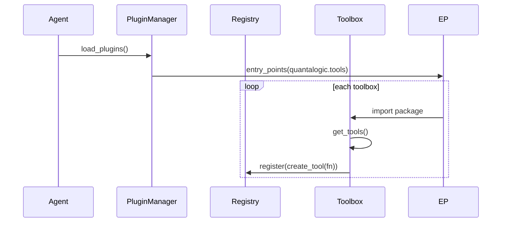

# Quantalogic Toolbox Documentation

The Quantalogic Toolbox system empowers developers to extend AI agents with modular, type-safe, and self-documenting tools written in Python. By adhering to a convention-based design philosophy, it eliminates the need for explicit dependencies, making it lightweight and accessible. This document explores the system's philosophy, structure, and features, with a detailed focus on the confirmation system for safe tool execution.

## Table of Contents
- [Philosophy: Convention Over Configuration](#philosophy-convention-over-configuration)
- [Why Use a Toolbox?](#why-use-a-toolbox)
- [Anatomy of a Toolbox](#anatomy-of-a-toolbox)
  - [Declaring Your Tools](#declaring-your-tools)
  - [Toolbox Structure](#toolbox-structure)
- [Discovery and Registration](#discovery-and-registration)
- [Tool Definition and Execution](#tool-definition-and-execution)
  - [Defining Tools](#defining-tools)
  - [Executing Tools](#executing-tools)
  - [Error Handling](#error-handling)
- [Confirmation System](#confirmation-system)
  - [Defining Confirmation Requirements](#defining-confirmation-requirements)
  - [Dynamic Confirmation Messages](#dynamic-confirmation-messages)
  - [Execution Workflow](#execution-workflow)
  - [Configuration Overrides](#configuration-overrides)
  - [Examples](#examples)
- [Automatic Documentation](#automatic-documentation)
- [Installing and Managing Toolboxes](#installing-and-managing-toolboxes)
  - [CLI Mode](#cli-mode)
  - [Shell Mode](#shell-mode)
- [Using Custom Configurations](#using-custom-configurations)
  - [Global Configuration](#global-configuration)
  - [Tool-Specific Configuration](#tool-specific-configuration)
- [Best Practices](#best-practices)
  - [Structured Returns](#structured-returns)
  - [Environment Variables](#environment-variables)
  - [Tool Versioning](#tool-versioning)
- [Security Considerations](#security-considerations)
- [Performance Optimization](#performance-optimization)
- [Testing Your Tools](#testing-your-tools)
- [Frequently Asked Questions (FAQ)](#frequently-asked-questions-faq)

---

## Philosophy: Convention Over Configuration

The Quantalogic Toolbox system is built on a "convention over configuration" philosophy, designed to minimize complexity and dependencies for developers. Instead of requiring explicit imports, decorators, or class definitions, the system relies on simple naming conventions and Python's built-in features. This approach ensures that toolboxes are easy to create, maintain, and integrate with the Quantalogic agent.

### Core Conventions
1. **Tool Functions**: Tools are Python functions (synchronous or asynchronous) defined with type hints and docstrings for automatic validation and documentation.
2. **Toolbox Exposure**: A `get_tools()` function in the toolbox's `__init__.py` returns a list of tool functions, serving as the entry point for discovery.
3. **No Dependencies**: Toolbox authors need not import Quantalogic-specific modules; the system detects tools via standard Python introspection.
4. **Function Attributes**: Additional metadata, such as confirmation requirements, is set using function attributes (e.g., `requires_confirmation`), leveraging Python's native capabilities.

### Why This Matters
- **Simplicity**: Developers write standard Python functions without learning a new API or framework.
- **Portability**: Toolboxes are self-contained Python packages, installable via `pip` without Quantalogic-specific dependencies.
- **Flexibility**: Conventions allow for extensibility (e.g., adding confirmation logic) without altering the core toolbox structure.

**Example**: A minimal toolbox exposes tools by defining `get_tools()`:

```python
# my_toolbox/my_toolbox/__init__.py
from .tools import read_file

def get_tools():
    return [read_file]
```

This convention allows the Quantalogic agent to discover and register tools automatically, keeping the system lightweight and developer-friendly.

---

## Why Use a Toolbox?

Quantalogic Toolboxes enable modular extensions to AI agents, offering:
- **Modularity**: Add capabilities (e.g., file operations, API calls) without modifying the agent’s core.
- **Type Safety**: Use Python type hints for input/output validation.
- **Self-Documentation**: Generate rich documentation from docstrings and type hints.
- **Hot-Pluggable**: Install or update toolboxes without restarting the agent.
- **Safety**: Features like the confirmation system ensure user control over sensitive operations.

**Use Case**: A developer wants an AI agent to manage files. They create a `file_toolbox` with tools like `read_file` and `delete_file`, install it, and use it via the agent’s task-solving interface.

---

## Anatomy of a Toolbox

A toolbox is a Python package structured to expose tools via conventions.

### Declaring Your Tools

Tools are defined in a `tools.py` file as Python functions with type hints and docstrings. No Quantalogic-specific imports are required.

**Example**:

```python
# my_toolbox/my_toolbox/tools.py
async def read_file(path: str) -> str:
    """Read a file and return its contents."""
    with open(path, 'r') as f:
        return f.read()
```

### Toolbox Structure

A typical toolbox looks like:

```
my_toolbox/
├── pyproject.toml     # Metadata and dependencies
├── my_toolbox/
│   ├── __init__.py    # Exports get_tools()
│   └── tools.py       # Tool functions
└── README.md          # Optional documentation
```

**pyproject.toml Example**:

```toml
[tool.poetry]
name = "my-toolbox"
version = "0.1.0"
description = "A Quantalogic toolbox for file operations"
authors = ["Your Name <you@example.com>"]
packages = [{ include = "my_toolbox" }]

[tool.poetry.dependencies]
python = "^3.10"

[build-system]
requires = ["poetry-core>=1.0.0"]
build-backend = "poetry.core.masonry.api"

[tool.poetry.plugins."quantalogic.tools"]
my_toolbox = "my_toolbox"
```

**__init__.py Example**:

```python
# my_toolbox/my_toolbox/__init__.py
from .tools import read_file

def get_tools():
    return [read_file]
```

---

## Discovery and Registration

The Quantalogic agent uses the `PluginManager` to discover toolboxes at startup:
1. Scans `quantalogic.tools` entry points via `importlib.metadata.entry_points`.
2. Imports each toolbox package.
3. Calls `get_tools()` to retrieve tool functions.
4. Wraps functions as `Tool` instances using `create_tool`, registering them in a `ToolRegistry`.

**Sequence Diagram**:



Only toolboxes listed in `enabled_toolboxes` in the configuration are loaded, allowing selective activation.

---

## Tool Definition and Execution

### Defining Tools

Tools are Python functions with:
- **Type Hints**: For input/output validation.
- **Docstrings**: For documentation generation.
- **Optional Attributes**: For metadata like confirmation requirements.

**Example**:

```python
async def read_file(path: str) -> str:
    """Read a file and return its contents."""
    with open(path, 'r') as f:
        return f.read()
```

### Executing Tools

Tools are executed within the agent’s task-solving process, not as direct CLI commands. The `Executor` class manages execution, ensuring safety and context.

**Programmatic Execution**:

```python
from quantalogic_codeact.codeact.tools_manager import ToolRegistry
registry = ToolRegistry()
result = await registry.get("read_file").async_execute(path="./data.txt")
```

**Shell Task-Solving**:

```bash
/solve "Read the contents of ./data.txt"
```

### Error Handling

Tools should handle errors gracefully:

```python
async def read_file(path: str) -> str:
    """Read a file or return an error message."""
    try:
        with open(path, 'r') as f:
            return f.read()
    except FileNotFoundError:
        return "Error: File not found"
```

---

## Confirmation System

The confirmation system ensures user approval for sensitive or destructive tools (e.g., `delete_file`). It’s integrated into the toolbox system using function attributes, maintaining the dependency-free convention.

### Defining Confirmation Requirements

Toolbox authors mark tools as requiring confirmation by setting the `requires_confirmation` attribute to `True` on the tool function. This is detected by `create_tool` and applied to the `Tool` instance.

**Example**:

```python
async def delete_file(path: str) -> bool:
    """Delete a file at the given path."""
    import os
    if os.path.exists(path):
        os.remove(path)
        return True
    return False

delete_file.requires_confirmation = True
```

### Dynamic Confirmation Messages

The `confirmation_message` attribute can be:
- A `str`: A static message displayed to the user.
- A callable without parameters: Invoked at runtime to generate a message.

**Static Message**:

```python
delete_file.confirmation_message = "Are you sure you want to delete this file?"
```

**Dynamic Message (Callable)**:

```python
def get_confirmation_message():
    return "Confirm file deletion? This action is irreversible."

delete_file.confirmation_message = get_confirmation_message
```

**Why No Parameters?**

- Keeping callables parameter-free aligns with the simplicity of the convention-based system, avoiding the need for toolbox authors to handle complex argument passing.
- The callable can still access runtime context via closures or external state if needed.

### Configuration Overrides

Confirmation settings can be overridden via `tools_config` in the YAML configuration, applied during tool registration:

```yaml
tools_config:
  - name: delete_file
    requires_confirmation: true
    confirmation_message: "Confirm file deletion?"
```

**Code Snippet (Tool Registration)**:

```python
# quantalogic_codeact/quantalogic_codeact/codeact/tools_manager.py
def get_default_tools(model, history_store, enabled_toolboxes, installed_toolboxes):
    tools = [...]  # Load tools
    tool_confs = [tc for tb in installed_toolboxes if tb.enabled for tc in tb.tool_configs or []]
    for tool in tools:
        for tc in tool_confs:
            if tc.name == tool.name:
                tool.requires_confirmation = getattr(tc, 'requires_confirmation', tool.requires_confirmation)
                tool.confirmation_message = getattr(tc, 'confirmation_message', tool.confirmation_message)
    return tools
```

### Examples

**Static Confirmation**:

```python
# file_toolbox/file_toolbox/tools.py
async def delete_file(path: str) -> bool:
    """Delete a file at the given path."""
    import os
    if os.path.exists(path):
        os.remove(path)
        return True
    return False

delete_file.requires_confirmation = True
delete_file.confirmation_message = "Are you sure you want to delete this file?"

def get_tools():
    return [delete_file]
```

**Shell Interaction**:

```bash
/solve "Delete ./temp.txt"
[Prompt]: Are you sure you want to delete this file? (yes/no)
yes
[Result]: File deleted successfully
```

**Dynamic Confirmation**:

```python
# file_toolbox/file_toolbox/tools.py
def get_confirmation_message():
    return "Confirm file deletion? This action cannot be undone."

async def delete_file(path: str) -> bool:
    """Delete a file at the given path."""
    import os
    if os.path.exists(path):
        os.remove(path)
        return True
    return False

delete_file.requires_confirmation = True
delete_file.confirmation_message = get_confirmation_message

def get_tools():
    return [delete_file]
```

**Shell Interaction**:

```bash
/solve "Delete ./temp.txt"
[Prompt]: Confirm file deletion? This action cannot be undone. (yes/no)
no
[Result]: Operation cancelled by user
```

**Configuration Override**:

```yaml
# config.yaml
tools_config:
  - name: delete_file
    requires_confirmation: true
    confirmation_message: "Proceed with file deletion?"
```

**Shell Interaction**:

```bash
/solve "Delete ./temp.txt"
[Prompt]: Proceed with file deletion? (yes/no)
yes
[Result]: File deleted successfully
```

---

## Automatic Documentation

Tools generate documentation via:
- **`to_markdown()`**: Produces Markdown with argument tables and examples.
- **`to_docstring()`**: Creates Python docstrings for IDEs.
- **`to_json()`**: Outputs JSON schemas for validation.

**Example (delete_file)**:

```markdown
`delete_file`:
- **Description**: Delete a file at the given path.
- **Parameters**:
  - `path`: (string, required) The file path to delete.
- **Requires Confirmation**: Yes
- **Confirmation Message**: Are you sure you want to delete this file?
- **Returns**: `bool` - True if deletion succeeded, False otherwise.
```

---

## Installing and Managing Toolboxes

### CLI Mode

```bash
# Install a toolbox
quantalogic_codeagent toolbox install file-toolbox

# Uninstall
quantalogic_codeagent toolbox uninstall file-toolbox

# List installed
quantalogic_codeagent toolbox installed
```

### Shell Mode

```bash
/toolbox install file-toolbox
/toolbox uninstall file-toolbox
/toolbox installed
/toolbox doc file_toolbox delete_file
```

---

## Using Custom Configurations

### Global Configuration

Stored at `~/.quantalogic/config.yaml`:

```yaml
log_level: INFO
installed_toolboxes:
  - name: file_toolbox
    package: file-toolbox
    version: 0.1.0
enabled_toolboxes:
  - file_toolbox
```

### Tool-Specific Configuration

Override tool settings:

```yaml
tools_config:
  - name: delete_file
    requires_confirmation: true
    confirmation_message: "Confirm file deletion?"
```

---

## Best Practices

### Structured Returns

Use dataclasses for structured outputs:

```python
from dataclasses import dataclass

@dataclass
class FileInfo:
    name: str
    size: int

async def list_files(path: str) -> List[FileInfo]:
    """List files in a directory."""
    import os
    return [FileInfo(name=f, size=os.path.getsize(os.path.join(path, f))) for f in os.listdir(path)]
```

### Environment Variables

Manage secrets with `os.getenv`:

```python
import os
API_KEY = os.getenv("API_KEY", "default-key")

async def fetch_data(query: str) -> dict:
    """Fetch data using an API key."""
    return {"data": query}
```

### Tool Versioning

Use semantic versioning in `pyproject.toml`:

```toml
[tool.poetry]
version = "0.1.0"
```

---

## Security Considerations

- **Input Validation**: Validate inputs to prevent injection:
  ```python
  async def safe_tool(input: str) -> str:
      if not input.isalnum():
          raise ValueError("Input must be alphanumeric")
      return input
  ```

- **Path Sanitization**:
  ```python
  import os
  async def read_file(path: str) -> str:
      safe_path = os.path.normpath(os.path.join(os.getcwd(), path))
      if not safe_path.startswith(os.getcwd()):
          raise ValueError("Invalid path")
      with open(safe_path, 'r') as f:
          return f.read()
  ```

---

## Performance Optimization

- **Async I/O**:
  ```python
  import aiohttp
  async def fetch_data(url: str) -> str:
      async with aiohttp.ClientSession() as session:
          async with session.get(url) as resp:
              return await resp.text()
  ```

- **Caching**:
  ```python
  from functools import lru_cache
  @lru_cache(maxsize=100)
  async def compute(value: int) -> int:
      return value * 2
  ```

---

## Testing Your Tools

Use `pytest` and `pytest-asyncio`:

```python
# tests/test_tools.py
import pytest
from file_toolbox.tools import read_file

@pytest.mark.asyncio
async def test_read_file(tmp_path):
    file_path = tmp_path / "test.txt"
    file_path.write_text("Hello")
    result = await read_file(str(file_path))
    assert result == "Hello"
```

Run tests:

```bash
pytest --asyncio-mode=auto
```

---

## Frequently Asked Questions (FAQ)

- **Q: How do I debug a tool?**  
  A: Use `/loglevel DEBUG` in the shell for detailed logs.

- **Q: Can synchronous tools use confirmation?**  
  A: Yes, they’re wrapped in `asyncio.to_thread` and support confirmation.

- **Q: How do I override confirmation settings?**  
  A: Use `tools_config` in the YAML configuration.

- **Q: What if a toolbox installation fails?**  
  A: Check the CLI output for errors and verify the package exists on PyPI.

---

*Document last updated: 2025-04-25*