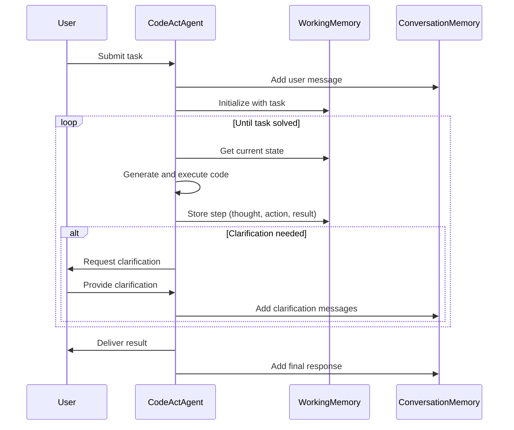

# Technical Document: Memory Systems in the CodeAct Agent

## Why

The **CodeAct Agent** is a sophisticated system designed to solve tasks through iterative reasoning and code execution, often requiring multiple steps and dynamic interactions with users. Two distinct memory systems—**WorkingMemory** and **ConversationMemory**—are critical to its operation:

- **WorkingMemory**:
  - **Purpose**: To manage the transient state of the current task, tracking progress, storing intermediate results, and maintaining execution context across multiple steps.
  - **Necessity**: Without this, the agent would lose coherence within a task, leading to redundant actions, inconsistent reasoning, or failure to complete complex tasks.

- **ConversationMemory**:
  - **Purpose**: To preserve a persistent history of user-agent interactions, providing long-term context for understanding user intent and ensuring coherent conversations across tasks.
  - **Necessity**: This enables the agent to reference prior messages, maintain conversational continuity, and handle follow-up queries or clarifications effectively.

These systems work in tandem to support the agent's ability to perform context-aware, multi-step problem-solving while maintaining a coherent dialogue with the user, addressing both immediate task needs and long-term interaction context.

---

## What

### WorkingMemory

- **Definition**: A structured storage mechanism that holds task-specific information, enabling the CodeAct Agent to manage the state of the current task.
- **Components**:
  - **Task Description**: A persistent string defining the current task.
  - **System Prompt**: Persistent instructions guiding the agent’s behavior.
  - **Step History**: A list of `Step` objects, each containing:
    - `step_number`: The sequential step number.
    - `thought`: The reasoning or rationale for the action.
    - `action`: The generated Python code executed in the step.
    - `result`: An `ExecutionResult` object that records the execution status, result, error (if any), and a snapshot of all local variables for each step. This ensures that both the outcome and the step's full variable context are available for review, debugging, and reasoning.
  - **Token Limit**: A configurable `max_tokens` (default: 64K) to limit the size of formatted history.
- **Scope**: Task-specific, cleared at the start of each new task to ensure a clean slate.

### ConversationMemory

- **Definition**: A persistent record of all user-agent interactions, managed by the `ConversationManager` class, designed to maintain conversational context across tasks and sessions.
- **Components**:
  - **Messages**: A list of `Message` objects, each with:
    - `role`: Either "user" or "assistant".
    - `content`: The text of the message.
    - `nanoid`: A unique identifier for efficient retrieval.
  - **Message Dictionary**: A hash map (`message_dict`) mapping `nanoid` to `Message` objects for rapid lookup.
  - **Token Limit**: A configurable `max_tokens` (default: 64K) to manage history size.
- **Scope**: Persists across tasks, accumulating interaction history to support long-term context.

### Key Differences
- **WorkingMemory** is transient, resetting with each new task to focus on execution details, while **ConversationMemory** is persistent, accumulating interaction history for conversational continuity.
- **WorkingMemory** stores structured data (thought, action, result) for task execution, whereas **ConversationMemory** stores raw message exchanges for dialogue context.

---

## How

### WorkingMemory

#### Implementation
- **Class**: `WorkingMemory` in `working_memory.py`.
- **Initialization**: Configured with `max_tokens`, `system_prompt`, and `task_description` to set the task context and history limits.
- **Step Management**: Uses a `Step` dataclass to encapsulate step details, added via the `add` method after each execution.
- **History Formatting**: The `format_history` method renders step history using a Jinja2 template (`step.j2`), truncating older steps if the total token count exceeds `max_tokens`.
- **Context Retrieval**: The `get_full_context` method combines the system prompt, task description, and formatted history for use in reasoning.

#### Usage
- **Task Initiation**: The memory is initialized with the task description and cleared of prior steps to focus on the current task.
- **Step Execution**: Each step’s thought, action, and result are stored post-execution, enabling the agent to reflect on prior actions.
- **Reasoning Support**: The formatted history is provided to the `Reasoner` to inform code generation, ensuring context-aware decisions.

**Code Example**:
```python
from dataclasses import dataclass
from typing import List, Dict
from loguru import logger
from .events import ExecutionResult
from .templates import jinja_env

@dataclass
class Step:
    step_number: int
    thought: str
    action: str
    result: ExecutionResult

class WorkingMemory:
    def __init__(self, max_tokens: int = 64*1024, system_prompt: str = "", task_description: str = ""):
        self.max_tokens = max_tokens
        self._system_prompt = system_prompt
        self._task_description = task_description
        self._store: List[Step] = []
        logger.debug(f"Initialized WorkingMemory with system_prompt: '{system_prompt}', task_description: '{task_description}'")

    def add(self, step_data: Dict) -> None:
        try:
            step = Step(
                step_number=step_data['step_number'],
                thought=step_data['thought'],
                action=step_data['action'],
                result=ExecutionResult(**step_data['result'])
            )
            self._store.append(step)
            logger.debug(f"Added step {step.step_number} to working memory")
        except Exception as e:
            logger.error(f"Failed to add step: {e}")

    def format_history(self, max_iterations: int) -> str:
        try:
            included_steps: List[str] = []
            total_tokens: int = 0
            step_template = jinja_env.get_template("step.j2")
            for step in reversed(self._store):
                step_str = step_template.render(step=step, max_iterations=max_iterations)
                step_tokens: int = len(step_str.split())
                if total_tokens + step_tokens > self.max_tokens:
                    break
                included_steps.append(step_str)
                total_tokens += step_tokens
            return "\n".join(reversed(included_steps)) or "No previous steps"
        except Exception as e:
            logger.error(f"Error formatting history: {e}")
            return "No previous steps"
```

#### Integration
- Embedded in the `CodeActAgent` class, used in the `solve` method to track task progress and provide context to the `Reasoner` via `generate_action`.

### ConversationMemory

#### Implementation
- **Class**: `ConversationManager` in `conversation_manager.py`.
- **Initialization**: Configured with `max_tokens` to set the history size limit.
- **Message Storage**: Messages are added via `add_message`, stored in both a list (`messages`) and a dictionary (`message_dict`) for efficient retrieval by `nanoid`.
- **Retrieval**: The `get_history` method returns the full message list, while tools like `RetrieveMessageTool` access specific messages by `nanoid`.

#### Usage
- **Interaction Recording**: Updated after each user-agent exchange, such as during `chat` or `solve` operations.
- **Context Provision**: Supplies conversation history to the `Reasoner` and `Executor`, enabling context-aware responses and actions.
- **Tool Access**: The `RetrieveMessageTool` uses `nanoid` to retrieve specific messages, enhancing efficiency in accessing past interactions.

**Code Example**:
```python
from typing import List, Dict
from loguru import logger
from .message import Message

class ConversationManager:
    def __init__(self, max_tokens: int = 64*1024):
        self.messages: List[Message] = []
        self.message_dict: Dict[str, Message] = {}
        self.max_tokens: int = max_tokens
        logger.debug(f"Initialized ConversationManager with max_tokens: {max_tokens}")

    def add_message(self, role: str, content: str) -> None:
        try:
            message = Message(role=role, content=content)
            self.messages.append(message)
            self.message_dict[message.nanoid] = message
            logger.debug(f"Added message with nanoid '{message.nanoid}' and role '{role}'")
        except Exception as e:
            logger.error(f"Failed to add message: {e}")

    def get_history(self) -> List[Message]:
        try:
            return self.messages
        except Exception as e:
            logger.error(f"Error getting history: {e}")
            return []
```

#### Integration
- Integrated into the `CodeActAgent` and `Agent` classes, used in `chat` and `solve` methods to maintain conversational context and support tools like `RetrieveMessageTool`.

### Interaction Examples

To illustrate the roles of **WorkingMemory** and **ConversationMemory**, consider the following example scenario where a user tasks the CodeAct Agent with writing and translating a poem.

#### Scenario: Writing and Translating a Poem

**Step 1: User Submits Task**
- **User Input**: "Write a short poem about the moon and translate it to Spanish."
- **ConversationMemory**:
  - Adds a `Message`:
    ```python
    Message(
        role="user",
        content="Write a short poem about the moon and translate it to Spanish.",
        nanoid="abc123"
    )
    ```
  - **Content**: Stores the raw user request for future reference.
  - **Role**: Marks the message as "user" to distinguish it from agent responses.
- **WorkingMemory**:
  - Initializes with:
    ```python
    task_description="Write a short poem about the moon and translate it to Spanish."
    system_prompt="You are a creative AI specializing in poetry and translation."
    _store=[]  # Empty step history
    ```
  - **Content**: Sets the task context, ready to store execution steps.
  - **Role**: Provides the task-specific context for the current execution.

**Step 2: Agent Writes the Poem**
- **Agent Action**: Generates code to write a poem using the `agent_tool`.
- **WorkingMemory**:
  - Adds a `Step` after execution:
    ```python
    Step(
        step_number=1,
        thought="Generate a short poem about the moon using the agent_tool.",
        action="""
import asyncio
async def main():
    system_prompt = '''
You are a poet. Write a short poem about the moon.
'''
    prompt = 'Write a 4-line poem about the moon.'
    poem = await default.agent_tool(
        system_prompt=system_prompt,
        prompt=prompt,
        temperature=0.7,
        max_tokens=100
    )
    return {'status': 'inprogress', 'result': poem, 'next_step': 'Translate the poem to Spanish'}
""",
        result=ExecutionResult(
            execution_status="success",
            task_status="inprogress",
            result="The moon glows soft in night's embrace,\nA silver dream in cosmic space,\nIts whispers guide the tides to sway,\nA beacon till the break of day.",
            next_step="Translate the poem to Spanish",
            execution_time=2.5,
            local_variables={"step1_poem": "The moon glows soft..."}
        )
    )
    ```
  - **Content**: Stores the thought, code, and result, including the poem as a variable (`step1_poem`).
  - **Role**: Tracks the execution state, enabling the agent to build on this result in the next step.
- **ConversationMemory**:
  - No new messages are added, as this step involves internal execution without user interaction.
  - **Content**: Retains the initial user message for context.
  - **Role**: Provides background context but is not directly modified.

**Step 3: Agent Requests Clarification**
- **Agent Action**: Determines that it needs confirmation on the Spanish dialect (e.g., Castilian or Latin American).
- **ConversationMemory**:
  - Adds two `Message` objects:
    ```python
    Message(
        role="assistant",
        content="Should I translate the poem into Castilian Spanish or Latin American Spanish?",
        nanoid="def456"
    )
    Message(
        role="user",
        content="Use Latin American Spanish.",
        nanoid="ghi789"
    )
    ```
  - **Content**: Captures the clarification exchange, preserving the dialogue for future reference.
  - **Role**: Enables the agent to recall the user’s preference in subsequent steps.
- **WorkingMemory**:
  - No new step is added, as this is a conversational pause rather than an execution step.
  - **Content**: Remains focused on the poem from Step 1, ready for the next execution.
  - **Role**: Maintains task state, unaffected by the conversational detour.

**Step 4: Agent Translates the Poem**
- **Agent Action**: Uses the `RetrieveMessageTool` to access the user’s dialect preference and translates the poem.
- **WorkingMemory**:
  - Adds a new `Step`:
    ```python
    Step(
        step_number=2,
        thought="Retrieve the user's dialect preference and translate the poem to Latin American Spanish.",
        action="""
import asyncio
async def main():
    dialect = await default.retrieve_message(nanoid='ghi789')
    poem = context_vars.get('step1_poem', '')
    system_prompt = '''
You are a translation expert specializing in Latin American Spanish.
'''
    prompt = f'''
Translate the following poem to Latin American Spanish:

{poem}
'''
    translation = await default.agent_tool(
        system_prompt=system_prompt,
        prompt=prompt,
        temperature=0.3,
        max_tokens=100
    )
    return {'status': 'completed', 'result': translation}
""",
        result=ExecutionResult(
            execution_status="success",
            task_status="completed",
            result="La luna brilla suave en la noche,\nUn sueño plateado en el espacio,\nSus susurros guían las mareas,\nUn faro hasta el amanecer.",
            execution_time=3.0,
            local_variables={"step2_translation": "La luna brilla suave..."}
        )
    )
    ```
  - **Content**: Stores the translation logic, result, and new variable (`step2_translation`), completing the task.
  - **Role**: Finalizes the task state, providing the complete execution history for evaluation.
- **ConversationMemory**:
  - Adds a final `Message`:
    ```python
    Message(
        role="assistant",
        content="Here is your poem translated to Latin American Spanish:\nLa luna brilla suave en la noche,\nUn sueño plateado en el espacio,\nSus susurros guían las mareas,\nUn faro hasta el amanecer.",
        nanoid="jkl012"
    )
    ```
  - **Content**: Records the final output delivered to the user.
  - **Role**: Completes the conversational record, enabling future reference to the task’s outcome.

#### Analysis of Memory Roles
- **WorkingMemory**:
  - **Role**: Manages the task’s execution lifecycle, storing each step’s thought, action, and result to ensure the agent progresses logically toward task completion.
  - **Content**: Structured data (e.g., poem and translation as variables) that supports iterative reasoning and execution.
- **ConversationMemory**:
  - **Role**: Maintains the dialogue context, capturing user inputs, agent queries, and final outputs to ensure conversational coherence.
  - **Content**: Raw message exchanges (e.g., clarification on dialect) that provide background context for task execution.

### Interaction Flow

The memory systems interact with the CodeAct Agent as follows:

1. **Task Initiation**:
   - `WorkingMemory` is initialized with the task description and cleared of prior steps.
   - `ConversationMemory` records the user’s task input.

2. **Step Execution**:
   - `WorkingMemory` stores each step’s execution details (thought, action, result).
   - `ConversationMemory` captures any intermediate user-agent interactions, such as clarifications.

3. **Task Completion**:
   - `WorkingMemory` provides the final task state for evaluation and result validation.
   - `ConversationMemory` logs the final response, completing the interaction history.

**Mermaid Diagram**:


---

## Summary

- **WorkingMemory** is the task-specific backbone, resetting per task to manage execution details and ensure coherent progress through structured step data.
- **ConversationMemory** is the conversational anchor, persisting across tasks to maintain interaction history and support context-aware dialogue.
- Together, they enable the **CodeAct Agent** to execute complex tasks efficiently while maintaining a seamless, contextually rich interaction with the user.