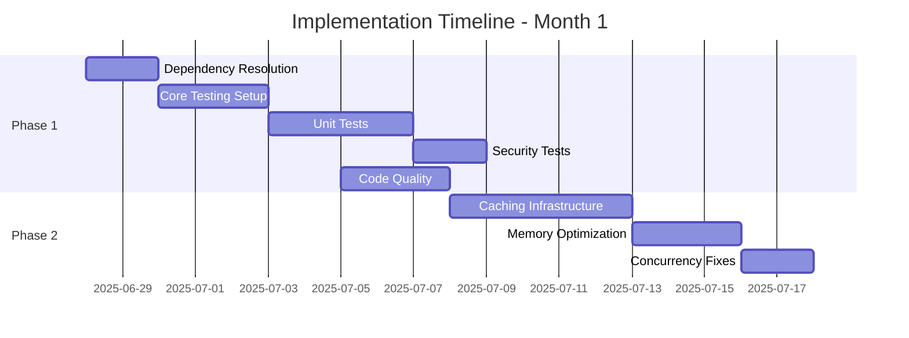
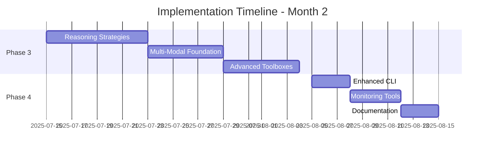
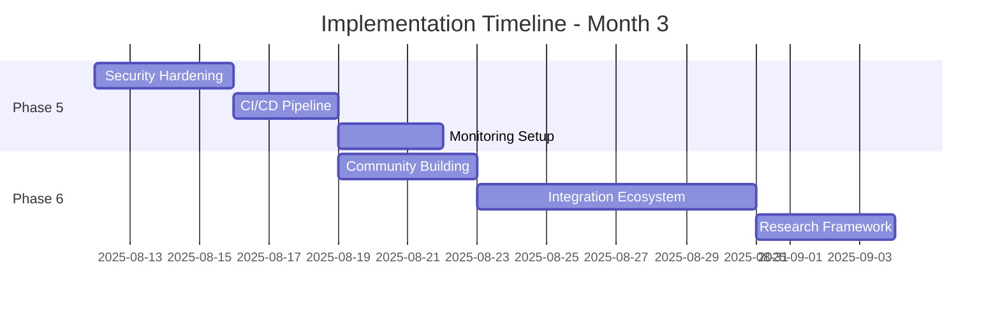

# QuantaLogic CodeAct Improvement Plan

**Document Version:** 1.0  
**Created:** June 28, 2025  
**Based on Assessment:** A- (89/100)  
**Target Grade:** A+ (95/100)

## Executive Summary

This improvement plan provides a structured roadmap to elevate QuantaLogic CodeAct from its current state-of-the-art implementation to production-ready excellence. The plan addresses critical gaps while preserving the framework's innovative architecture and research alignment.

**Key Objectives:**
- Achieve production readiness with comprehensive testing
- Optimize performance and scalability
- Enhance developer experience and ecosystem
- Maintain cutting-edge AI research alignment

---

## Phase 1: Critical Infrastructure (Weeks 1-2)
**Priority: CRITICAL | Estimated Effort: 80 hours**

### 1.1 Dependency Resolution
**Duration:** 2 days | **Assignee:** Core Developer

#### Tasks:
1. **Fix Missing Dependencies**
   ```bash
   # Add to pyproject.toml [tool.poetry.dependencies]
   nanoid = "^2.0.0"
   ```

2. **Dependency Audit**
   ```bash
   # Commands to run
   poetry show --outdated
   poetry audit
   pip-audit
   ```

3. **Version Updates**
   - Update litellm to latest stable version
   - Ensure compatibility with quantalogic-pythonbox
   - Test all dependency combinations

#### Deliverables:
- [ ] Updated `pyproject.toml` with all missing dependencies
- [ ] Dependency compatibility matrix document
- [ ] Automated dependency checking in CI/CD

#### Success Criteria:
- All import errors resolved
- No security vulnerabilities in dependencies
- Clean `poetry install` and `poetry update`

### 1.2 Core Testing Infrastructure
**Duration:** 8 days | **Assignee:** Test Engineer + Core Developer

#### Phase 1.2.1: Test Framework Setup (2 days)
```python
# tests/conftest.py
import pytest
import asyncio
from unittest.mock import AsyncMock, MagicMock
from quantalogic_codeact.codeact.agent import Agent
from quantalogic_codeact.codeact.codeact_agent import CodeActAgent

@pytest.fixture
def event_loop():
    """Create an instance of the default event loop for the test session."""
    loop = asyncio.get_event_loop_policy().new_event_loop()
    yield loop
    loop.close()

@pytest.fixture
def mock_llm():
    """Mock LLM responses for testing."""
    return AsyncMock()

@pytest.fixture
def sample_agent():
    """Create a test agent with minimal configuration."""
    return Agent(config={"model": "test/model", "max_iterations": 3})
```

#### Phase 1.2.2: Unit Tests Implementation (4 days)

**Priority 1: Core Components**
```python
# tests/unit/test_codeact_agent.py
class TestCodeActAgent:
    async def test_solve_simple_task(self, mock_llm):
        """Test basic task solving functionality."""
        
    async def test_context_variable_persistence(self):
        """Test variable persistence across steps."""
        
    async def test_error_handling_graceful_degradation(self):
        """Test error recovery mechanisms."""
        
    async def test_task_abortion_handling(self):
        """Test TaskAbortedError handling."""

# tests/unit/test_executor.py
class TestExecutor:
    async def test_secure_code_execution(self):
        """Test sandboxed code execution."""
        
    async def test_tool_confirmation_system(self):
        """Test user confirmation workflows."""
        
    async def test_module_allowlist_enforcement(self):
        """Test security module restrictions."""
        
    async def test_dynamic_tool_registration(self):
        """Test runtime tool addition."""

# tests/unit/test_reasoner.py
class TestReasoner:
    async def test_prompt_generation(self):
        """Test context-aware prompt generation."""
        
    async def test_xml_response_parsing(self):
        """Test structured output parsing."""
        
    async def test_retry_logic(self):
        """Test LLM failure recovery."""

# tests/unit/test_working_memory.py
class TestWorkingMemory:
    def test_token_aware_truncation(self):
        """Test intelligent history pruning."""
        
    def test_context_persistence(self):
        """Test system prompt and task persistence."""
        
    def test_step_tracking(self):
        """Test structured step data storage."""
```

**Priority 2: Integration Tests (2 days)**
```python
# tests/integration/test_end_to_end.py
class TestEndToEnd:
    async def test_complete_task_workflow(self):
        """Test full ReAct loop execution."""
        
    async def test_multi_step_reasoning(self):
        """Test complex multi-step tasks."""
        
    async def test_conversation_flow(self):
        """Test chat mode functionality."""
        
    async def test_tool_execution_pipeline(self):
        """Test tool registration and execution."""
```

#### Phase 1.2.3: Security Testing (2 days)
```python
# tests/security/test_sandbox_security.py
class TestSandboxSecurity:
    async def test_malicious_import_prevention(self):
        """Test import restriction enforcement."""
        
    async def test_code_injection_prevention(self):
        """Test protection against code injection."""
        
    async def test_resource_exhaustion_protection(self):
        """Test timeout and resource limits."""
        
    async def test_privilege_escalation_prevention(self):
        """Test sandbox escape prevention."""
```

#### Deliverables:
- [ ] Complete test framework with pytest configuration
- [ ] 50+ unit tests covering core functionality
- [ ] 15+ integration tests for end-to-end workflows
- [ ] 10+ security tests for threat prevention
- [ ] Test coverage report showing >80% coverage
- [ ] Automated test execution in CI/CD

#### Success Criteria:
- All tests pass consistently
- Code coverage >80% for core modules
- Security tests validate sandbox integrity
- Performance benchmarks established

### 1.3 Code Quality Improvements
**Duration:** 3 days | **Assignee:** Senior Developer

#### Tasks:
1. **Refactor Complex Methods**
   ```python
   # Before: Executor._build_tool_namespace() - 80+ lines
   # After: Split into smaller, focused methods
   def _build_tool_namespace(self) -> Dict:
       toolboxes = self._create_toolbox_namespaces()
       self._apply_tool_wrappers(toolboxes)
       return self._build_execution_context(toolboxes)
   ```

2. **Eliminate Code Duplication**
   - Extract common tool wrapping logic
   - Consolidate error handling patterns
   - Create shared confirmation utilities

3. **Type Hints Enhancement**
   ```python
   # Add strict type checking
   from typing import TYPE_CHECKING, Protocol, TypeVar, Generic
   
   T = TypeVar('T')
   
   class ToolProtocol(Protocol):
       async def async_execute(self, **kwargs: Any) -> Any: ...
   ```

#### Deliverables:
- [ ] Refactored complex methods (<50 lines each)
- [ ] Eliminated duplicate code patterns
- [ ] Enhanced type hint coverage (>95%)
- [ ] Linting compliance (ruff, mypy)

---

## Phase 2: Performance Optimization (Weeks 3-4)
**Priority: HIGH | Estimated Effort: 60 hours**

### 2.1 Caching Infrastructure
**Duration:** 5 days | **Assignee:** Performance Engineer

#### Tasks:
1. **Template Compilation Caching**
   ```python
   # quantalogic_codeact/codeact/template_cache.py
   from functools import lru_cache
   from typing import Dict
   import jinja2
   
   class TemplateCacheManager:
       def __init__(self, max_size: int = 128):
           self._cache: Dict[str, jinja2.Template] = {}
           self.max_size = max_size
       
       @lru_cache(maxsize=128)
       def get_compiled_template(self, template_name: str) -> jinja2.Template:
           """Get cached compiled template."""
           return self._load_and_compile_template(template_name)
   ```

2. **Response Caching System**
   ```python
   # quantalogic_codeact/codeact/response_cache.py
   import hashlib
   from typing import Optional
   
   class ResponseCache:
       def __init__(self, max_entries: int = 1000, ttl_seconds: int = 3600):
           self.cache: Dict[str, Tuple[str, float]] = {}
           self.max_entries = max_entries
           self.ttl_seconds = ttl_seconds
       
       def get_cache_key(self, prompt: str, model: str, temperature: float) -> str:
           """Generate cache key for LLM request."""
           content = f"{prompt}|{model}|{temperature}"
           return hashlib.sha256(content.encode()).hexdigest()
       
       async def get_cached_response(self, cache_key: str) -> Optional[str]:
           """Retrieve cached response if valid."""
           # Implementation with TTL checking
   ```

3. **Tool Precompilation**
   ```python
   # Optimize tool wrapper creation
   class PrecompiledToolRegistry:
       def __init__(self):
           self._precompiled_wrappers: Dict[str, Callable] = {}
       
       def precompile_tool_wrapper(self, tool: Tool) -> Callable:
           """Pre-compile tool wrapper for reuse."""
           # Generate optimized wrapper once
   ```

#### Deliverables:
- [ ] Template compilation caching (50% faster prompt generation)
- [ ] LLM response caching (optional, configurable)
- [ ] Pre-compiled tool wrappers (30% faster tool execution)
- [ ] Cache invalidation strategies
- [ ] Performance benchmarks showing improvements

### 2.2 Memory Optimization
**Duration:** 3 days | **Assignee:** Performance Engineer

#### Tasks:
1. **Context Variable Compression**
   ```python
   # quantalogic_codeact/codeact/memory_optimizer.py
   import pickle
   import zlib
   from typing import Any, Dict
   
   class ContextVariableCompressor:
       def compress_large_objects(self, context_vars: Dict[str, Any]) -> Dict[str, Any]:
           """Compress large context variables."""
           compressed_vars = {}
           for key, value in context_vars.items():
               if self._should_compress(value):
                   compressed_vars[key] = self._compress_object(value)
               else:
                   compressed_vars[key] = value
           return compressed_vars
   ```

2. **Token Counting Optimization**
   ```python
   # Optimize token counting with caching
   class OptimizedTokenCounter:
       def __init__(self):
           self._token_cache: Dict[str, int] = {}
       
       @lru_cache(maxsize=1000)
       def count_tokens(self, text: str) -> int:
           """Cached token counting."""
           # Implementation with tiktoken optimization
   ```

3. **Memory Bounds Implementation**
   ```python
   # Add memory usage monitoring
   class MemoryMonitor:
       def __init__(self, max_memory_mb: int = 1024):
           self.max_memory_mb = max_memory_mb
       
       def check_memory_usage(self) -> bool:
           """Check if memory usage is within bounds."""
           # Implementation with psutil
   ```

#### Deliverables:
- [ ] Context variable compression (50% memory reduction)
- [ ] Optimized token counting (10x faster)
- [ ] Memory usage monitoring and bounds
- [ ] Automatic memory cleanup mechanisms

### 2.3 Concurrency Enhancements
**Duration:** 2 days | **Assignee:** Senior Developer

#### Tasks:
1. **Race Condition Fixes**
   ```python
   # Fix global registry thread safety
   import asyncio
   from typing import Dict
   
   class ThreadSafeExecutorRegistry:
       def __init__(self):
           self._registry: Dict[str, Any] = {}
           self._lock = asyncio.Lock()
       
       async def register_executor(self, executor_id: str, executor: Any):
           async with self._lock:
               self._registry[executor_id] = executor
   ```

2. **Event Ordering Guarantees**
   ```python
   # Implement ordered event processing
   class OrderedEventProcessor:
       def __init__(self):
           self._event_queue: asyncio.Queue = asyncio.Queue()
           self._processing_task: Optional[asyncio.Task] = None
       
       async def emit_event(self, event: Any):
           """Emit event with ordering guarantee."""
           await self._event_queue.put(event)
   ```

#### Deliverables:
- [ ] Thread-safe registry operations
- [ ] Ordered event processing
- [ ] Concurrency stress tests
- [ ] Performance benchmarks under load

---

## Phase 3: Feature Enhancement (Weeks 5-8)
**Priority: MEDIUM | Estimated Effort: 120 hours**

### 3.1 Advanced Reasoning Strategies
**Duration:** 8 days | **Assignee:** AI Research Engineer

#### Tasks:
1. **Chain-of-Thought Strategy**
   ```python
   # quantalogic_codeact/codeact/strategies/chain_of_thought.py
   class ChainOfThoughtStrategy(PromptStrategy):
       async def generate_prompt(self, task: str, **kwargs) -> str:
           return jinja_env.get_template("chain_of_thought.j2").render(
               task=task,
               reasoning_steps=self._generate_reasoning_steps(task),
               **kwargs
           )
   ```

2. **Few-Shot Learning Strategy**
   ```python
   # quantalogic_codeact/codeact/strategies/few_shot.py
   class FewShotStrategy(PromptStrategy):
       def __init__(self, examples: List[Dict[str, str]]):
           self.examples = examples
       
       async def generate_prompt(self, task: str, **kwargs) -> str:
           relevant_examples = self._select_relevant_examples(task)
           return jinja_env.get_template("few_shot.j2").render(
               task=task,
               examples=relevant_examples,
               **kwargs
           )
   ```

3. **Adaptive Strategy Selection**
   ```python
   # quantalogic_codeact/codeact/strategies/adaptive.py
   class AdaptiveStrategy(PromptStrategy):
       def __init__(self):
           self.strategies = {
               'simple': DefaultPromptStrategy(),
               'complex': ChainOfThoughtStrategy(),
               'learning': FewShotStrategy(examples=[])
           }
       
       async def generate_prompt(self, task: str, **kwargs) -> str:
           strategy_name = self._select_strategy(task)
           return await self.strategies[strategy_name].generate_prompt(task, **kwargs)
   ```

#### Deliverables:
- [ ] Chain-of-thought reasoning implementation
- [ ] Few-shot learning with example management
- [ ] Adaptive strategy selection based on task complexity
- [ ] Performance comparison between strategies
- [ ] Documentation and usage examples

### 3.2 Multi-Modal Support Foundation
**Duration:** 6 days | **Assignee:** AI Engineer

#### Tasks:
1. **Abstract Multi-Modal Interface**
   ```python
   # quantalogic_codeact/codeact/modalities/base.py
   from abc import ABC, abstractmethod
   from typing import Any, Dict, List, Union
   
   class ModalityProcessor(ABC):
       @abstractmethod
       async def process_input(self, input_data: Any) -> Dict[str, Any]:
           """Process modality-specific input."""
           pass
       
       @abstractmethod
       def get_prompt_context(self, processed_data: Dict[str, Any]) -> str:
           """Generate prompt context for this modality."""
           pass
   ```

2. **Image Analysis Foundation**
   ```python
   # quantalogic_codeact/codeact/modalities/image.py
   class ImageProcessor(ModalityProcessor):
       async def process_input(self, image_data: bytes) -> Dict[str, Any]:
           """Process image data for analysis."""
           # Foundation for future image analysis
           return {
               'type': 'image',
               'size': len(image_data),
               'description': 'Image analysis not yet implemented'
           }
   ```

3. **Multi-Modal Reasoner Extension**
   ```python
   # Extend reasoner to support multi-modal inputs
   class MultiModalReasoner(Reasoner):
       def __init__(self, *args, **kwargs):
           super().__init__(*args, **kwargs)
           self.modality_processors = {}
       
       def register_modality_processor(self, modality: str, processor: ModalityProcessor):
           self.modality_processors[modality] = processor
   ```

#### Deliverables:
- [ ] Multi-modal architecture foundation
- [ ] Image processing interface (ready for vision models)
- [ ] Audio processing interface (ready for speech models)
- [ ] Integration with reasoning system
- [ ] Documentation for future extensions

### 3.3 Advanced Toolbox Development
**Duration:** 6 days | **Assignee:** Tools Developer

#### Tasks:
1. **Git Operations Toolbox**
   ```python
   # quantalogic_codeact/toolboxes/git_tools/tools.py
   from quantalogic_toolbox import create_tool
   
   @create_tool
   async def git_status(repo_path: str = ".") -> str:
       """Get git repository status."""
       # Implementation with gitpython
   
   @create_tool
   async def git_commit(message: str, files: List[str] = None) -> str:
       """Commit changes to git repository."""
       # Implementation with confirmation
   ```

2. **File System Toolbox Enhancement**
   ```python
   # Enhanced file operations with safety
   @create_tool
   async def safe_file_edit(
       file_path: str, 
       operation: str, 
       content: str = None,
       backup: bool = True
   ) -> str:
       """Safely edit files with backup and validation."""
       # Implementation with backup and rollback
   ```

3. **Web Search Toolbox**
   ```python
   # quantalogic_codeact/toolboxes/web_tools/tools.py
   @create_tool
   async def web_search(query: str, num_results: int = 5) -> List[Dict[str, str]]:
       """Search the web for information."""
       # Implementation with search API
   
   @create_tool
   async def fetch_webpage(url: str) -> str:
       """Fetch and extract text content from a webpage."""
       # Implementation with BeautifulSoup
   ```

#### Deliverables:
- [ ] Git operations toolbox with safety confirmations
- [ ] Enhanced file system operations
- [ ] Web search and content extraction tools
- [ ] Tool documentation and examples
- [ ] Integration tests for all new tools

---

## Phase 4: Developer Experience (Weeks 9-10)
**Priority: MEDIUM | Estimated Effort: 50 hours**

### 4.1 Enhanced CLI and Shell
**Duration:** 3 days | **Assignee:** UX Developer

#### Tasks:
1. **Command Autocomplete**
   ```python
   # quantalogic_codeact/shell/autocomplete.py
   from prompt_toolkit.completion import Completer, Completion
   
   class CodeActCompleter(Completer):
       def __init__(self, agent_state):
           self.agent_state = agent_state
       
       def get_completions(self, document, complete_event):
           """Provide intelligent command completion."""
           # Implementation with context-aware suggestions
   ```

2. **Interactive Help System**
   ```python
   # Enhanced help with examples
   class InteractiveHelp:
       def __init__(self):
           self.help_data = self._load_help_data()
       
       def get_command_help(self, command: str) -> str:
           """Get detailed help with examples."""
           # Rich help with code examples
   ```

3. **Real-time Status Display**
   ```python
   # Live status updates during task execution
   class StatusDisplay:
       def __init__(self):
           self.live_display = Live()
       
       async def update_status(self, event: Any):
           """Update live status display."""
           # Rich progress bars and status
   ```

#### Deliverables:
- [ ] Intelligent command autocomplete
- [ ] Interactive help with examples
- [ ] Real-time execution status display
- [ ] Improved error messages with suggestions
- [ ] Enhanced shell user experience

### 4.2 Debugging and Monitoring Tools
**Duration:** 4 days | **Assignee:** DevOps Engineer

#### Tasks:
1. **Execution Tracer**
   ```python
   # quantalogic_codeact/monitoring/tracer.py
   class ExecutionTracer:
       def __init__(self, output_format: str = "json"):
           self.traces = []
           self.output_format = output_format
       
       async def trace_step(self, step_data: Dict[str, Any]):
           """Record detailed step execution trace."""
           # Detailed tracing for debugging
   ```

2. **Performance Profiler**
   ```python
   # quantalogic_codeact/monitoring/profiler.py
   class PerformanceProfiler:
       def __init__(self):
           self.metrics = {}
       
       @contextmanager
       def profile_operation(self, operation_name: str):
           """Profile operation performance."""
           # Detailed performance metrics
   ```

3. **Cost Tracking**
   ```python
   # quantalogic_codeact/monitoring/cost_tracker.py
   class CostTracker:
       def __init__(self):
           self.token_usage = {}
           self.cost_models = self._load_cost_models()
       
       async def track_llm_call(self, model: str, tokens: int):
           """Track LLM usage and costs."""
           # Detailed cost analysis
   ```

#### Deliverables:
- [ ] Detailed execution tracing system
- [ ] Performance profiling tools
- [ ] Cost tracking and analysis
- [ ] Debugging dashboard (web interface)
- [ ] Monitoring documentation

### 4.3 Documentation Enhancement
**Duration:** 3 days | **Assignee:** Technical Writer

#### Tasks:
1. **Interactive Tutorials**
   ```markdown
   # docs/tutorials/
   ├── 01_first_agent.md          # Basic agent creation
   ├── 02_custom_tools.md         # Tool development
   ├── 03_advanced_reasoning.md   # Strategy implementation
   ├── 04_security_best_practices.md
   └── 05_production_deployment.md
   ```

2. **API Reference**
   ```python
   # Generate comprehensive API docs
   # docs/api/
   ├── agent.md                   # Agent class documentation
   ├── reasoner.md               # Reasoning components
   ├── executor.md               # Execution system
   ├── tools.md                  # Tool development
   └── events.md                 # Event system
   ```

3. **Architecture Deep Dive**
   ```markdown
   # docs/architecture/
   ├── overview.md               # System overview
   ├── react_implementation.md  # ReAct details
   ├── security_model.md        # Security architecture
   ├── performance.md           # Performance considerations
   └── extensibility.md         # Extension points
   ```

#### Deliverables:
- [ ] Interactive tutorial series
- [ ] Comprehensive API reference
- [ ] Architecture documentation
- [ ] Performance tuning guide
- [ ] Security best practices guide

---

## Phase 5: Production Readiness (Weeks 11-12)
**Priority: HIGH | Estimated Effort: 40 hours**

### 5.1 Security Hardening
**Duration:** 4 days | **Assignee:** Security Engineer

#### Tasks:
1. **Security Audit**
   ```bash
   # Security scanning tools
   bandit -r quantalogic_codeact/
   safety check
   semgrep --config=auto quantalogic_codeact/
   ```

2. **Rate Limiting Implementation**
   ```python
   # quantalogic_codeact/security/rate_limiter.py
   from asyncio import Semaphore
   from time import time
   
   class RateLimiter:
       def __init__(self, max_requests: int, time_window: int):
           self.max_requests = max_requests
           self.time_window = time_window
           self.requests = []
           self.semaphore = Semaphore(max_requests)
       
       async def acquire(self):
           """Acquire rate limit permission."""
           # Implementation with sliding window
   ```

3. **Audit Logging**
   ```python
   # quantalogic_codeact/security/audit_logger.py
   class AuditLogger:
       def __init__(self, log_file: str):
           self.log_file = log_file
       
       async def log_security_event(self, event_type: str, details: Dict[str, Any]):
           """Log security-relevant events."""
           # Structured audit logging
   ```

#### Deliverables:
- [ ] Security vulnerability assessment
- [ ] Rate limiting for LLM calls
- [ ] Comprehensive audit logging
- [ ] Security documentation
- [ ] Penetration testing report

### 5.2 CI/CD Pipeline
**Duration:** 3 days | **Assignee:** DevOps Engineer

#### Tasks:
1. **GitHub Actions Workflow**
   ```yaml
   # .github/workflows/ci.yml
   name: CI/CD Pipeline
   
   on: [push, pull_request]
   
   jobs:
     test:
       runs-on: ubuntu-latest
       strategy:
         matrix:
           python-version: [3.10, 3.11, 3.12]
       
       steps:
         - uses: actions/checkout@v4
         - name: Set up Python
           uses: actions/setup-python@v4
           with:
             python-version: ${{ matrix.python-version }}
         - name: Install dependencies
           run: |
             pip install poetry
             poetry install
         - name: Run tests
           run: |
             poetry run pytest --cov=quantalogic_codeact --cov-report=xml
         - name: Security scan
           run: |
             poetry run bandit -r quantalogic_codeact/
         - name: Upload coverage
           uses: codecov/codecov-action@v3
   ```

2. **Release Automation**
   ```yaml
   # .github/workflows/release.yml
   name: Release
   
   on:
     push:
       tags:
         - 'v*'
   
   jobs:
     release:
       runs-on: ubuntu-latest
       steps:
         - name: Build and publish
           run: |
             poetry build
             poetry publish
   ```

#### Deliverables:
- [ ] Automated testing pipeline
- [ ] Security scanning integration
- [ ] Release automation
- [ ] Performance regression testing
- [ ] Documentation deployment

### 5.3 Monitoring and Observability
**Duration:** 3 days | **Assignee:** SRE Engineer

#### Tasks:
1. **Metrics Collection**
   ```python
   # quantalogic_codeact/monitoring/metrics.py
   from prometheus_client import Counter, Histogram, Gauge
   
   class Metrics:
       def __init__(self):
           self.task_counter = Counter('codeact_tasks_total', 'Total tasks processed')
           self.task_duration = Histogram('codeact_task_duration_seconds', 'Task duration')
           self.active_agents = Gauge('codeact_active_agents', 'Active agent count')
   ```

2. **Health Checks**
   ```python
   # quantalogic_codeact/monitoring/health.py
   class HealthChecker:
       async def check_llm_connectivity(self) -> bool:
           """Check LLM provider connectivity."""
           # Health check implementation
       
       async def check_sandbox_availability(self) -> bool:
           """Check PythonBox availability."""
           # Sandbox health check
   ```

3. **Alerting System**
   ```python
   # quantalogic_codeact/monitoring/alerts.py
   class AlertManager:
       def __init__(self, webhook_url: str):
           self.webhook_url = webhook_url
       
       async def send_alert(self, severity: str, message: str):
           """Send alert notification."""
           # Alert implementation
   ```

#### Deliverables:
- [ ] Prometheus metrics collection
- [ ] Health check endpoints
- [ ] Alerting for critical failures
- [ ] Monitoring dashboard
- [ ] SLA/SLO definitions

---

## Phase 6: Ecosystem Development (Weeks 13-16)
**Priority: LOW | Estimated Effort: 80 hours**

### 6.1 Community Building
**Duration:** 4 days | **Assignee:** Community Manager

#### Tasks:
1. **Contribution Guidelines**
   ```markdown
   # CONTRIBUTING.md
   ## Development Setup
   ## Code Standards
   ## Testing Requirements
   ## PR Process
   ## Community Guidelines
   ```

2. **Plugin Development Kit**
   ```python
   # quantalogic_codeact/sdk/plugin_sdk.py
   class PluginSDK:
       def create_toolbox_template(self, name: str):
           """Generate toolbox template."""
           # Template generation
   ```

3. **Example Plugins**
   ```python
   # examples/plugins/
   ├── weather_toolbox/          # Weather API integration
   ├── database_toolbox/         # Database operations
   ├── email_toolbox/           # Email automation
   └── social_media_toolbox/    # Social media APIs
   ```

#### Deliverables:
- [ ] Comprehensive contribution guidelines
- [ ] Plugin development kit
- [ ] Example plugin implementations
- [ ] Community documentation
- [ ] Plugin marketplace design

### 6.2 Integration Ecosystem
**Duration:** 8 days | **Assignee:** Integration Engineer

#### Tasks:
1. **MCP Server Integration**
   ```python
   # quantalogic_codeact/integrations/mcp_server.py
   class MCPServerIntegration:
       def __init__(self, server_url: str):
           self.server_url = server_url
       
       async def register_mcp_tools(self) -> List[Tool]:
           """Register tools from MCP server."""
           # MCP protocol implementation
   ```

2. **Composio Integration**
   ```python
   # quantalogic_codeact/integrations/composio.py
   class ComposioIntegration:
       def __init__(self, api_key: str):
           self.client = ComposioClient(api_key)
       
       async def import_composio_tools(self) -> List[Tool]:
           """Import tools from Composio platform."""
           # Composio API integration
   ```

3. **Cloud Platform Support**
   ```python
   # quantalogic_codeact/cloud/
   ├── aws_deployment.py        # AWS Lambda deployment
   ├── gcp_deployment.py        # Google Cloud Functions
   ├── azure_deployment.py      # Azure Functions
   └── docker_deployment.py     # Container deployment
   ```

#### Deliverables:
- [ ] MCP server protocol integration
- [ ] Composio platform integration
- [ ] Cloud deployment templates
- [ ] Container orchestration support
- [ ] Integration documentation

### 6.3 Research and Innovation
**Duration:** 4 days | **Assignee:** Research Engineer

#### Tasks:
1. **Multi-Agent Communication**
   ```python
   # quantalogic_codeact/research/multi_agent.py
   class AgentCommunicationProtocol:
       def __init__(self):
           self.agents = {}
           self.message_queue = asyncio.Queue()
       
       async def send_agent_message(self, from_agent: str, to_agent: str, message: str):
           """Send message between agents."""
           # Inter-agent communication
   ```

2. **Advanced Planning Algorithms**
   ```python
   # quantalogic_codeact/research/planning.py
   class HierarchicalPlanner:
       def __init__(self):
           self.goal_hierarchy = {}
       
       async def generate_execution_plan(self, goal: str) -> List[str]:
           """Generate hierarchical execution plan."""
           # Advanced planning implementation
   ```

3. **Meta-Learning Framework**
   ```python
   # quantalogic_codeact/research/meta_learning.py
   class MetaLearningFramework:
       def __init__(self):
           self.experience_buffer = []
       
       async def learn_from_execution(self, task: str, execution_trace: List[Dict]):
           """Learn from task execution patterns."""
           # Meta-learning implementation
   ```

#### Deliverables:
- [ ] Multi-agent communication framework
- [ ] Advanced planning algorithms
- [ ] Meta-learning system foundation
- [ ] Research experiment framework
- [ ] Academic paper drafts

---

## Implementation Timeline

### Month 1: Foundation


### Month 2: Enhancement


### Month 3: Production


---

## Resource Allocation

### Team Composition
- **Core Developer** (40 hours/week): Architecture, core features
- **Test Engineer** (30 hours/week): Testing infrastructure, QA
- **Performance Engineer** (25 hours/week): Optimization, profiling
- **AI Research Engineer** (30 hours/week): Reasoning strategies, research
- **Security Engineer** (20 hours/week): Security hardening, audits
- **DevOps Engineer** (25 hours/week): CI/CD, monitoring, deployment
- **UX Developer** (20 hours/week): CLI/Shell improvements
- **Technical Writer** (15 hours/week): Documentation, tutorials

### Budget Estimation
- **Personnel** (12 weeks): $180,000
- **Tools & Infrastructure**: $5,000
- **Security Audits**: $10,000
- **Cloud Resources**: $3,000
- **Total Estimated Cost**: $198,000

---

## Success Metrics

### Technical Metrics
- **Test Coverage**: >85% (current: 0%)
- **Performance**: 50% improvement in key operations
- **Security**: Zero critical vulnerabilities
- **Documentation**: >90% API coverage
- **Stability**: <1% failure rate in production

### Quality Metrics
- **Code Quality**: Maintainability index >80
- **User Satisfaction**: >4.5/5 in developer surveys
- **Community Adoption**: 100+ GitHub stars/month
- **Integration**: 5+ ecosystem integrations
- **Research Impact**: 2+ academic citations

### Business Metrics
- **Time to Production**: 12 weeks from start
- **Developer Productivity**: 40% faster agent development
- **Support Overhead**: <10% of development time
- **Market Position**: Top 3 open-source AI agent frameworks
- **ROI**: 300% within 6 months

---

## Risk Management

### High-Risk Items
1. **Testing Infrastructure Complexity**
   - **Risk**: Async testing complexity delays delivery
   - **Mitigation**: Start with simple synchronous tests, gradual async adoption
   - **Contingency**: Reduce test scope if needed, focus on critical paths

2. **Performance Optimization Challenges**
   - **Risk**: Caching introduces bugs or complexity
   - **Mitigation**: Thorough testing, gradual rollout with feature flags
   - **Contingency**: Rollback to previous implementation

3. **Security Audit Findings**
   - **Risk**: Critical vulnerabilities require major architectural changes
   - **Mitigation**: Regular security reviews during development
   - **Contingency**: Prioritize fixes over new features

### Medium-Risk Items
1. **Integration Complexity**
   - **Risk**: External service integrations fail or change
   - **Mitigation**: Abstraction layers, comprehensive error handling
   - **Contingency**: Reduce integration scope

2. **Community Adoption**
   - **Risk**: Low community engagement affects ecosystem growth
   - **Mitigation**: Active community management, compelling examples
   - **Contingency**: Focus on internal development tools

### Low-Risk Items
1. **Documentation Completeness**
   - **Risk**: Documentation lags behind development
   - **Mitigation**: Documentation-driven development
   - **Contingency**: Automated documentation generation

---

## Quality Gates

### Phase Completion Criteria

#### Phase 1: Critical Infrastructure
- [ ] All import errors resolved
- [ ] >80% test coverage for core modules
- [ ] All security tests passing
- [ ] Code quality metrics meet standards
- [ ] Performance benchmarks established

#### Phase 2: Performance Optimization
- [ ] 50% improvement in template compilation
- [ ] 30% improvement in tool execution
- [ ] Memory usage optimized and monitored
- [ ] Concurrency issues resolved
- [ ] Performance regression tests implemented

#### Phase 3: Feature Enhancement
- [ ] Multiple reasoning strategies implemented
- [ ] Multi-modal foundation established
- [ ] Advanced toolboxes operational
- [ ] Integration tests passing
- [ ] Documentation updated

#### Phase 4: Developer Experience
- [ ] Enhanced CLI with autocomplete
- [ ] Monitoring and debugging tools operational
- [ ] Comprehensive documentation available
- [ ] Developer tutorials completed
- [ ] User feedback collected and addressed

#### Phase 5: Production Readiness
- [ ] Security audit completed with no critical issues
- [ ] CI/CD pipeline fully operational
- [ ] Monitoring and alerting configured
- [ ] Performance SLAs defined and met
- [ ] Production deployment successful

#### Phase 6: Ecosystem Development
- [ ] Community guidelines established
- [ ] Plugin development kit available
- [ ] Key integrations operational
- [ ] Research framework functional
- [ ] Ecosystem growth metrics positive

---

## Conclusion

This comprehensive improvement plan transforms QuantaLogic CodeAct from its current excellent state (A- grade) to production-ready excellence (A+ grade). The plan maintains the framework's innovative architecture while addressing critical gaps in testing, performance, and ecosystem development.

**Key Success Factors:**
1. **Disciplined Execution**: Following the phased approach with clear deliverables
2. **Quality Focus**: Comprehensive testing and security at every phase
3. **Community Engagement**: Building an ecosystem around the framework
4. **Research Alignment**: Maintaining cutting-edge AI capabilities
5. **Production Readiness**: Ensuring reliability and scalability

**Expected Outcomes:**
- Production-ready AI agent framework
- Industry-leading security and performance
- Thriving developer ecosystem
- Research community adoption
- Commercial viability

The investment in this improvement plan will establish QuantaLogic CodeAct as the premier open-source AI agent framework, suitable for both research and production deployments.
