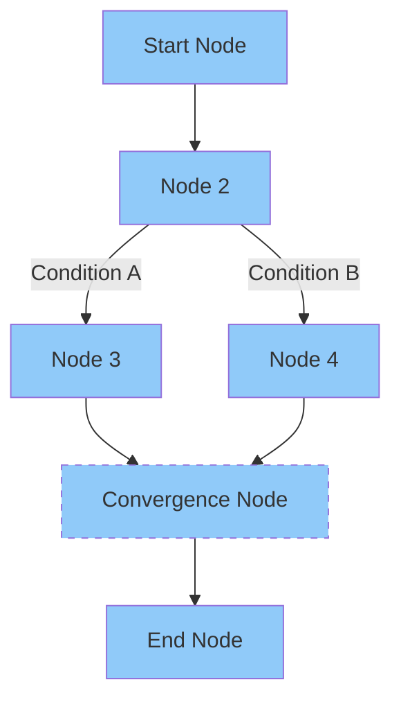
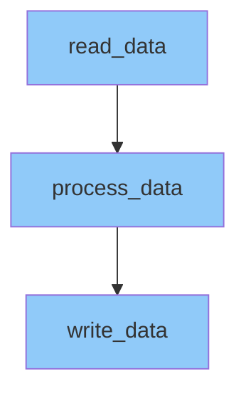
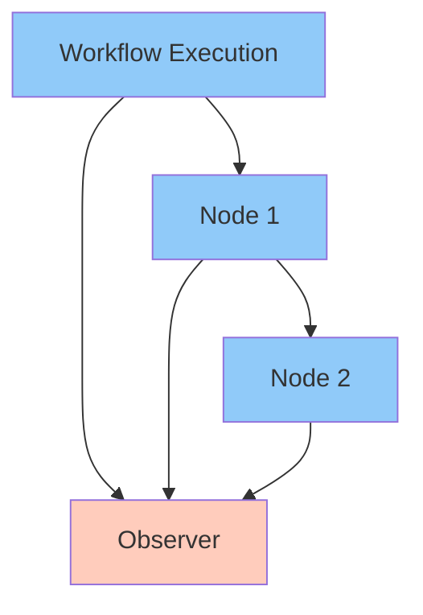
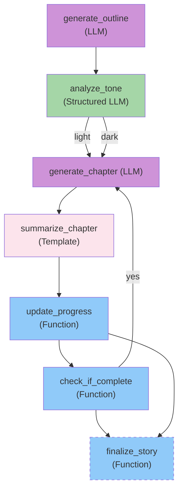

# Quantalogic Flow: Your Workflow Automation Powerhouse 

Welcome to **Quantalogic Flow**, an open-source Python library designed to make workflow automation intuitive, scalable, and powerful. Whether you're orchestrating AI-driven tasks with Large Language Models (LLMs), processing data pipelines, or formatting outputs with templates, Quantalogic Flow has you covered with two flexible approaches: a [**declarative YAML interface**](flow_yaml.md) for simplicity and a **fluent Python API** for dynamic control.
+ [](https://pypi.org/project/quantalogic-flow)
+ [](https://github.com/quantalogic/quantalogic-flow/actions)
+ [](https://github.com/quantalogic/quantalogic-flow/blob/main/LICENSE)

This README is your guide to mastering Quantalogic Flow. Packed with examples, visualizations, and insider tips, it’ll take you from beginner to pro in no time. Let’s dive in and start building workflows that work smarter, not harder!

---

## Table of Contents
1. [Why Quantalogic Flow?](#why-quantalogic-flow)
2. [Installation](#installation)
3. [Quickstart](#quickstart)
4. [Core Concepts](#core-concepts)
   - [Nodes: The Building Blocks](#nodes-the-building-blocks)
   - [Workflows: The Roadmap](#workflows-the-roadmap)
   - [Context: The Glue](#context-the-glue)
5. [Approaches: YAML vs. Fluent API](#approaches-yaml-vs-fluent-api)
   - [YAML Approach](#yaml-approach)
   - [Fluent API Approach](#fluent-api-approach)
6. [Fluent API Examples](#fluent-api-examples)
7. [Advanced Features](#advanced-features)
   - [Input Mapping](#input-mapping)
   - [Dynamic Model Selection](#dynamic-model-selection)
   - [Sub-Workflows](#sub-workflows)
   - [Observers](#observers)
8. [Validation and Debugging](#validation-and-debugging)
9. [Conversion Tools](#conversion-tools)
10. [Case Study: AI-Powered Story Generator](#case-study-ai-powered-story-generator)
11. [Best Practices and Insider Tips](#best-practices-and-insider-tips)
12. [Flow Manager API](#flow-manager-api)
13. [Resources and Community](#resources-and-community)
14. [API Reference](#api-reference)
15. [Flow YAML Reference](#flow-yaml-reference)

---

## Why Quantalogic Flow?

**Why**: Workflows—like generating reports, processing data, or creating AI-driven content—often involve repetitive steps, conditional logic, and data handoffs. Writing this logic from scratch is time-consuming and error-prone. Quantalogic Flow simplifies this by letting you define workflows declaratively or programmatically, saving hours and reducing bugs.

**What**: Quantalogic Flow is a Python library that enables:
- **Declarative YAML workflows**: Human-readable, shareable, and perfect for static processes.
- **Fluent Python API**: Dynamic, code-driven workflows for developers.
- **LLM integration**: Seamlessly use AI models for text generation or structured data extraction.
- **Template rendering**: Format outputs with Jinja2 for polished results.
- **Advanced logic**: Support for branching, looping, and parallel execution.

**How**: You define nodes (tasks) and workflows (sequences), then execute them with a shared context to pass data. Whether you’re a non-coder editing YAML or a developer chaining Python methods, Quantalogic Flow adapts to your style.

---

## Installation

### Prerequisites
- Python 3.10 or higher.
- Basic knowledge of Python and YAML.
- Optional: API keys for LLM providers (e.g., Gemini, OpenAI).

### Installation
Install Quantalogic Flow via pip:
```bash
pip install quantalogic-flow
```

For template nodes, install Jinja2:
```bash
pip install jinja2
```

For structured LLM nodes, install Instructor:
```bash
pip install instructor[litellm]
```

### Setup
Set up your environment by configuring LLM API keys (if using LLM nodes):
```bash
export GEMINI_API_KEY="your-api-key"
```

---

## Quickstart

```python
from quantalogic_flow import Workflow

# Define a simple workflow
workflow = Workflow("start") \
    .node("read", function=lambda ctx: ctx.update({"data": "Hello World"})) \
    .node("write", function=lambda ctx: print(ctx["data"]))

# Run the workflow
workflow.run()
```

---

## Core Concepts

### Nodes: The Building Blocks
Nodes are the individual tasks in a workflow, like workers in a factory. Quantalogic Flow supports four types:

1. **Function Nodes**: Run custom Python code (e.g., data processing).
2. **LLM Nodes**: Generate text using AI models (e.g., story writing).
3. **Structured LLM Nodes**: Extract structured data (e.g., JSON or Pydantic models).
4. **Template Nodes**: Render formatted text with Jinja2 (e.g., reports).

### Workflows: The Roadmap
Workflows define how nodes connect, like a recipe directing kitchen staff. They specify:
- A **start node** to begin execution.
- **Transitions** for sequential, parallel, or conditional flow.
- **Convergence nodes** where parallel paths merge.

### Context: The Glue
The context (`ctx`) is a dictionary that carries data between nodes, like a shared clipboard. Nodes read inputs from the context and write outputs to it.

**Mermaid Diagram: Core Workflow Structure**


---

## Approaches: YAML vs. Fluent API

Quantalogic Flow offers two ways to define workflows: **YAML** for simplicity and **Fluent API** for flexibility. Let’s explore both with a simple example: a workflow that reads a string, converts it to uppercase, and prints it.

### YAML Approach
**Why**: YAML is declarative, readable, and ideal for static workflows or non-coders.
**What**: Define functions, nodes, and workflow structure in a YAML file.
**How**:
```yaml
functions:
  read_data:
    type: embedded
    code: |
      def read_data():
          return "hello world"
  process_data:
    type: embedded
    code: |
      def process_data(data):
          return data.upper()
  write_data:
    type: embedded
    code: |
      def write_data(processed_data):
          print(processed_data)
nodes:
  start:
    function: read_data
    output: data
  process:
    function: process_data
    inputs_mapping:
      data: "data"
    output: processed_data
  end:
    function: write_data
    inputs_mapping:
      processed_data: "processed_data"
workflow:
  start: start
  transitions:
    - from_node: start
      to_node: process
    - from_node: process
      to_node: end
```

**Execution**:
```python
from quantalogic_flow.flow.flow_manager import WorkflowManager
import asyncio

manager = WorkflowManager()
manager.load_from_yaml("simple_workflow.yaml")
workflow = manager.instantiate_workflow()
result = asyncio.run(workflow.build().run({}))
print(result)  # Outputs: HELLO WORLD
```

### Fluent API Approach
**Why**: The Fluent API is programmatic, dynamic, and perfect for developers integrating workflows with Python logic.
**What**: Use method chaining to define nodes and transitions.
**How**:
```python
from quantalogic_flow.flow import Nodes, Workflow

@Nodes.define(output="data")
def read_data():
    return "hello world"

@Nodes.define(output="processed_data")
def process_data(data):
    return data.upper()

@Nodes.define()
def write_data(processed_data):
    print(processed_data)

workflow = (
    Workflow("read_data")
    .node("read_data")
    .then("process_data")
    .then("write_data")
)

async def main():
    result = await workflow.build().run({})
    print(result)

if __name__ == "__main__":
    import asyncio
    asyncio.run(main())  # Outputs: HELLO WORLD
```

**Comparison Table**:
| **Feature**          | **YAML**                     | **Fluent API**               |
|----------------------|------------------------------|------------------------------|
| **Style**            | Declarative, static          | Programmatic, dynamic        |
| **Best For**         | Non-coders, static flows     | Developers, dynamic logic    |
| **Readability**      | High, non-technical          | Moderate, Python-based       |
| **Flexibility**      | Limited by YAML structure    | High, full Python power      |

**Mermaid Diagram: Workflow Flow**


**Insider Tip**: Use YAML for team collaboration or quick prototyping, and switch to Fluent API when you need runtime decisions or integration with existing Python code.

---

## Fluent API Examples

```python
# 1. Basic Workflow
from quantalogic_flow import Workflow

workflow = Workflow("start") \
    .node("read", function=read_data) \
    .node("process", function=process_data) \
    .node("write", function=write_data)

result = workflow.run(context={"data": [1, 2, 3]})
print(result)
```

```python
# 2. Conditional Branching
from quantalogic_flow import Workflow

workflow = Workflow("start") \
    .node("start", function=lambda ctx: ctx.update({"x": ctx["x"] * 2})) \
    .condition(lambda ctx: ctx["x"] > 10, true_node="high_path", false_node="low_path") \
    .node("high_path", function=handle_high) \
    .node("low_path", function=handle_low)

workflow.run(context={"x": 6})
```

```python
# 3. Looping
from quantalogic_flow import Workflow

workflow = Workflow("init") \
    .node("init", function=lambda ctx: ctx.update({"count": 0})) \
    .while_loop(lambda ctx: ctx["count"] < 3) \
        .node("increment", function=lambda ctx: ctx.update({"count": ctx["count"] + 1})) \
    .end_loop()

workflow.run()
```

```python
# 4. Observers and Hooks
from quantalogic_flow import Workflow

def logger(event):
    print(f"{event.node_name} - {event.event_type}")

workflow = Workflow("start") \
    .add_observer(logger) \
    .node("start", function=read_data) \
    .node("end", function=process_data)

workflow.run()
```

```python
# 5. Structured Extraction with LLM into Pydantic model
from quantalogic_flow.flow import Nodes, Workflow
from pydantic import BaseModel

# Define Pydantic models
class Address(BaseModel):
    street: str
    city: str
    zip_code: str

class Person(BaseModel):
    name: str
    age: int
    address: Address

# Node: use LLM to extract structured Person
@Nodes.structured_llm_node(
    system_prompt="Extract person info and format as JSON matching the Pydantic schema.",
    output="person",
    response_model=Person,
    prompt_template="Extract name, age, street, city, zip_code from text:\n{text}",
)
async def extract_person(text: str) -> Person:
    pass

# Node: print result
@Nodes.define(output=None)
async def print_person(person: Person):
    print(f"{person.name} ({person.age}) lives at {person.address.street}, {person.address.city} {person.address.zip_code}")

# Build and run workflow
workflow = Workflow("extract_person") \
    .node("extract_person", inputs_mapping={"text": "input_text"}) \
    .then("print_person")

input_text = "Alice is 30 years old and lives at 123 Main St, Metropolis, 12345."
workflow.run(input_text)
```

---

## Advanced Features

### Input Mapping
**Why**: Hardcoding inputs limits flexibility. Input mapping lets nodes dynamically pull data from the context or compute values.
**What**: Map node parameters to context keys or lambda expressions.
**How**:
```yaml
nodes:
  process:
    function: process_data
    inputs_mapping:
      data: "data"
      prefix: "lambda ctx: 'Processed: ' + ctx['data']"
    output: processed_data
```
**Fluent API**:
```python
.node("process_data", inputs_mapping={"data": "data", "prefix": lambda ctx: "Processed: " + ctx["data"]})
```

### Dynamic Model Selection
**Why**: Different tasks may need different LLMs (e.g., GPT for creativity, Gemini for speed).
**What**: Specify the LLM model dynamically using a lambda.
**How**:
```yaml
nodes:
  generate:
    llm_config:
      model: "lambda ctx: ctx['model_name']"
      prompt_template: "Write about {topic}."
    inputs_mapping:
      topic: "user_topic"
    output: text
```
**Context Example**:
```python
{"model_name": "gemini/gemini-2.0-flash", "user_topic": "space travel"}
```

### Sub-Workflows
**Why**: Break complex workflows into reusable modules.
**What**: Define nested workflows within a node.
**How**:
```yaml
nodes:
  parent_node:
    sub_workflow:
      start: sub_start
      transitions:
        - from_node: sub_start
          to_node: sub_end
```
**Fluent API**:
```python
sub_workflow = Workflow("sub_start").then("sub_end")
workflow.add_sub_workflow("parent_node", sub_workflow, inputs={"key": "value"}, output="result")
```

### Observers
**Why**: Monitor workflow execution for debugging or logging.
**What**: Functions that receive events (e.g., node started, completed).
**How**:
```yaml
functions:
  monitor:
    type: embedded
    code: |
      def monitor(event):
          print(f"Event: {event.event_type.value} @ {event.node_name}")
observers:
  - monitor
```
**Fluent API**:
```python
workflow.add_observer(monitor)
```

**Mermaid Diagram: Observer Integration**


**Insider Tip**: Use observers to track LLM token usage or log errors for quick debugging.

---

## Validation and Debugging

- **Validation**: Ensure your workflow is sound with `validate_workflow_definition()`.
  ```python
  from quantalogic_flow.flow.flow_validator import validate_workflow_definition
  issues = validate_workflow_definition(manager.workflow)
  for issue in issues:
      print(f"Node '{issue.node_name}': {issue.description}")
  ```
- **Debugging**: Attach observers to log context changes or use print statements in function nodes.

**Insider Tip**: Validate early and often to catch circular transitions or missing inputs before execution.

---

## Conversion Tools

Switch between YAML and Python effortlessly:
- **YAML to Python**: Generate executable scripts with `flow_generator.py`.
  ```python
  from quantalogic_flow.flow.flow_generator import generate_executable_script
  manager = WorkflowManager()
  manager.load_from_yaml("workflow.yaml")
  generate_executable_script(manager.workflow, {}, "script.py")
  ```
- **Python to YAML**: Extract Fluent API workflows with `flow_extractor.py`.
  ```python
  from quantalogic_flow.flow.flow_extractor import extract_workflow_from_file
  workflow_def, globals = extract_workflow_from_file("script.py")
  WorkflowManager(workflow_def).save_to_yaml("workflow.yaml")
  ```

**Insider Tip**: Use conversion tools to prototype in YAML, then fine-tune in Python for dynamic tweaks.

---

## Case Study: AI-Powered Story Generator

Let’s build a workflow that generates a multi-chapter story, analyzes its tone, and formats it with a template.

### Objective
1. Generate a story outline with an LLM.
2. Analyze its tone (light or dark) with a structured LLM.
3. Generate chapters based on tone.
4. Summarize each chapter with a template.
5. Loop until all chapters are done, then finalize the story.

### YAML Definition
```yaml
functions:
  update_progress:
    type: embedded
    code: |
      async def update_progress(**context):
          chapters = context.get('chapters', [])
          completed_chapters = context.get('completed_chapters', 0)
          chapter_summary = context.get('chapter_summary', '')
          updated_chapters = chapters + [chapter_summary]
          return {**context, "chapters": updated_chapters, "completed_chapters": completed_chapters + 1}
  check_if_complete:
    type: embedded
    code: |
      async def check_if_complete(completed_chapters=0, num_chapters=0):
          return completed_chapters < num_chapters
  finalize_story:
    type: embedded
    code: |
      async def finalize_story(chapters):
          return "\n".join(chapters)
  monitor:
    type: embedded
    code: |
      def monitor(event):
          print(f"Event: {event.event_type.value} @ {event.node_name}")
nodes:
  generate_outline:
    llm_config:
      model: "lambda ctx: ctx['model_name']"
      system_prompt: "You are a creative writer."
      prompt_template: "Create a story outline for a {genre} story with {num_chapters} chapters."
    inputs_mapping:
      genre: "story_genre"
      num_chapters: "chapter_count"
    output: outline
  analyze_tone:
    llm_config:
      model: "lambda ctx: ctx['model_name']"
      system_prompt: "Analyze the tone."
      prompt_template: "Determine if this outline is light or dark: {outline}."
      response_model: "path.to.ToneModel"
    inputs_mapping:
      outline: "outline"
    output: tone
  generate_chapter:
    llm_config:
      model: "lambda ctx: ctx['model_name']"
      system_prompt: "You are a writer."
      prompt_template: "Write chapter {chapter_num} for this outline: {outline}. Style: {style}."
    inputs_mapping:
      chapter_num: "completed_chapters"
      style: "style"
    output: chapter
  summarize_chapter:
    template_config:
      template: "Chapter {{ chapter_num }}: {{ chapter }}"
    inputs_mapping:
      chapter_num: "completed_chapters"
      chapter: "chapter"
    output: chapter_summary
  update_progress:
    function: update_progress
    output: updated_context
  check_if_complete:
    function: check_if_complete
    output: continue_generating
  finalize_story:
    function: finalize_story
    output: final_story
workflow:
  start: generate_outline
  transitions:
    - from_node: generate_outline
      to_node: analyze_tone
    - from_node: analyze_tone
      to_node:
        - to_node: generate_chapter
          condition: "ctx['tone'] == 'light'"
        - to_node: generate_chapter
          condition: "ctx['tone'] == 'dark'"
    - from_node: generate_chapter
      to_node: summarize_chapter
    - from_node: summarize_chapter
      to_node: update_progress
    - from_node: update_progress
      to_node: check_if_complete
    - from_node: check_if_complete
      to_node: generate_chapter
      condition: "ctx['continue_generating']"
  convergence_nodes:
    - finalize_story
observers:
  - monitor
```

### Pydantic Model
```python
from pydantic import BaseModel

class ToneModel(BaseModel):
    tone: str  # e.g., "light" or "dark"
```

### Execution
```python
from quantalogic_flow.flow.flow_manager import WorkflowManager
import asyncio

manager = WorkflowManager()
manager.load_from_yaml("story_generator.yaml")
workflow = manager.instantiate_workflow()

async def main():
    context = {
        "story_genre": "fantasy",
        "chapter_count": 2,
        "chapters": [],
        "completed_chapters": 0,
        "style": "epic",
        "model_name": "gemini/gemini-2.0-flash"
    }
    result = await workflow.build().run(context)
    print(f"Story:\n{result['final_story']}")

asyncio.run(main())
```

**Mermaid Diagram: Story Generator Workflow**


**Sample Output**:
```
Event: workflow_started @ workflow
Event: node_started @ generate_outline
Event: node_completed @ generate_outline
...
Story:
Chapter 1: A mage discovers a prophecy...
Chapter 2: The mage defeats the dragon...
```

**Insider Tip**: Use `prompt_file` for reusable LLM prompts stored in Jinja2 templates to keep your YAML clean and modular.

---

## Best Practices and Insider Tips

1. **Start Small**: Begin with a simple workflow (e.g., two nodes) to grasp the context flow.
2. **Validate Early**: Run `validate_workflow_definition()` before execution to catch errors.
3. **Optimize LLMs**: Set `temperature=0.3` for consistent outputs, `0.7` for creative tasks.
4. **Reuse Sub-Workflows**: Encapsulate common patterns (e.g., data validation) for modularity.
5. **Log Everything**: Attach observers to track context changes and debug issues.
6. **Test Incrementally**: Add nodes one at a time and test to isolate problems.
7. **Document YAML**: Use comments to explain node purposes for team collaboration.

---

## Flow Manager API

The `WorkflowManager` provides programmatic control over workflow definitions, dependencies, and serialization.

```python
from quantalogic_flow.flow.flow_manager import WorkflowManager
```

### Core Methods

- `__init__(workflow: Optional[WorkflowDefinition] = None)`: create a manager, optionally with an existing definition.
- `_ensure_dependencies()`: install or verify declared dependencies.
- `add_function(name: str, type_: str, code: Optional[str] = None)`: register a Python function (embedded or module).
- `add_node(name: str, function: Optional[str] = None, llm_config: Optional[dict] = None, template_config: Optional[dict] = None, inputs_mapping: dict = None, output: str = None, retries: int = 3, delay: float = 1.0, timeout: Optional[float] = None, parallel: bool = False)`: add a new node definition.
- `add_transition(from_node: str, to_node: Union[str, List[Union[str, BranchCondition]]], condition: Optional[str] = None)`: define edges, including branching.
- `add_loop(loop_nodes: List[str], condition: str, exit_node: str)`: wrap nodes in a while-loop.
- `set_start_node(name: str) / add_convergence_node(name: str) / add_observer(observer_name: str)`: configure execution behavior.
- `load_from_yaml(file_path: str) / save_to_yaml(file_path: str)`: serialize to/from YAML.
- `instantiate_workflow() -> Workflow`: compile to a runnable `Workflow` instance.

### Example: Manual Workflow Construction

```python
from quantalogic_flow.flow.flow_manager import WorkflowManager

mgr = WorkflowManager()
# register custom functions
mgr.add_function('read', 'embedded', code='def read(): return "data"')
mgr.add_function('proc', 'embedded', code='def proc(data): return data.upper()')
# build nodes and transitions
mgr.add_node('start', function='read', output='raw')
mgr.add_node('process', function='proc', inputs_mapping={'data': 'raw'}, output='processed')
mgr.add_transition('start', 'process')
mgr.set_start_node('start')

# instantiate and run
workflow = mgr.instantiate_workflow()
result = workflow.build().run({})
print(result['processed'])  # 'DATA'
```

### Example: YAML-driven Workflow

```yaml
functions:
  loader:
    type: embedded
    code: |
      def loader(): return [1,2,3]
nodes:
  load:
    function: loader
    output: items
workflow:
  start: load
  transitions: []
```

```python
from quantalogic_flow.flow.flow_manager import WorkflowManager
import asyncio

mgr = WorkflowManager()
mgr.load_from_yaml('my_flow.yaml')
mgr.save_to_yaml('exported.yaml')  # reserialize with formatting
workflow = mgr.instantiate_workflow()
asyncio.run(workflow.build().run({}))
```

---

## Resources and Community

- **Documentation**: [Quantalogic Flow Docs](https://github.com/quantalogic/quantalogic-flow)
- **GitHub**: [Repository](https://github.com/quantalogic/quantalogic-flow)
- **Issues**: Report bugs or request features on GitHub.

---

## API Reference

### Workflow Class

- `Workflow(start_node: str)`: initialize a workflow.
- `.node(name: str, inputs_mapping: Optional[dict] = None)`: add a task node.
- `.sequence(*nodes: str)`: add multiple nodes in order.
- `.then(next_node: str, condition: Optional[Callable] = None)`: transition to another node.
- `.branch(conditions: List[Tuple[str, Callable]], next_node: str)`: conditional branching.
- `.converge(node: str)`: merge parallel branches.
- `.while_loop(condition: Callable) / .end_loop()`: loop until condition is false.
- `.add_sub_workflow(name: str, workflow: Workflow, inputs: dict, output: str)`: nest workflows.
- `.build(parent_engine: Optional[WorkflowEngine] = None)`: compile to engine.
- `.run(initial_context: dict or *args)`: execute workflow.

### Node Decorators

- `@Nodes.define(output: str)`: define a pure-Python node.
- `@Nodes.structured_llm_node(...)`: define an LLM-powered node with structured output (response_model).
- `@Nodes.validate_node(output: str)`: define a validation node.
- `@Nodes.transform_node(output: str, transformer: Callable)`: define a transform node.
- `@Nodes.template_node(output: str, template: str or template_file)`: define a Jinja2 template node.

### Utilities Modules

- **flow_extractor.py**: generate Workflow from YAML definitions.
- **flow_generator.py**: codegen helpers for workflows.
- **flow_manager.py**: load, cache, and manage named workflows.
- **flow_manager_schema.py**: Pydantic schemas for flow_manager.
- **flow_mermaid.py**: export workflows to Mermaid diagrams.
- **flow_validator.py**: static validation of YAML or API workflows.
- **flow_yaml.md**: reference for YAML syntax.

### Mermaid Diagram Generation

- `generate_mermaid_diagram(workflow_def: WorkflowDefinition, include_subgraphs: bool = False, title: Optional[str] = None, include_legend: bool = True, diagram_type: str = "flowchart") -> str`: Generate a Mermaid flowchart or state diagram from a `WorkflowDefinition`, with options for pastel styling, subgraphs, and legends.
- `get_node_label_and_type(node_name: str, node_def: Optional[NodeDefinition], has_conditions: bool) -> Tuple[str, str, str]`: Internal helper to create Mermaid-compatible labels, styles, and shapes for nodes based on their definitions and branching conditions.

```python
from quantalogic_flow.flow.flow_mermaid import generate_mermaid_diagram

# Assuming `workflow_def` is a WorkflowDefinition
diagram = generate_mermaid_diagram(workflow_def, title="Sample Workflow")
print(diagram)
```

---

## Flow YAML Reference

A quick overview: The Flow YAML Reference walks you through using the declarative YAML interface to define and configure workflows. It covers file structure, syntax for nodes and workflows, context mappings, branching logic, loops, sub-workflows, and practical examples for common use cases.

[Read the Flow YAML Reference](flow_yaml.md)
