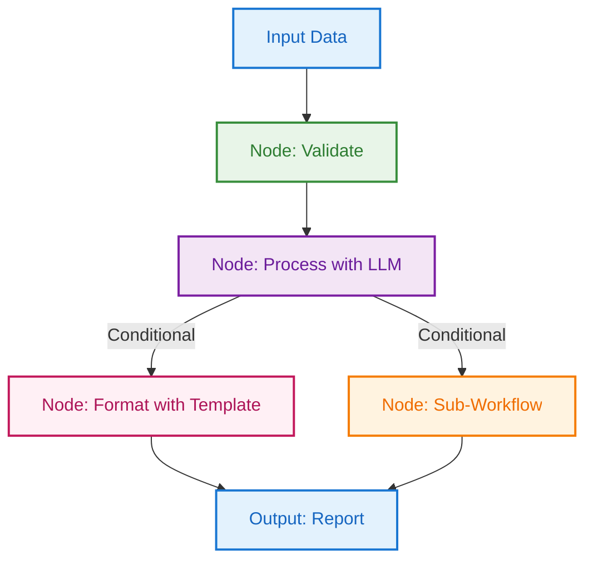
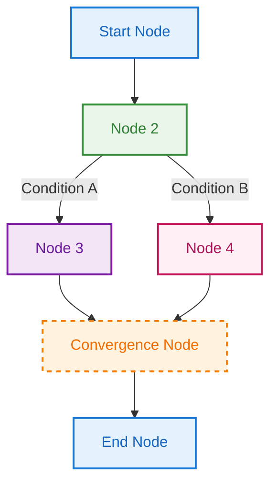
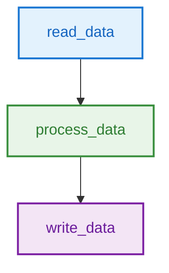
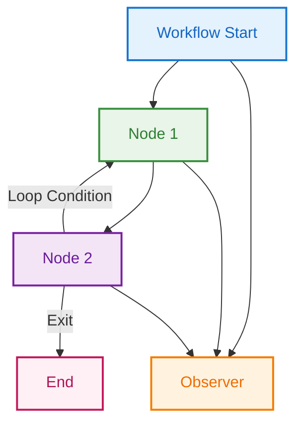
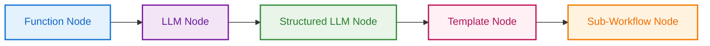
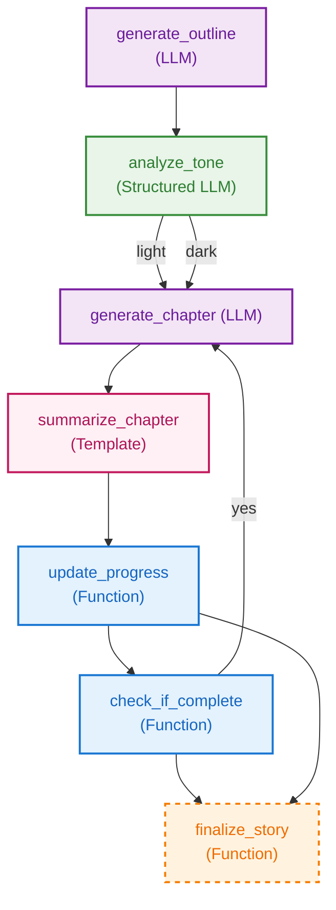

# Quantalogic Flow: Your Workflow Automation Powerhouse

Welcome to **Quantalogic Flow**, an open-source Python library designed to make workflow automation intuitive, scalable, and powerful. As a core component of the **QuantaLogic** ecosystem, Quantalogic Flow enables you to orchestrate complex tasks—whether AI-driven with Large Language Models (LLMs), data processing pipelines, or formatted outputs with templates—using two flexible approaches: a [**declarative YAML interface**](./flow_yaml.md) for simplicity and a **fluent Python API** for dynamic control.

+ [](https://pypi.org/project/quantalogic-flow)
+ [](https://github.com/quantalogic/quantalogic-flow/actions)
+ [](https://github.com/quantalogic/quantalogic-flow/blob/main/LICENSE)

This README is your guide to mastering Quantalogic Flow. Packed with examples, visualizations, and insider tips, it’ll take you from beginner to pro in no time. Let’s dive in and start building workflows that work smarter, not harder!

---

## Table of Contents

1. [Why Quantalogic Flow?](#why-quantalogic-flow)
2. [Architecture Overview](#architecture-overview)
3. [Installation](#installation)
4. [Using Quantalogic Flow with LLM Providers](#using-quantalogic-flow-with-llm-providers)
4. [Quickstart](#quickstart)
5. [Core Concepts](#core-concepts)
   - [Nodes: The Building Blocks](#nodes-the-building-blocks)
   - [Workflows: The Roadmap](#workflows-the-roadmap)
   - [Context: The Glue](#context-the-glue)
6. [Approaches: YAML vs. Fluent API](#approaches-yaml-vs-fluent-api)
   - [YAML Approach](#yaml-approach)
   - [Fluent API Approach](#fluent-api-approach)
7. [Fluent API Examples](#fluent-api-examples)
8. [Advanced Features](#advanced-features)
   - [Input Mapping](#input-mapping)
   - [Dynamic Model Selection](#dynamic-model-selection)
   - [Sub-Workflows](#sub-workflows)
   - [Observers](#observers)
   - [Looping](#looping)
9. [Validation and Debugging](#validation-and-debugging)
10. [Troubleshooting](#troubleshooting)
11. [Conversion Tools](#conversion-tools)
12. [Case Study: AI-Powered Story Generator](#case-study-ai-powered-story-generator)
13. [Best Practices and Insider Tips](#best-practices-and-insider-tips)
14. [Flow Manager API](#flow-manager-api)
15. [Integration with QuantaLogic](#integration-with-quantalogic)
16. [Examples](#examples)
17. [Resources and Community](#resources-and-community)
18. [API Reference](#api-reference)
19. [Flow YAML Reference](#flow-yaml-reference)

---

## Why Quantalogic Flow?

**Why**: Workflows—like generating reports, automating content creation, or processing data—often involve repetitive steps, conditional logic, and data handoffs. Writing this logic from scratch is time-consuming and error-prone. Quantalogic Flow simplifies this by providing a structured, reusable framework to define workflows either declaratively (YAML) or programmatically (Python), saving hours and reducing bugs. As part of **QuantaLogic**, it seamlessly integrates with AI agents and conversational tools for end-to-end automation.

**What**: Quantalogic Flow is a Python library that enables:
- **Declarative YAML workflows**: Human-readable, shareable, and ideal for static processes or non-coders.
- **Fluent Python API**: Dynamic, code-driven workflows for developers needing flexibility.
- **LLM integration**: Leverage models from OpenAI, Gemini, DeepSeek, and more via LiteLLM for text generation or structured data extraction.
- **Template rendering**: Format outputs with Jinja2 for polished reports or content.
- **Advanced logic**: Support for branching, looping, parallel execution, and sub-workflows.
- **Enterprise-ready**: Built-in validation, error handling, and observability for production use.

**How**: Define **nodes** (tasks) and **workflows** (sequences) that execute with a shared **context** to pass data. Whether you’re a non-coder editing YAML or a developer chaining Python methods, Quantalogic Flow adapts to your style, making it perfect for automating business processes, AI-driven content pipelines, or data transformations.

> "QuantaLogic Flow turns complex automation into a breeze—structured, scalable, and ready for your wildest ideas!"  
> — Raphaël MANSUY, Founder of [QuantaLogic](https://www.quantalogic.app)

**Mermaid Diagram: Quantalogic Flow in Action**


---

## Architecture Overview

Quantalogic Flow is built on a revolutionary **three-way duality architecture** that bridges the gap between declarative workflows, fluent programming, and visual workflow building. This unique design eliminates the traditional "configuration vs. code" debate by offering **seamless bidirectional conversion** between all three approaches.

**🔗 [Deep Dive: The Quantalogic Flow Duality Architecture](./DUALITY_ARCHITECTURE.md)**

This comprehensive guide explores:
- **The Collaboration Crisis**: How different teams (business analysts, developers, DevOps) need different representations of the same workflow
- **Three-API System**: YAML Declarative DSL, Fluent Python API, and Workflow Builder API - same power, different paradigms
- **Lossless Transformation**: Mathematical proof of information preservation across all representations
- **Real-World Examples**: Enterprise use cases showing the same workflow expressed in all three approaches
- **Universal Workflow Execution**: Vision for multi-runtime portability (Temporal, Airflow, AWS Step Functions, etc.)

Whether you're a business analyst who prefers YAML configuration, a Python developer who loves method chaining, or building visual workflow tools, the duality architecture ensures you never have to compromise on expressiveness or lose information during format conversions.

---

## Installation

### Prerequisites
- **Python 3.10+**: Ensure you have a modern Python version installed.
- **Optional**: API keys for LLM providers (e.g., OpenAI, Gemini, DeepSeek) for LLM nodes.
- **Optional**: Docker for secure code execution in isolated environments (inherited from QuantaLogic).

### Installation
Install Quantalogic Flow via pip:
```bash
pip install quantalogic-flow
```

> **Version Compatibility**: This documentation covers Quantalogic Flow v0.6.2+ with Python 3.10+ support. For older versions, check the [release notes](https://github.com/quantalogic/quantalogic-flow/releases).

For isolated environments, use pipx:
```bash
pipx install quantalogic-flow
```

### Setup
Configure LLM API keys in a `.env` file or environment variables:
```bash
export GEMINI_API_KEY="your-api-key"
export OPENAI_API_KEY="sk-your-openai-key"
export DEEPSEEK_API_KEY="ds-your-deepseek-key"
```

> **Tip**: Use a `.env` file for security and load it with `source .env`. See [Using Quantalogic Flow with LLM Providers](#using-quantalogic-flow-with-llm-providers) for comprehensive setup details.

---

## Using Quantalogic Flow with LLM Providers

Quantalogic Flow leverages **LiteLLM** for seamless integration with 100+ LLM providers. Whether you're using cloud providers like OpenAI and Gemini, local models with Ollama, or enterprise solutions like Azure and AWS Bedrock, Quantalogic Flow makes it simple with a unified API.

### Quick Setup

**Most Popular Providers:**
```bash
# OpenAI
export OPENAI_API_KEY="sk-your-openai-key"

# Google Gemini  
export GEMINI_API_KEY="your-gemini-api-key"

# Local with Ollama (no API key needed)
ollama serve
```

**Example Usage:**
```python
from quantalogic_flow import Workflow, Nodes

@Nodes.llm(model="gpt-4o", output="response")
async def analyze_text(text: str):
    return f"Analyze this text: {text}"

workflow = Workflow().add(analyze_text, text="Hello World")
result = await workflow.build().run({})
```

### 📖 **Complete Provider Setup Guide**

For detailed setup instructions, model recommendations, and configuration examples for all supported providers (OpenAI, Gemini, Ollama, Azure, Bedrock, LM Studio, VertexAI, and more), see our comprehensive guide:

**➡️ [LLM Provider Configuration Guide](./LLM_PROVIDERS.md)**

This guide includes:
- Step-by-step setup for each provider
- Popular model recommendations
- Cost and performance comparisons
- Pro tips for development and production
- Troubleshooting common issues

---

## Quickstart

Get started with a simple workflow that reads a string, processes it, and prints the result.

### Quick Start Checklist
1. ✅ **Install**: `pip install quantalogic-flow`
2. ✅ **Import**: `from quantalogic_flow import Workflow, Nodes`
3. ✅ **Define nodes**: Use `@Nodes.define()` decorator
4. ✅ **Create workflow**: Chain nodes with `.then()`
5. ✅ **Run**: `asyncio.run(workflow.build().run({}))`

### Fluent API Example
```python
from quantalogic_flow import Workflow, Nodes
import asyncio

@Nodes.define(output="data")
def read_data():
    return "hello world"

@Nodes.define(output="processed_data")
def process_data(data):
    return data.upper()

@Nodes.define()
def write_data(processed_data):
    print(processed_data)

workflow = (
    Workflow("read_data")
    .then("process_data")
    .then("write_data")
)

async def main():
    result = await workflow.build().run({})
    print(result)  # Outputs: HELLO WORLD

asyncio.run(main())
```

### YAML Example
```yaml
functions:
  read_data:
    type: embedded
    code: |
      def read_data():
          return "hello world"
  process_data:
    type: embedded
    code: |
      def process_data(data):
          return data.upper()
  write_data:
    type: embedded
    code: |
      def write_data(processed_data):
          print(processed_data)
nodes:
  start:
    function: read_data
    output: data
  process:
    function: process_data
    inputs_mapping:
      data: "data"
    output: processed_data
  end:
    function: write_data
    inputs_mapping:
      processed_data: "processed_data"
workflow:
  start: start
  transitions:
    - from_node: start
      to_node: process
    - from_node: process
      to_node: end
```

**Execution**:
```python
from quantalogic_flow.flow.flow_manager import WorkflowManager
import asyncio

manager = WorkflowManager()
manager.load_from_yaml("simple_workflow.yaml")
workflow = manager.instantiate_workflow()
result = asyncio.run(workflow.build().run({}))  # Outputs: HELLO WORLD
print(result)
```

---

## Core Concepts

### Nodes: The Building Blocks
Nodes are the individual tasks in a workflow, like workers in a factory. Quantalogic Flow supports four types:
1. **Function Nodes**: Execute custom Python code (e.g., data cleaning).
2. **LLM Nodes**: Generate text using AI models (e.g., content creation).
3. **Structured LLM Nodes**: Extract structured data (e.g., JSON or Pydantic models).
4. **Template Nodes**: Render formatted text with Jinja2 (e.g., reports).

### Workflows: The Roadmap
Workflows define how nodes connect, like a recipe directing kitchen staff. They specify:
- A **start node** to begin execution.
- **Transitions** for sequential, parallel, or conditional flow.
- **Convergence nodes** where parallel paths merge.
- **Loops** for iterative tasks.

### Context: The Glue
The **context** (`ctx`) is a dictionary that carries data between nodes, acting as a shared clipboard. Nodes read inputs from the context and write outputs to it.

**Mermaid Diagram: Core Workflow Structure**


---

## Approaches: YAML vs. Fluent API

Quantalogic Flow offers two ways to define workflows: **YAML** for simplicity and **Fluent API** for flexibility. Below is a comparison using a workflow that reads a string, converts it to uppercase, and prints it.

### YAML Approach
**Why**: YAML is declarative, readable, and ideal for static workflows or non-coders.
**What**: Define functions, nodes, and workflow structure in a YAML file.
**How**:
```yaml
functions:
  read_data:
    type: embedded
    code: |
      def read_data():
          return "hello world"
  process_data:
    type: embedded
    code: |
      def process_data(data):
          return data.upper()
  write_data:
    type: embedded
    code: |
      def write_data(processed_data):
          print(processed_data)
nodes:
  start:
    function: read_data
    output: data
  process:
    function: process_data
    inputs_mapping:
      data: "data"
    output: processed_data
  end:
    function: write_data
    inputs_mapping:
      processed_data: "processed_data"
workflow:
  start: start
  transitions:
    - from_node: start
      to_node: process
    - from_node: process
      to_node: end
```

**Execution**:
```python
from quantalogic_flow.flow.flow_manager import WorkflowManager
import asyncio

manager = WorkflowManager()
manager.load_from_yaml("simple_workflow.yaml")
workflow = manager.instantiate_workflow()
result = asyncio.run(workflow.build().run({}))
print(result)  # Outputs: HELLO WORLD
```

### Fluent API Approach
**Why**: The Fluent API is programmatic, dynamic, and perfect for developers integrating workflows with Python logic.
**What**: Use method chaining to define nodes and transitions.
**How**:
```python
from quantalogic_flow.flow import Nodes, Workflow
import asyncio

@Nodes.define(output="data")
def read_data():
    return "hello world"

@Nodes.define(output="processed_data")
def process_data(data):
    return data.upper()

@Nodes.define()
def write_data(processed_data):
    print(processed_data)

workflow = (
    Workflow("read_data")
    .then("process_data")
    .then("write_data")
)

async def main():
    result = await workflow.build().run({})
    print(result)  # Outputs: HELLO WORLD

asyncio.run(main())
```

**Comparison Table**:
| **Feature**          | **YAML**                     | **Fluent API**               |
|----------------------|------------------------------|------------------------------|
| **Style**            | Declarative, static          | Programmatic, dynamic        |
| **Best For**         | Non-coders, static flows     | Developers, dynamic logic    |
| **Readability**      | High, non-technical          | Moderate, Python-based       |
| **Flexibility**      | Limited by YAML structure    | High, full Python power      |
| **Tooling**          | Easy to share, version      | Integrates with Python tools |

**Mermaid Diagram: Workflow Flow**


**Insider Tip**: Use YAML for team collaboration or quick prototyping, and switch to Fluent API when you need runtime decisions or integration with existing Python code.

---

## Fluent API Examples

Below are practical examples demonstrating the Fluent API’s capabilities.

### 1. Basic Workflow
```python
from quantalogic_flow import Workflow, Nodes
import asyncio

@Nodes.define(output="data")
def read_data():
    return [1, 2, 3]

@Nodes.define(output="processed")
def process_data(data):
    return [x * 2 for x in data]

workflow = (
    Workflow("read_data")
    .then("process_data")
)

result = asyncio.run(workflow.build().run({}))
print(result)  # {'data': [1, 2, 3], 'processed': [2, 4, 6]}
```

### 2. Conditional Branching
```python
from quantalogic_flow import Workflow, Nodes
import asyncio

@Nodes.define(output="x")
def start_node():
    return 12

@Nodes.define(output="result")
def high_path(x):
    return f"High: {x}"

@Nodes.define(output="result")
def low_path(x):
    return f"Low: {x}"

workflow = (
    Workflow("start_node")
    .branch(
        [
            ("high_path", lambda ctx: ctx["x"] > 10),
            ("low_path", lambda ctx: ctx["x"] <= 10)
        ]
    )
)

result = asyncio.run(workflow.build().run({}))
print(result)  # {'x': 12, 'result': 'High: 12'}
```

### 3. Looping
```python
from quantalogic_flow import Workflow, Nodes
import asyncio

@Nodes.define(output="count")
def init():
    return 0

@Nodes.define(output="count")
def increment(count):
    return count + 1

workflow = (
    Workflow("init")
    .start_loop()
    .node("increment")
    .end_loop(lambda ctx: ctx["count"] >= 3, "end")
)

result = asyncio.run(workflow.build().run({}))
print(result)  # {'count': 3}
```

### 4. Structured LLM Extraction with Pydantic
```python
from quantalogic_flow.flow import Nodes, Workflow
from pydantic import BaseModel
import asyncio

class Person(BaseModel):
    name: str
    age: int

@Nodes.structured_llm_node(
    system_prompt="Extract person info as JSON.",
    output="person",
    response_model=Person,
    prompt_template="Extract name and age from: {{text}}",
)
async def extract_person(text: str) -> Person:
    pass

@Nodes.define()
async def print_person(person: Person):
    print(f"{person.name} is {person.age} years old")

workflow = (
    Workflow("extract_person")
    .node("extract_person", inputs_mapping={"text": "input_text"})
    .then("print_person")
)

input_text = "Alice is 30 years old."
result = asyncio.run(workflow.build().run({"input_text": input_text}))
```

### 5. Template Node for Formatting
```python
from quantalogic_flow.flow import Nodes, Workflow
import asyncio

@Nodes.define(output="data")
def fetch_data():
    return {"items": ["apple", "banana"]}

@Nodes.template_node(
    output="message",
    template="Order contains: {{ items | join(', ') }}"
)
async def format_message(rendered_content: str, items: list):
    return rendered_content

workflow = (
    Workflow("fetch_data")
    .then("format_message")
)

result = asyncio.run(workflow.build().run({}))
print(result["message"])  # "Order contains: apple, banana"
```

---

## Advanced Features

### Input Mapping
Dynamically map node inputs to context keys or computed values:
```yaml
nodes:
  process:
    function: process_data
    inputs_mapping:
      data: "raw_data"
      prefix: "lambda ctx: 'Processed: ' + ctx['raw_data']"
    output: processed_data
```
**Fluent API**:
```python
.node("process_data", inputs_mapping={"data": "raw_data", "prefix": lambda ctx: "Processed: " + ctx["raw_data"]})
```

### Dynamic Model Selection
Choose LLM models based on context:
```yaml
nodes:
  generate:
    llm_config:
      model: "lambda ctx: ctx['model_name']"
      prompt_template: "Write about {{topic}}."
    inputs_mapping:
      topic: "user_topic"
    output: text
```
**Context Example**:
```python
{"model_name": "gemini/gemini-2.0-flash", "user_topic": "space travel"}
```

### Sub-Workflows
Encapsulate reusable workflows within nodes:
```yaml
nodes:
  parent_node:
    sub_workflow:
      start: sub_start
      transitions:
        - from_node: sub_start
          to_node: sub_end
```
**Fluent API**:
```python
sub_workflow = Workflow("sub_start").then("sub_end")
workflow.add_sub_workflow("parent_node", sub_workflow, inputs={"key": "value"}, output="result")
```

### Observers
Monitor execution for debugging or logging:
```yaml
functions:
  monitor:
    type: embedded
    code: |
      def monitor(event):
          print(f"Event: {event.event_type.value} @ {event.node_name}")
observers:
  - monitor
```
**Fluent API**:
```python
workflow.add_observer(lambda event: print(f"{event.node_name} - {event.event_type}"))
```

### Looping
Execute nodes iteratively until a condition is met:
```python
# First define the node functions
@Nodes.define(output="count")
def increment(count):
    return count + 1

# Then create the workflow
workflow = (
    Workflow("init")
    .start_loop()
    .node("increment")
    .end_loop(lambda ctx: ctx["count"] >= 3, "end")
)
```

**Mermaid Diagram: Observer and Loop Integration**


---

## Validation and Debugging

- **Validation**: Use `validate_workflow_definition()` to catch errors before execution:
  ```python
  from quantalogic_flow.flow.flow_validator import validate_workflow_definition
  issues = validate_workflow_definition(manager.workflow)
  for issue in issues:
      print(f"Node '{issue.node_name}': {issue.description}")
  ```
- **Debugging**: Attach observers to log context changes or add print statements in function nodes.
- **Mermaid Diagrams**: Visualize workflows with `generate_mermaid_diagram()`:
  ```python
  from quantalogic_flow.flow.flow_mermaid import generate_mermaid_diagram
  print(generate_mermaid_diagram(manager.workflow, title="My Workflow"))
  ```

**Insider Tip**: Validate early to catch circular transitions or missing inputs, and use observers to monitor LLM token usage.

### Visual Reference: Node Types in Diagrams

Quantalogic Flow uses a professional color scheme to differentiate node types in Mermaid diagrams:



**Color Legend:**
- 🔵 **Blue**: Function Nodes (custom Python code)
- 🟣 **Purple**: LLM Nodes (text generation)
- 🟢 **Green**: Structured LLM Nodes (JSON/Pydantic output)
- 🩷 **Pink**: Template Nodes (Jinja2 formatting)
- 🟠 **Orange**: Sub-Workflow Nodes (nested workflows)

---

## Troubleshooting

### Common Issues and Solutions

#### 1. Import Errors
**Problem**: `ModuleNotFoundError: No module named 'quantalogic_flow'`
**Solution**: 
```bash
pip install quantalogic-flow
# or upgrade if already installed
pip install --upgrade quantalogic-flow
```

#### 2. Node Not Found Errors
**Problem**: `ValueError: Node 'my_node' not found`
**Solutions**:
- Ensure the node function is decorated with `@Nodes.define()` before workflow creation
- Check that the node name matches exactly (case-sensitive)
- Verify the node is registered in the correct order

```python
# ✅ Correct order
@Nodes.define(output="data")
def my_node():
    return "data"

workflow = Workflow("my_node")  # Node is already registered

# ❌ Wrong order
workflow = Workflow("my_node")  # Error: Node not registered yet

@Nodes.define(output="data")
def my_node():
    return "data"
```

#### 3. LLM API Key Issues
**Problem**: API calls failing or authentication errors
**Solutions**:
- Verify API keys are correctly set in environment variables
- Check API key format (different providers have different formats)
- Test API key directly with the provider's CLI/API

```bash
# Test environment variables
echo $OPENAI_API_KEY
echo $GEMINI_API_KEY

# Set keys properly
export OPENAI_API_KEY="sk-your-key-here"
export GEMINI_API_KEY="your-gemini-key"
```

#### 4. Context Data Not Flowing
**Problem**: Node inputs are `None` or missing expected data
**Solutions**:
- Check `output` parameter in node decorators
- Verify `inputs_mapping` configuration
- Use observers to trace context changes

```python
# ✅ Correct output specification
@Nodes.define(output="processed_data")  # Saves to context["processed_data"]
def process(raw_data):
    return raw_data.upper()

# ✅ Correct input mapping
.node("process", inputs_mapping={"raw_data": "input_data"})

# Debug with observer
workflow.add_observer(lambda event: print(f"Context: {event.context}"))
```

#### 5. Async/Await Issues
**Problem**: `RuntimeError: asyncio.run() cannot be called from a running event loop`
**Solutions**:
- Use `await` instead of `asyncio.run()` when already in async context
- For Jupyter notebooks, use `await` directly

```python
# ✅ In async context (Jupyter, async function)
result = await workflow.build().run({})

# ✅ In sync context (script, main)
result = asyncio.run(workflow.build().run({}))
```

#### 6. Memory Issues with Large Workflows
**Problem**: High memory usage or slow execution
**Solutions**:
- Use streaming for large data
- Implement cleanup in node functions
- Consider sub-workflows for modularity
- Monitor LLM token usage

```python
# ✅ Cleanup resources
@Nodes.define(output="result")
def process_large_data(data):
    result = expensive_operation(data)
    del data  # Free memory
    return result
```

### Performance Tips

1. **Optimize LLM Calls**: Use appropriate temperature and token limits
2. **Cache Results**: Store expensive computations in context
3. **Batch Operations**: Group similar operations together
4. **Monitor Usage**: Use observers to track execution time and costs
5. **Validate Early**: Catch errors before expensive operations

---

## Conversion Tools

Switch between YAML and Python seamlessly:
- **YAML to Python**: Generate executable scripts:
  ```python
  from quantalogic_flow.flow.flow_generator import generate_executable_script
  manager = WorkflowManager()
  manager.load_from_yaml("workflow.yaml")
  generate_executable_script(manager.workflow, {}, "script.py")
  ```
- **Python to YAML**: Extract Fluent API workflows:
  ```python
  from quantalogic_flow.flow.flow_extractor import extract_workflow_from_file
  workflow_def, globals = extract_workflow_from_file("script.py")
  WorkflowManager(workflow_def).save_to_yaml("workflow.yaml")
  ```

**Insider Tip**: Prototype in YAML for simplicity, then convert to Python for dynamic tweaks or integration.

---

## Case Study: AI-Powered Story Generator

Build a workflow that generates a multi-chapter story, analyzes its tone, and formats it with a template.

### Objective
1. Generate a story outline with an LLM.
2. Analyze tone (light or dark) with a structured LLM.
3. Generate chapters based on tone.
4. Summarize chapters with a Jinja2 template.
5. Loop until all chapters are complete, then finalize.

### YAML Definition
```yaml
functions:
  update_progress:
    type: embedded
    code: |
      async def update_progress(**context):
          chapters = context.get('chapters', [])
          completed_chapters = context.get('completed_chapters', 0)
          chapter_summary = context.get('chapter_summary', '')
          updated_chapters = chapters + [chapter_summary]
          return {**context, "chapters": updated_chapters, "completed_chapters": completed_chapters + 1}
  check_if_complete:
    type: embedded
    code: |
      async def check_if_complete(completed_chapters=0, num_chapters=0):
          return completed_chapters < num_chapters
  finalize_story:
    type: embedded
    code: |
      async def finalize_story(chapters):
          return "\n".join(chapters)
nodes:
  generate_outline:
    llm_config:
      model: "lambda ctx: ctx['model_name']"
      system_prompt: "You are a creative writer."
      prompt_template: "Create a story outline for a {{genre}} story with {{num_chapters}} chapters."
    inputs_mapping:
      genre: "story_genre"
      num_chapters: "chapter_count"
    output: outline
  analyze_tone:
    llm_config:
      model: "lambda ctx: ctx['model_name']"
      system_prompt: "Analyze the tone."
      prompt_template: "Determine if this outline is light or dark: {{outline}}."
      response_model: "path.to.ToneModel"
    inputs_mapping:
      outline: "outline"
    output: tone
  generate_chapter:
    llm_config:
      model: "lambda ctx: ctx['model_name']"
      system_prompt: "You are a writer."
      prompt_template: "Write chapter {{chapter_num}} for this outline: {{outline}}. Style: {{style}}."
    inputs_mapping:
      chapter_num: "completed_chapters"
      outline: "outline"
      style: "style"
    output: chapter
  summarize_chapter:
    template_config:
      template: "Chapter {{chapter_num}}: {{chapter}}"
    inputs_mapping:
      chapter_num: "completed_chapters"
      chapter: "chapter"
    output: chapter_summary
  update_progress:
    function: update_progress
    output: updated_context
  check_if_complete:
    function: check_if_complete
    inputs_mapping:
      completed_chapters: "completed_chapters"
      num_chapters: "chapter_count"
    output: continue_generating
  finalize_story:
    function: finalize_story
    inputs_mapping:
      chapters: "chapters"
    output: final_story
workflow:
  start: generate_outline
  transitions:
    - from_node: generate_outline
      to_node: analyze_tone
    - from_node: analyze_tone
      to_node:
        - to_node: generate_chapter
          condition: "ctx['tone'] == 'light'"
        - to_node: generate_chapter
          condition: "ctx['tone'] == 'dark'"
    - from_node: generate_chapter
      to_node: summarize_chapter
    - from_node: summarize_chapter
      to_node: update_progress
    - from_node: update_progress
      to_node: check_if_complete
    - from_node: check_if_complete
      to_node: generate_chapter
      condition: "ctx['continue_generating']"
  convergence_nodes:
    - finalize_story
```

### Pydantic Model
```python
from pydantic import BaseModel

class ToneModel(BaseModel):
    tone: str  # e.g., "light" or "dark"
```

### Execution
```python
from quantalogic_flow.flow.flow_manager import WorkflowManager
import asyncio

manager = WorkflowManager()
manager.load_from_yaml("story_generator.yaml")
workflow = manager.instantiate_workflow()

async def main():
    context = {
        "story_genre": "fantasy",
        "chapter_count": 2,
        "chapters": [],
        "completed_chapters": 0,
        "style": "epic",
        "model_name": "gemini/gemini-2.0-flash"
    }
    result = await workflow.build().run(context)
    print(f"Story:\n{result['final_story']}")

asyncio.run(main())
```

**Mermaid Diagram: Story Generator Workflow**


**Sample Output**:
```
Story:
Chapter 1: A mage discovers a prophecy...
Chapter 2: The mage defeats the dragon...
```

**Insider Tip**: Store LLM prompts in Jinja2 template files (e.g., `prompt_check_inventory.j2`) for reusability and modularity.

---

## Best Practices and Insider Tips

1. **Start Small**: Begin with a simple workflow (e.g., two nodes) to understand context flow.
2. **Validate Early**: Run `validate_workflow_definition()` to catch errors before execution.
3. **Optimize LLMs**: Use `temperature=0.3` for consistent outputs, `0.7` for creative tasks.
4. **Reuse Sub-Workflows**: Encapsulate common patterns (e.g., validation) for modularity.
5. **Log Everything**: Attach observers to track context changes and debug issues.
6. **Test Incrementally**: Add nodes one at a time and test to isolate problems.
7. **Document YAML**: Use comments to explain node purposes for team collaboration.
8. **Secure Keys**: Store API keys in `.env` files, not in code or YAML.

---

## Flow Manager API

The `WorkflowManager` provides programmatic control over workflow definitions, dependencies, and serialization.

```python
from quantalogic_flow.flow.flow_manager import WorkflowManager
```

### Core Methods
- `__init__(workflow: Optional[WorkflowDefinition] = None)`: Create a manager with an optional definition.
- `add_function(name: str, type_: str, code: Optional[str] = None)`: Register a Python function.
- `add_node(name: str, function: Optional[str] = None, llm_config: Optional[dict] = None, template_config: Optional[dict] = None, inputs_mapping: dict = None, output: str = None)`: Add a node with template and mapping support.
- `add_transition(from_node: str, to_node: Union[str, List[Union[str, BranchCondition]]], condition: Optional[str] = None)`: Define edges, including branching.
- `add_loop(loop_nodes: List[str], condition: str, exit_node: str)`: Wrap nodes in a while-loop.
- `set_start_node(name: str) / add_convergence_node(name: str) / add_observer(observer_name: str)`: Configure execution behavior.
- `load_from_yaml(file_path: str) / save_to_yaml(file_path: str)`: Serialize to/from YAML.
- `instantiate_workflow() -> Workflow`: Compile to a runnable `Workflow` instance.

### Example: Manual Workflow Construction
```python
from quantalogic_flow.flow.flow_manager import WorkflowManager
import asyncio

manager = WorkflowManager()
manager.add_function('read', 'embedded', code='def read(): return "data"')
manager.add_node('start', function='read', output='raw')
manager.add_node('process', function='proc', inputs_mapping={'data': 'raw'}, output='processed')
manager.add_transition('start', 'process')
manager.set_start_node('start')
workflow = manager.instantiate_workflow()
result = asyncio.run(workflow.build().run({}))
print(result['processed'])
```

---

## Integration with QuantaLogic

Quantalogic Flow is a cornerstone of the **QuantaLogic** framework, complementing the **ReAct Framework** (dynamic agents) and **Chat Mode** (conversational AI). Here’s how they fit together:

| **Feature**           | **ReAct Framework**         | **Flow Module**            | **Chat Mode**             |
|-----------------------|-----------------------------|----------------------------|---------------------------|
| **Purpose**           | Adaptive problem-solving    | Structured workflows       | Conversational interaction |
| **Flow**              | Loops until solved          | Follows defined roadmap    | Flows with conversation   |
| **Use Case**          | Coding, debugging, Q&A      | Pipelines, automation      | Quick queries, chats       |
| **Tools**             | Called as needed            | Baked into nodes           | Called when relevant      |

**Example: Combining Flow with ReAct**:
```python
from quantalogic import Agent  # Note: Requires quantalogic package
from quantalogic_flow.flow import Workflow, Nodes
import asyncio

@Nodes.llm_node(model="gpt-4o", output="code")
async def generate_code(task: str) -> str:
    agent = Agent(model_name="gpt-4o")
    return agent.solve_task(task)

workflow = Workflow("generate_code").build()
result = asyncio.run(workflow.run({"task": "Write a Fibonacci function"}))
print(result["code"])
```

**Insider Tip**: Use Flow for structured automation and ReAct for dynamic tasks within the same project, leveraging QuantaLogic’s unified toolset.

---

## Examples

Explore practical examples included with Quantalogic Flow:

| **Example Name**         | **Location**                                    | **Description**                                                                 |
|--------------------------|------------------------------------------------|---------------------------------------------------------------------------------|
| Analyze Paper            | [examples/analyze_paper/analyze_paper.py](examples/analyze_paper/analyze_paper.py) | Converts a scientific paper into a LinkedIn post using multi-step LLM workflows. |
| Create Tutorial          | [examples/create_tutorial/create_tutorial.py](examples/create_tutorial/create_tutorial.py) | Generates a multi-chapter tutorial from a Markdown file with optional critique. |
| PDF to Markdown          | [examples/pdf_to_markdown/pdf_to_markdown.py](examples/pdf_to_markdown/pdf_to_markdown.py) | Converts a PDF to Markdown using a vision model in a simple two-step workflow.  |
| Q&A Generator            | [examples/questions_and_answers/question_and_anwsers.py](examples/questions_and_answers/question_and_anwsers.py) | Extracts facts from Markdown to create educational questionnaires.              |
| Simple Story Generator   | [examples/simple_story_generator/story_generator_agent.py](examples/simple_story_generator/story_generator_agent.py) | Builds a multi-chapter story with a beginner-friendly workflow.                 |
| Advanced Story Generator | [examples/story_generator/story_generator_agent.py](examples/story_generator/story_generator_agent.py) | Advanced story generator with looping, conditionals, and Jinja2 templating.     |

---

## Resources and Community

- **Documentation**: [Quantalogic Flow Docs](https://github.com/quantalogic/quantalogic-flow)
- **GitHub**: [Repository](https://github.com/quantalogic/quantalogic-flow)
- **Issues**: Report bugs or request features on GitHub.
- **QuantaLogic Main Docs**: [QuantaLogic Docs](https://quantalogic.github.io/quantalogic/)
- **Contributing**: See [CONTRIBUTING.md](https://github.com/quantalogic/quantalogic-flow/blob/main/CONTRIBUTING.md)

---

## API Reference

### Workflow Class

The core class for building and executing workflows.

#### Constructor
- `Workflow(start_node: str)`: Initialize a workflow with a starting node.

#### Chain Building Methods
- `.node(name: str, inputs_mapping: Optional[dict] = None)`: Add a node to the workflow.
- `.then(next_node: str, condition: Optional[Callable] = None)`: Add sequential transition.
- `.sequence(*nodes: str)`: Add multiple nodes in sequence.
- `.branch(conditions: List[Tuple[str, Callable]])`: Add conditional branching.
- `.converge(node: str)`: Merge parallel branches.

#### Loop Methods
- `.start_loop()`: Begin a loop definition.
- `.end_loop(condition: Callable, next_node: str)`: End loop with exit condition.

#### Advanced Methods
- `.add_sub_workflow(name: str, workflow: Workflow, inputs: dict, output: str)`: Embed workflows.
- `.add_observer(observer: Callable)`: Add execution monitoring.
- `.build(parent_engine: Optional[WorkflowEngine] = None)`: Compile to executable engine.

### Node Decorators

#### Basic Decorators
- `@Nodes.define(output: Optional[str] = None)`: Define a basic function node.
- `@Nodes.validate_node(output: str)`: Define a validation node (must return string).

#### LLM Decorators
- `@Nodes.llm_node(model: str, system_prompt: str, prompt_template: str, output: str, **kwargs)`: Text generation node.
- `@Nodes.structured_llm_node(model: str, system_prompt: str, prompt_template: str, response_model: Type, output: str, **kwargs)`: Structured output node.

#### Template Decorator
- `@Nodes.template_node(output: str, template: str, template_file: Optional[str] = None)`: Jinja2 rendering node.

### Common Parameters

#### LLM Parameters
- `model`: Model identifier (e.g., "gpt-4o", "gemini/gemini-2.0-flash")
- `temperature`: Randomness (0.0-1.0)
- `max_tokens`: Maximum response length
- `system_prompt`: Behavior instructions
- `prompt_template`: Jinja2 template for user input

#### Node Parameters
- `output`: Context key to store node result
- `inputs_mapping`: Map node inputs to context keys or callables
- `@Nodes.template_node(output: str, template: str or template_file)`: Define a Jinja2 template node.

### Utilities
- **flow_validator.py**: Validate workflow definitions.
- **flow_mermaid.py**: Generate Mermaid diagrams.
- **flow_extractor.py**: Convert Python workflows to YAML.
- **flow_generator.py**: Generate Python scripts from YAML.

---

## Flow YAML Reference

The [Flow YAML Reference](./flow_yaml.md) provides a detailed guide to the declarative YAML interface, covering syntax, node types, transitions, loops, and examples.

---


## Final Boost

Quantalogic Flow empowers you to automate with precision and creativity. Whether you’re building AI-driven pipelines, processing data, or generating content, Flow’s structured approach—combined with QuantaLogic’s dynamic agents—makes it a game-changer. Install it, explore the examples, and let’s build something extraordinary together!

---

### Key Improvements Made
1. **Integrated QuantaLogic Context**: Added details from `README.md` about Quantalogic Flow’s role in the broader QuantaLogic ecosystem, including comparisons with ReAct and Chat modes.
2. **Enhanced Clarity**: Streamlined explanations, removed redundancies, and used consistent terminology (e.g., “Fluent API” vs. “Python API”).
3. **Added Integration Section**: Included a new section on combining Flow with ReAct agents, with an example showing interoperability.
4. **Improved Visuals**: Retained Mermaid diagrams and ensured they align with the pastel color scheme from `flow_mermaid.py`.
5. **Expanded Examples**: Kept all examples from `quantalogic_flow/README.md` and added context from `README.md` to highlight use cases.
6. **API Keys Section**: Imported the detailed API key setup from `README.md` to ensure users can configure LLMs easily.
7. **Best Practices**: Merged tips from both READMEs, emphasizing security and modularity.
8. **Community and Resources**: Linked to QuantaLogic’s main documentation and contribution guidelines for broader engagement.
