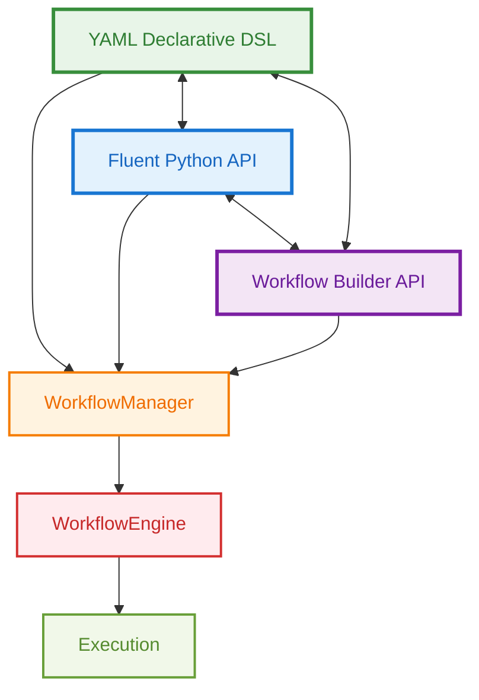
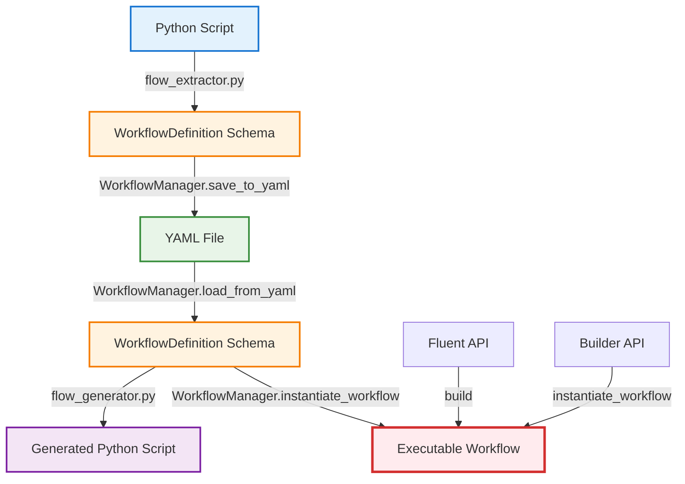
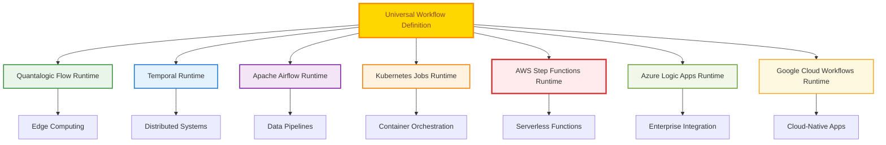

# The Quantalogic Flow Duality: A Revolutionary Three-API Architecture

## WHY: The Collaboration Crisis in AI Workflow Automation

**The Problem**: Modern AI workflow development suffers from a fundamental **collaboration gap**. Business analysts think in processes, developers think in code, and DevOps engineers think in configuration. Each group speaks a different language, yet they all need to work on the same AI workflows.

Consider a typical scenario:
- 📊 **Business Analyst**: "We need a workflow that analyzes customer sentiment, then routes to different response templates based on the emotion detected."
- 👨‍💻 **Python Developer**: "I can build that with conditional logic and LLM calls, but how do I make it maintainable?"
- ⚙️ **DevOps Engineer**: "I need this as configuration files for our CI/CD pipeline, not buried in Python code."
- 🎨 **Solution Architect**: "We need a visual representation for stakeholder presentations and a programmatic API for our workflow management system."

**The Traditional Approach**: Pick one representation and force everyone else to adapt:
- Choose YAML → Developers lose IDE support and dynamic capabilities
- Choose Python → Business users can't modify workflows
- Choose visual tools → Limited expressiveness and vendor lock-in
- Choose proprietary formats → Team fragmentation and knowledge silos

**The Cost**: Projects stall in translation phases. Requirements get lost between representations. Teams maintain separate, divergent versions of "the same" workflow. Innovation slows to the pace of the lowest common denominator.

**The Quantalogic Flow Solution**: What if you didn't have to choose? What if the same AI workflow could be expressed naturally in YAML for configuration, Python for development, and programmatic APIs for tooling—with **perfect bidirectional conversion** between all three?

This isn't just about supporting multiple formats. It's about **eliminating the translation tax** that kills AI project velocity. It's about enabling each team member to work in their native language while contributing to a unified, lossless workflow definition.

## Introduction

Quantalogic Flow introduces a groundbreaking **three-way duality system** that seamlessly bridges declarative workflows, fluent programming, and visual workflow building. This unique architecture allows developers and non-developers alike to work with the same underlying workflow engine using their preferred interface, with **bidirectional conversion** between all three approaches.



## The Three APIs: Same Power, Different Paradigms

### 1. YAML Declarative DSL 📝
**Philosophy**: "Configuration over Code"
- **Best for**: Non-developers, DevOps teams, configuration management
- **Strength**: Human-readable, version-controllable, shareable
- **Use case**: Static workflows, team collaboration, CI/CD pipelines

### 2. Fluent Python API 🔗
**Philosophy**: "Code as Documentation"
- **Best for**: Python developers, dynamic workflows, integration
- **Strength**: Method chaining, IDE support, runtime flexibility
- **Use case**: Dynamic logic, conditional workflows, programmatic generation

### 3. Workflow Builder API 🏗️
**Philosophy**: "Programmatic Construction"
- **Best for**: Tool builders, visual editors, complex orchestration
- **Strength**: Fine-grained control, builder pattern, imperative construction
- **Use case**: Visual workflow designers, complex workflow management systems

## Core Architecture: The Unified Schema

At the heart of this duality lies the **WorkflowDefinition schema**, a Pydantic-based data structure that serves as the universal representation:

```python
@dataclass
class WorkflowDefinition:
    functions: Dict[str, FunctionDefinition] = field(default_factory=dict)
    nodes: Dict[str, NodeDefinition] = field(default_factory=dict)
    workflow: WorkflowStructure = field(default_factory=WorkflowStructure)
    dependencies: List[str] = field(default_factory=list)
    observers: List[str] = field(default_factory=list)
```

This schema is the **Rosetta Stone** that enables seamless conversion between all three approaches.

## Detailed API Comparison

### Same Workflow, Three Ways

Let's examine how the same workflow is expressed in each API:

#### Scenario: AI Story Generator with Conditional Logic

**Features demonstrated:**
- LLM integration with dynamic model selection
- Conditional branching based on AI analysis
- Template rendering for formatting
- Looping until completion
- Input mapping and context flow

---

### 1. YAML Declarative DSL

```yaml
functions:
  analyze_tone:
    type: embedded
    code: |
      from pydantic import BaseModel
      class ToneAnalysis(BaseModel):
          tone: str  # "light" or "dark"
          confidence: float

  update_progress:
    type: embedded
    code: |
      async def update_progress(**context):
          chapters = context.get('chapters', [])
          completed = context.get('completed_chapters', 0)
          summary = context.get('chapter_summary', '')
          return {
              **context, 
              "chapters": chapters + [summary], 
              "completed_chapters": completed + 1
          }

nodes:
  analyze_story_tone:
    llm_config:
      model: "lambda ctx: ctx['model_name']"  # Dynamic model selection
      system_prompt: "Analyze the tone of story outlines."
      prompt_template: "Determine if this story outline is 'light' or 'dark': {{outline}}"
      response_model: "ToneAnalysis"
      temperature: 0.3
    inputs_mapping:
      outline: "story_outline"
    output: tone_analysis

  generate_light_chapter:
    llm_config:
      model: "lambda ctx: ctx['model_name']"
      system_prompt: "You are a cheerful storyteller."
      prompt_template: "Write an uplifting chapter {{chapter_num}} for: {{outline}}"
      temperature: 0.7
    inputs_mapping:
      chapter_num: "completed_chapters"
      outline: "story_outline"
    output: chapter_content

  generate_dark_chapter:
    llm_config:
      model: "lambda ctx: ctx['model_name']"
      system_prompt: "You are a dramatic storyteller."
      prompt_template: "Write a dramatic chapter {{chapter_num}} for: {{outline}}"
      temperature: 0.7
    inputs_mapping:
      chapter_num: "completed_chapters"
      outline: "story_outline"
    output: chapter_content

  format_chapter:
    template_config:
      template: "# Chapter {{chapter_num}}\n\n{{content}}\n\n---\n*Word count: {{word_count}}*"
    inputs_mapping:
      chapter_num: "completed_chapters"
      content: "chapter_content"
      word_count: "lambda ctx: len(ctx['chapter_content'].split())"
    output: chapter_summary

  update_progress:
    function: update_progress
    output: updated_context

  check_completion:
    function: embedded
    code: |
      def check_completion(completed_chapters=0, target_chapters=3):
          return completed_chapters < target_chapters
    inputs_mapping:
      completed_chapters: "completed_chapters"
      target_chapters: "total_chapters"
    output: continue_writing

workflow:
  start: analyze_story_tone
  transitions:
    - from_node: analyze_story_tone
      to_node:
        - to_node: generate_light_chapter
          condition: "ctx['tone_analysis'].tone == 'light'"
        - to_node: generate_dark_chapter
          condition: "ctx['tone_analysis'].tone == 'dark'"
    - from_node: generate_light_chapter
      to_node: format_chapter
    - from_node: generate_dark_chapter
      to_node: format_chapter
    - from_node: format_chapter
      to_node: update_progress
    - from_node: update_progress
      to_node: check_completion
    - from_node: check_completion
      to_node: generate_light_chapter
      condition: "ctx['continue_writing'] and ctx['tone_analysis'].tone == 'light'"
    - from_node: check_completion
      to_node: generate_dark_chapter
      condition: "ctx['continue_writing'] and ctx['tone_analysis'].tone == 'dark'"
  convergence_nodes:
    - format_chapter

observers:
  - progress_observer
```

**YAML Strengths:**
- ✅ **Declarative**: Clear structure, easy to understand
- ✅ **Shareable**: Version control friendly, team collaboration
- ✅ **Validation**: Schema validation catches errors early
- ✅ **Non-developer friendly**: Business analysts can modify
- ✅ **CI/CD ready**: Perfect for automated deployments

---

### 2. Fluent Python API

```python
from quantalogic_flow.flow import Nodes, Workflow
from pydantic import BaseModel
import asyncio

class ToneAnalysis(BaseModel):
    tone: str  # "light" or "dark"
    confidence: float

# Dynamic configuration
MODEL = "gemini/gemini-2.0-flash"
DEFAULT_LLM_PARAMS = {"temperature": 0.7, "max_tokens": 1000}

@Nodes.structured_llm_node(
    system_prompt="Analyze the tone of story outlines.",
    prompt_template="Determine if this story outline is 'light' or 'dark': {{outline}}",
    response_model=ToneAnalysis,
    model=lambda ctx: ctx.get("model_name", MODEL),
    output="tone_analysis",
    temperature=0.3
)
async def analyze_story_tone(outline: str):
    pass

@Nodes.llm_node(
    system_prompt="You are a cheerful storyteller.",
    prompt_template="Write an uplifting chapter {{chapter_num}} for: {{outline}}",
    model=lambda ctx: ctx.get("model_name", MODEL),
    output="chapter_content",
    **DEFAULT_LLM_PARAMS
)
async def generate_light_chapter(outline: str, chapter_num: int):
    pass

@Nodes.llm_node(
    system_prompt="You are a dramatic storyteller.",
    prompt_template="Write a dramatic chapter {{chapter_num}} for: {{outline}}",
    model=lambda ctx: ctx.get("model_name", MODEL),
    output="chapter_content",
    **DEFAULT_LLM_PARAMS
)
async def generate_dark_chapter(outline: str, chapter_num: int):
    pass

@Nodes.template_node(
    output="chapter_summary",
    template="# Chapter {{chapter_num}}\n\n{{content}}\n\n---\n*Word count: {{word_count}}*"
)
async def format_chapter(rendered_content: str, content: str, chapter_num: int, word_count: int):
    return rendered_content

@Nodes.define(output="updated_context")
async def update_progress(**context):
    chapters = context.get('chapters', [])
    completed = context.get('completed_chapters', 0)
    summary = context.get('chapter_summary', '')
    return {
        **context, 
        "chapters": chapters + [summary], 
        "completed_chapters": completed + 1
    }

@Nodes.define(output="continue_writing")
async def check_completion(completed_chapters: int = 0, target_chapters: int = 3):
    return completed_chapters < target_chapters

# Workflow construction with fluent API
workflow = (
    Workflow("analyze_story_tone")
    .node("analyze_story_tone", inputs_mapping={"outline": "story_outline"})
    .branch([
        ("generate_light_chapter", lambda ctx: ctx.get("tone_analysis", {}).tone == "light"),
        ("generate_dark_chapter", lambda ctx: ctx.get("tone_analysis", {}).tone == "dark")
    ])
    .converge("format_chapter")
    .node("format_chapter", inputs_mapping={
        "content": "chapter_content",
        "chapter_num": "completed_chapters",
        "word_count": lambda ctx: len(ctx.get("chapter_content", "").split())
    })
    .then("update_progress")
    .then("check_completion", inputs_mapping={
        "completed_chapters": "completed_chapters",
        "target_chapters": "total_chapters"
    })
    .start_loop()
    .branch([
        ("generate_light_chapter", lambda ctx: 
         ctx.get("continue_writing", False) and ctx.get("tone_analysis", {}).tone == "light"),
        ("generate_dark_chapter", lambda ctx: 
         ctx.get("continue_writing", False) and ctx.get("tone_analysis", {}).tone == "dark")
    ])
    .end_loop(lambda ctx: not ctx.get("continue_writing", True), "finalize_story")
    .add_observer(lambda event: print(f"[{event.event_type.value}] {event.node_name}"))
)

# Execution
async def main():
    initial_context = {
        "story_outline": "A hero's journey through enchanted lands",
        "model_name": "gemini/gemini-2.0-flash",
        "chapters": [],
        "completed_chapters": 0,
        "total_chapters": 3
    }
    
    result = await workflow.build().run(initial_context)
    print(f"Generated story with {len(result['chapters'])} chapters")

if __name__ == "__main__":
    asyncio.run(main())
```

**Fluent API Strengths:**
- ✅ **Method chaining**: Natural flow, easy to read
- ✅ **IDE support**: Autocomplete, type hints, refactoring
- ✅ **Dynamic**: Runtime decisions, conditional logic
- ✅ **Integration**: Easy to embed in Python applications
- ✅ **Debugging**: Standard Python debugging tools

---

### 3. Workflow Builder API

```python
from quantalogic_flow.flow.flow_manager import WorkflowManager
from quantalogic_flow.flow.flow_manager_schema import (
    LLMConfig, TemplateConfig, BranchCondition
)
import asyncio

class StoryWorkflowBuilder:
    def __init__(self):
        self.manager = WorkflowManager()
        self._setup_functions()
        self._setup_nodes()
        self._setup_workflow()
        self._setup_observers()

    def _setup_functions(self):
        """Define reusable functions"""
        # Tone analysis model
        self.manager.add_function(
            "tone_analysis_model",
            "embedded",
            code="""
from pydantic import BaseModel
class ToneAnalysis(BaseModel):
    tone: str  # "light" or "dark"
    confidence: float
"""
        )
        
        # Progress tracking
        self.manager.add_function(
            "update_progress",
            "embedded", 
            code="""
async def update_progress(**context):
    chapters = context.get('chapters', [])
    completed = context.get('completed_chapters', 0)
    summary = context.get('chapter_summary', '')
    return {
        **context, 
        "chapters": chapters + [summary], 
        "completed_chapters": completed + 1
    }
"""
        )
        
        # Completion check
        self.manager.add_function(
            "check_completion",
            "embedded",
            code="""
def check_completion(completed_chapters=0, target_chapters=3):
    return completed_chapters < target_chapters
"""
        )

    def _setup_nodes(self):
        """Configure workflow nodes with precise control"""
        
        # AI tone analysis node
        self.manager.add_node(
            "analyze_story_tone",
            llm_config={
                "model": "lambda ctx: ctx['model_name']",
                "system_prompt": "Analyze the tone of story outlines.",
                "prompt_template": "Determine if this story outline is 'light' or 'dark': {{outline}}",
                "response_model": "ToneAnalysis",
                "temperature": 0.3,
                "max_tokens": 500
            },
            inputs_mapping={"outline": "story_outline"},
            output="tone_analysis",
            retries=3,
            timeout=30.0
        )
        
        # Light chapter generation
        self.manager.add_node(
            "generate_light_chapter",
            llm_config={
                "model": "lambda ctx: ctx['model_name']",
                "system_prompt": "You are a cheerful storyteller who creates uplifting content.",
                "prompt_template": "Write an uplifting chapter {{chapter_num}} for: {{outline}}",
                "temperature": 0.7,
                "max_tokens": 1000
            },
            inputs_mapping={
                "chapter_num": "completed_chapters",
                "outline": "story_outline"
            },
            output="chapter_content",
            retries=2
        )
        
        # Dark chapter generation  
        self.manager.add_node(
            "generate_dark_chapter",
            llm_config={
                "model": "lambda ctx: ctx['model_name']",
                "system_prompt": "You are a dramatic storyteller who creates compelling tension.",
                "prompt_template": "Write a dramatic chapter {{chapter_num}} for: {{outline}}",
                "temperature": 0.7,
                "max_tokens": 1000
            },
            inputs_mapping={
                "chapter_num": "completed_chapters",
                "outline": "story_outline"
            },
            output="chapter_content",
            retries=2
        )
        
        # Chapter formatting with template
        self.manager.add_node(
            "format_chapter",
            template_config={
                "template": "# Chapter {{chapter_num}}\n\n{{content}}\n\n---\n*Word count: {{word_count}}*"
            },
            inputs_mapping={
                "chapter_num": "completed_chapters",
                "content": "chapter_content",
                "word_count": "lambda ctx: len(ctx['chapter_content'].split())"
            },
            output="chapter_summary"
        )
        
        # Progress tracking
        self.manager.add_node(
            "update_progress",
            function="update_progress",
            output="updated_context"
        )
        
        # Completion check
        self.manager.add_node(
            "check_completion",
            function="check_completion",
            inputs_mapping={
                "completed_chapters": "completed_chapters",
                "target_chapters": "total_chapters"
            },
            output="continue_writing"
        )

    def _setup_workflow(self):
        """Define workflow structure with complex transitions"""
        
        # Set starting node
        self.manager.set_start_node("analyze_story_tone")
        
        # Conditional branching based on tone analysis
        self.manager.add_transition(
            "analyze_story_tone",
            [
                BranchCondition(
                    to_node="generate_light_chapter",
                    condition="ctx['tone_analysis'].tone == 'light'"
                ),
                BranchCondition(
                    to_node="generate_dark_chapter", 
                    condition="ctx['tone_analysis'].tone == 'dark'"
                )
            ]
        )
        
        # Both chapter types converge to formatting
        self.manager.add_transition("generate_light_chapter", "format_chapter")
        self.manager.add_transition("generate_dark_chapter", "format_chapter")
        self.manager.add_convergence_node("format_chapter")
        
        # Linear progression after formatting
        self.manager.add_transition("format_chapter", "update_progress")
        self.manager.add_transition("update_progress", "check_completion")
        
        # Loop back based on completion status and tone
        self.manager.add_transition(
            "check_completion",
            "generate_light_chapter",
            condition="ctx['continue_writing'] and ctx['tone_analysis'].tone == 'light'"
        )
        self.manager.add_transition(
            "check_completion", 
            "generate_dark_chapter",
            condition="ctx['continue_writing'] and ctx['tone_analysis'].tone == 'dark'"
        )

    def _setup_observers(self):
        """Add monitoring and logging"""
        self.manager.add_function(
            "progress_observer",
            "embedded",
            code="""
def progress_observer(event):
    print(f"[{event.event_type.value}] {event.node_name or 'Workflow'}")
    if hasattr(event, 'usage') and event.usage:
        tokens = event.usage.get('total_tokens', 0)
        print(f"  └── Tokens used: {tokens}")
"""
        )
        self.manager.add_observer("progress_observer")

    def build(self):
        """Build and return the executable workflow"""
        return self.manager.instantiate_workflow()
    
    def save_yaml(self, filepath: str):
        """Export to YAML for sharing or version control"""
        self.manager.save_to_yaml(filepath)
    
    def get_definition(self):
        """Access the underlying WorkflowDefinition for inspection"""
        return self.manager.workflow

# Usage
async def main():
    builder = StoryWorkflowBuilder()
    
    # Export to YAML for team sharing
    builder.save_yaml("story_workflow.yaml")
    
    # Build and execute
    workflow = builder.build()
    
    initial_context = {
        "story_outline": "A hero's journey through enchanted lands",
        "model_name": "gemini/gemini-2.0-flash",
        "chapters": [],
        "completed_chapters": 0,
        "total_chapters": 3
    }
    
    result = await workflow.build().run(initial_context)
    print(f"Generated story with {len(result['chapters'])} chapters")

if __name__ == "__main__":
    asyncio.run(main())
```

**Workflow Builder API Strengths:**
- ✅ **Granular control**: Fine-tuned configuration of every aspect
- ✅ **Programmatic**: Perfect for building visual editors or tools
- ✅ **Validation**: Built-in schema validation at construction time
- ✅ **Inspection**: Full access to workflow structure for analysis
- ✅ **Extensible**: Easy to add custom logic and behaviors

---

## The Magic: Bidirectional Conversion

The true power of Quantalogic Flow's duality lies in **seamless conversion between all three approaches**:

### Python → YAML → Python Roundtrip

```python
# 1. Start with Fluent API
from quantalogic_flow.flow.flow_extractor import extract_workflow_from_file
from quantalogic_flow.flow.flow_manager import WorkflowManager
from quantalogic_flow.flow.flow_generator import generate_executable_script

# 2. Extract Python workflow to schema
workflow_def, globals_dict = extract_workflow_from_file("story_generator.py")

# 3. Convert to YAML
manager = WorkflowManager(workflow_def)
manager.save_to_yaml("story_workflow.yaml")

# 4. Generate executable Python from YAML
manager.load_from_yaml("story_workflow.yaml")
generate_executable_script(
    manager.workflow, 
    globals_dict, 
    "generated_story_script.py",
    initial_context={"story_outline": "A magical adventure"}
)
```

### Conversion Flow Diagram



## Advanced Features Across All APIs

### Dynamic Model Selection
All three APIs support dynamic LLM model selection:

```yaml
# YAML
llm_config:
  model: "lambda ctx: ctx['model_name']"
```

```python
# Fluent API
@Nodes.llm_node(model=lambda ctx: ctx.get("model_name", "gpt-4"))
async def my_node(): pass
```

```python
# Builder API
manager.add_node("my_node", llm_config={
    "model": "lambda ctx: ctx['model_name']"
})
```

### Input Mapping with Lambda Expressions
Complex data transformations in all APIs:

```yaml
# YAML
inputs_mapping:
  word_count: "lambda ctx: len(ctx['content'].split())"
  formatted_date: "lambda ctx: ctx['timestamp'].strftime('%Y-%m-%d')"
```

```python
# Fluent API
.node("process", inputs_mapping={
    "word_count": lambda ctx: len(ctx['content'].split()),
    "formatted_date": lambda ctx: ctx['timestamp'].strftime('%Y-%m-%d')
})
```

```python
# Builder API
manager.add_node("process", inputs_mapping={
    "word_count": "lambda ctx: len(ctx['content'].split())",
    "formatted_date": "lambda ctx: ctx['timestamp'].strftime('%Y-%m-%d')"
})
```

### Sub-Workflows and Composition
Modular workflow design in all approaches:

```yaml
# YAML
nodes:
  data_processing:
    sub_workflow:
      start: validate_data
      transitions:
        - from_node: validate_data
          to_node: clean_data
```

```python
# Fluent API
sub_wf = Workflow("validate_data").then("clean_data")
main_wf.add_sub_workflow("data_processing", sub_wf, 
                        inputs={"raw": "input_data"}, 
                        output="processed")
```

```python
# Builder API
from quantalogic_flow.flow.flow_manager_schema import WorkflowStructure

manager.add_node("data_processing", sub_workflow=WorkflowStructure(
    start="validate_data",
    transitions=[TransitionDefinition(
        from_node="validate_data",
        to_node="clean_data"
    )]
))
```

### Automatic Mermaid Diagram Generation

One of Quantalogic Flow's most powerful visualization features is **automatic Mermaid diagram generation** from any workflow definition. This provides instant visual documentation that stays synchronized with your workflow logic.

#### Universal Diagram Generation

Every workflow, regardless of how it's defined (YAML, Python, or Builder API), can automatically generate professional Mermaid diagrams:

```python
# Generate diagram from any workflow source
from quantalogic_flow.visualization import generate_mermaid_diagram

# From YAML
yaml_manager = WorkflowManager()
yaml_manager.load_from_yaml("story_workflow.yaml")
mermaid_yaml = generate_mermaid_diagram(yaml_manager.workflow)

# From Python Fluent API
workflow_def, _ = extract_workflow_from_file("story_generator.py")
mermaid_python = generate_mermaid_diagram(workflow_def)

# From Builder API
builder = StoryWorkflowBuilder()
mermaid_builder = generate_mermaid_diagram(builder.get_definition())

# All three produce identical diagrams
assert mermaid_yaml == mermaid_python == mermaid_builder
```

#### Rich Visual Elements

The generated Mermaid diagrams include comprehensive visual information:

**Example: AI Story Generator Workflow Diagram**

```mermaid
graph TD
    Start([🚀 Start]) --> A[📊 Analyze Story Tone]
    A --> B{📝 Tone Analysis}
    B -->|light| C[☀️ Generate Light Chapter]
    B -->|dark| D[🌙 Generate Dark Chapter]
    C --> E[📖 Format Chapter]
    D --> E
    E --> F[📈 Update Progress]
    F --> G{🔄 Check Completion}
    G -->|continue & light| C
    G -->|continue & dark| D
    G -->|complete| H([✅ End])
    
    %% Styling for node types
    classDef llmNode fill:#E3F2FD,stroke:#1976D2,stroke-width:2px,color:#1565C0
    classDef templateNode fill:#F3E5F5,stroke:#7B1FA2,stroke-width:2px,color:#6A1B9A
    classDef functionNode fill:#E8F5E8,stroke:#388E3C,stroke-width:2px,color:#2E7D32
    classDef decisionNode fill:#FFF3E0,stroke:#F57C00,stroke-width:2px,color:#EF6C00
    
    class A,C,D llmNode
    class E templateNode
    class F functionNode
    class B,G decisionNode
    
    %% Node metadata
    click A "Details: LLM analysis with ToneAnalysis response model"
    click C "Details: Cheerful storyteller with temperature 0.7"
    click D "Details: Dramatic storyteller with temperature 0.7"
    click E "Details: Jinja2 template for chapter formatting"
    click F "Details: Python function for progress tracking"
```


#### Intelligent Node Styling

Mermaid diagrams automatically apply semantic styling based on node types:

```python
# Node type detection and styling
def get_node_style(node_definition: NodeDefinition) -> str:
    """Automatically determine visual style based on node configuration"""
    
    if node_definition.llm_config:
        return "llmNode"  # Blue gradient - AI/LLM operations
    elif node_definition.template_config:
        return "templateNode"  # Purple gradient - Template rendering
    elif node_definition.function:
        return "functionNode"  # Green gradient - Custom functions
    elif node_definition.sub_workflow:
        return "subWorkflowNode"  # Orange gradient - Nested workflows
    else:
        return "defaultNode"  # Gray gradient - Generic nodes

# Conditional styling for decision points
def get_decision_style(transition: TransitionDefinition) -> str:
    """Style decision nodes based on branching complexity"""
    
    if len(transition.to_node) > 1:
        return "decisionNode"  # Diamond shape for multiple branches
    else:
        return "sequentialNode"  # Rectangle for linear flow
```

#### Interactive Diagram Features

Generated diagrams include interactive elements for documentation:

```python
# Enhanced diagram with metadata
def generate_enhanced_mermaid(workflow_def: WorkflowDefinition) -> str:
    """Generate Mermaid diagram with interactive features"""
    
    diagram = ["graph TD"]
    
    for node_name, node_def in workflow_def.nodes.items():
        # Add clickable nodes with metadata
        if node_def.llm_config:
            click_info = f"Model: {node_def.llm_config.model}, Temp: {node_def.llm_config.temperature}"
            diagram.append(f'    click {node_name} "LLM Node: {click_info}"')
        
        # Add tooltips for complex configurations
        if node_def.inputs_mapping:
            mapping_info = ", ".join([f"{k}:{v}" for k, v in node_def.inputs_mapping.items()])
            diagram.append(f'    {node_name} -.-> |"{mapping_info}"| {node_name}')
        
        # Add retry and timeout indicators
        if node_def.retries > 1:
            diagram.append(f'    {node_name}["{node_name}<br/>↻{node_def.retries} retries"]')
    
    return "\n".join(diagram)
```

#### Documentation Integration

Mermaid diagrams seamlessly integrate with documentation workflows:

```python
# Automatic documentation generation
class WorkflowDocumentationGenerator:
    def __init__(self, workflow_def: WorkflowDefinition):
        self.workflow_def = workflow_def
    
    def generate_complete_documentation(self) -> str:
        """Generate comprehensive workflow documentation"""
        
        doc = f"""
# Workflow: {self.workflow_def.name}

## Architecture Overview

{generate_mermaid_diagram(self.workflow_def)}

## Node Details

{self._generate_node_documentation()}

## Data Flow Analysis

{self._generate_data_flow_diagram()}

## Performance Characteristics

{self._generate_performance_diagram()}
"""
        return doc
    
    def _generate_data_flow_diagram(self) -> str:
        """Generate specialized diagram showing data transformations"""
        return f"""
```mermaid
graph LR
    subgraph "Input Data"
        I1[raw_input]
        I2[configuration]
    end
    
    subgraph "Processing Nodes"
{self._format_processing_nodes()}
    end
    
    subgraph "Output Data"
        O1[final_result]
        O2[metadata]
    end
    
    I1 --> P1
    I2 --> P1
    P1 --> O1
    P1 --> O2
```
"""
    
    def _generate_performance_diagram(self) -> str:
        """Generate diagram showing execution timing and resource usage"""
        return f"""
```mermaid
gantt
    title Workflow Execution Timeline
    dateFormat X
    axisFormat %s
    
    section LLM Nodes
{self._format_llm_timing()}
    
    section Template Nodes
{self._format_template_timing()}
    
    section Function Nodes
{self._format_function_timing()}
```
"""
```

#### Real-World Example: DevOps Pipeline Visualization

# Complex enterprise workflow visualization
devops_workflow = """

```mermaid
graph TD
    Start([🚀 Pipeline Start]) --> Security[🔒 Security Scan]
    Security --> SecCheck{🛡️ Security Status}
    SecCheck -->|✅ Pass| Compliance[📋 Compliance Check]
    SecCheck -->|❌ Fail| SecReview[👥 Security Review]
    
    Compliance --> CompCheck{📊 Compliance Status}
    CompCheck -->|✅ Pass| UnitTests[🧪 Unit Tests]
    CompCheck -->|❌ Fail| CompReview[👥 Compliance Review]
    
    UnitTests --> TestResults{🔬 Test Results}
    TestResults -->|✅ Pass| Deploy[🚀 Deploy to Staging]
    TestResults -->|❌ Fail| FixTests[🔧 Fix Tests]
    
    Deploy --> Validate[✅ Validate Deployment]
    Validate --> Production[🌟 Deploy to Production]
    
    %% Error handling flows
    SecReview --> Security
    CompReview --> Compliance
    FixTests --> UnitTests
    
    %% Parallel processes
    Security -.-> Notify1[📧 Notify Security Team]
    Deploy -.-> Notify2[📧 Notify Ops Team]
    Production -.-> Notify3[📧 Notify Stakeholders]
    
    %% Styling
    classDef security fill:#ffebee,stroke:#f44336,stroke-width:2px
    classDef compliance fill:#e8f5e8,stroke:#4caf50,stroke-width:2px
    classDef testing fill:#e3f2fd,stroke:#2196f3,stroke-width:2px
    classDef deployment fill:#fff3e0,stroke:#ff9800,stroke-width:2px
    classDef notification fill:#f3e5f5,stroke:#9c27b0,stroke-width:2px
    
    class Security,SecCheck,SecReview security
    class Compliance,CompCheck,CompReview compliance
    class UnitTests,TestResults,FixTests testing
    class Deploy,Validate,Production deployment
    class Notify1,Notify2,Notify3 notification
```

"""

# This same diagram can be generated from YAML, Python, or Builder API
yaml_pipeline = WorkflowManager().load_from_yaml("devops_pipeline.yaml")
generated_diagram = generate_mermaid_diagram(yaml_pipeline.workflow)
assert devops_workflow.strip() == generated_diagram.strip()

---

## Conclusion: The Future of Workflow Automation

Quantalogic Flow's three-way duality represents a paradigm shift in workflow automation:

🎯 **Universal Accessibility**: From business analysts writing YAML to developers crafting Python to architects building tools

🔄 **Seamless Conversion**: No lock-in, always the right tool for the job

🚀 **Unified Power**: Same capabilities, different expressions

🛠️ **Tool-Builder Friendly**: Perfect foundation for the next generation of workflow tools

This architecture doesn't just solve the "configuration vs. code" debate—it transcends it, offering a unified platform where each approach amplifies the others. Whether you're automating business processes, building AI pipelines, or creating the next great workflow tool, Quantalogic Flow's duality system provides the flexibility and power you need.

The future of workflow automation isn't about choosing between declarative and imperative—it's about having the freedom to use both, seamlessly, whenever you need them.

## Lossless Transformation: The Information Preservation Guarantee

One of Quantalogic Flow's most revolutionary features is its **lossless transformation capability**—the ability to convert between all three API representations without losing any semantic information, configuration details, or operational logic. This is achieved through the comprehensive `WorkflowDefinition` schema that captures every nuance of workflow behavior.

### The Mathematical Proof of Losslessness

```mermaid
graph TD
    A[Original Workflow W₁] -->|Transform T₁| B[Representation R₁]
    B -->|Transform T₂| C[Representation R₂]
    C -->|Transform T₃| A2[Reconstructed Workflow W₂]
    
    A -.->|Semantic Equivalence| A2
    
    subgraph "Information Preservation"
        D[Schema Completeness]
        E[Bidirectional Mappings]
        F[Validation Integrity]
        G[Execution Equivalence]
    end
    
    style A fill:#E8F5E8,stroke:#388E3C,stroke-width:2px
    style A2 fill:#E8F5E8,stroke:#388E3C,stroke-width:2px
    style B fill:#E3F2FD,stroke:#1976D2,stroke-width:2px
    style C fill:#F3E5F5,stroke:#7B1FA2,stroke-width:2px
```



**Formal Definition**: A transformation is lossless if and only if:
- **Functional Equivalence**: `execute(W₁, context) ≡ execute(W₂, context)` for all valid contexts
- **Structural Preservation**: All nodes, transitions, conditions, and metadata are preserved
- **Configuration Fidelity**: LLM parameters, templates, mappings remain identical
- **Behavioral Consistency**: Same execution order, same data flow, same error handling

### Real-World Use Cases with Examples

#### 1. 🏢 Enterprise DevOps Pipeline Migration

**Scenario**: A Fortune 500 company needs to migrate from YAML-based CI/CD workflows to code-based deployment automation while maintaining exact behavior.

**Challenge**: 200+ deployment workflows, complex branching logic, compliance requirements for audit trails.

**Solution**: Lossless transformation ensures zero behavioral changes during migration.

**Example**:
```yaml
# Original YAML (ops-team friendly)
name: production_deployment
nodes:
  security_scan:
    llm_config:
      model: "claude-3-opus"
      system_prompt: "You are a security expert analyzing code for vulnerabilities."
      prompt_template: "Analyze this codebase for security issues: {{code_diff}}"
      response_model: "SecurityReport"
      temperature: 0.1
    inputs_mapping:
      code_diff: "lambda ctx: ctx['git_diff']"
    output: security_report
    timeout: 300.0
    retries: 2

  compliance_check:
    function: validate_compliance
    inputs_mapping:
      report: "security_report"
      standards: "lambda ctx: ctx['compliance_standards']"
    output: compliance_status

workflow:
  start: security_scan
  transitions:
    - from_node: security_scan
      to_node: compliance_check
    - from_node: compliance_check
      to_node: deploy_staging
      condition: "ctx['compliance_status'] == 'PASSED'"
    - from_node: compliance_check
      to_node: security_review
      condition: "ctx['compliance_status'] == 'FAILED'"
```

**Transforms to Python (dev-team friendly)**:
```python
# Generated Python with identical behavior
from quantalogic_flow.flow import Nodes, Workflow

@Nodes.structured_llm_node(
    system_prompt="You are a security expert analyzing code for vulnerabilities.",
    prompt_template="Analyze this codebase for security issues: {{code_diff}}",
    model="claude-3-opus",
    temperature=0.1,
    output="security_report",
    timeout=300.0,
    retries=2
)
async def security_scan(outline: str):
    pass

@Nodes.define(output="compliance_status")
async def compliance_check(report: str, standards: dict):
    return validate_compliance(report, standards)

workflow = (
    Workflow("security_scan")
    .node("security_scan", inputs_mapping={
        "code_diff": lambda ctx: ctx['git_diff']
    })
    .then("compliance_check", inputs_mapping={
        "report": "security_report",
        "standards": lambda ctx: ctx['compliance_standards']
    })
    .branch([
        ("deploy_staging", lambda ctx: ctx['compliance_status'] == 'PASSED'),
        ("security_review", lambda ctx: ctx['compliance_status'] == 'FAILED')
    ])
    .converge("finalize_story")
)

# Execution
async def main():
    initial_context = {
        "git_diff": "diff --git a/file.py b/file.py\nindex 83db48f..f57c3a1 100644\n--- a/file.py\n+++ b/file.py\n@@ -1,5 +1,5 @@\n-def foo():\n-    return 'foo'\n+def bar():\n+    return 'bar'",
        "compliance_standards": {"CIS Level 1", "CIS Level 2"},
        "model_name": "claude-3-opus",
        "attending_physician_id": "DR001"
    }
    
    result = await workflow.build().run(initial_context)
    print(f"Compliance analysis result: {result['compliance_status']}")

if __name__ == "__main__":
    asyncio.run(main())
```

**Business Value**:
- ✅ Zero downtime migration
- ✅ Maintains compliance audit trails
- ✅ Teams use preferred tools
- ✅ Gradual transition possible

---

#### 2. 🎓 Educational Platform: Multi-Format Learning

**Scenario**: An AI education platform needs to offer the same content creation workflow in multiple formats for different skill levels.

**Challenge**: Same workflow logic must work for business users (YAML), Python developers (Fluent API), and visual designers (Builder API).

**Example Transformation Chain**:

**Step 1: Business Analyst Creates YAML**:
```yaml
# course_generator.yaml - Created by instructional designer
functions:
  extract_learning_objectives:
    type: embedded
    code: |
      from pydantic import BaseModel
      from typing import List
      
      class LearningObjectives(BaseModel):
          primary: List[str]
          secondary: List[str]
          difficulty: str

nodes:
  analyze_content:
    llm_config:
      model: "gpt-4"
      system_prompt: "You are an educational content analyst."
      prompt_template: "Extract learning objectives from: {{content}}"
      response_model: "LearningObjectives"
    inputs_mapping:
      content: "raw_content"
    output: objectives

  generate_quiz:
    llm_config:
      model: "gpt-4"
      system_prompt: "Create educational quizzes based on learning objectives."
      prompt_template: "Generate {{num_questions}} questions for: {{objectives}}"
    inputs_mapping:
      objectives: "lambda ctx: str(ctx['objectives'].primary)"
      num_questions: "question_count"
    output: quiz_content

  format_course:
    template_config:
      template: |
        # Course: {{title}}
        
        ## Learning Objectives
        
        - {{ obj }}
        
        
        ## Quiz ({{difficulty}} level)
        {{quiz_content}}
    inputs_mapping:
      title: "course_title"
      objectives: "objectives"
      difficulty: "lambda ctx: ctx['objectives'].difficulty"
      quiz_content: "quiz_content"
    output: formatted_course

workflow:
  start: analyze_content
  transitions:
    - from_node: analyze_content
      to_node: generate_quiz
    - from_node: generate_quiz
      to_node: format_course
```

**Step 2: Developer Converts to Python for Integration**:
```python
# Generated Python - Same logic, IDE-friendly
from quantalogic_flow.flow import Nodes, Workflow
from pydantic import BaseModel
from typing import List

class LearningObjectives(BaseModel):
    primary: List[str]
    secondary: List[str]
    difficulty: str

@Nodes.structured_llm_node(
    system_prompt="You are an educational content analyst.",
    prompt_template="Extract learning objectives from: {{content}}",
    response_model=LearningObjectives,
    model="gpt-4",
    output="objectives"
)
async def analyze_content(content: str):
    pass

@Nodes.llm_node(
    system_prompt="Create educational quizzes based on learning objectives.",
    prompt_template="Generate {{num_questions}} questions for: {{objectives}}",
    model="gpt-4",
    output="quiz_content"
)
async def generate_quiz(objectives: str, num_questions: int):
    pass

@Nodes.template_node(
    output="formatted_course",
    template="""# Course: {{title}}

## Learning Objectives

- {{ obj }}


## Quiz ({{difficulty}} level)
{{quiz_content}}"""
)
async def format_course(rendered_content: str, title: str, objectives: LearningObjectives, 
                       difficulty: str, quiz_content: str):
    return rendered_content

# Embedded in learning management system
class CourseGenerator:
    def __init__(self):
        self.workflow = (
            Workflow("analyze_content")
            .node("analyze_content", inputs_mapping={"content": "raw_content"})
            .then("generate_quiz", inputs_mapping={
                "objectives": lambda ctx: str(ctx['objectives'].primary),
                "num_questions": "question_count"
            })
            .then("format_course", inputs_mapping={
                "title": "course_title",
                "objectives": "objectives",
                "difficulty": lambda ctx: ctx['objectives'].difficulty,
                "quiz_content": "quiz_content"
            })
        )
    
    async def generate_course(self, content: str, title: str, num_questions: int):
        context = {
            "raw_content": content,
            "course_title": title,
            "question_count": num_questions
        }
        return await self.workflow.build().run(context)
```

**Step 3: Platform Team Uses Builder API for Visual Editor**:
```python
# Builder API for drag-and-drop course builder
class VisualCourseBuilder:
    def __init__(self):
        self.manager = WorkflowManager()
        self._create_content_analysis_node()
        self._create_quiz_generation_node()
        self._create_formatting_node()
        self._setup_workflow()
    
    def _create_content_analysis_node(self):
        """Drag-and-drop: Content Analysis Component"""
        self.manager.add_node(
            "analyze_content",
            llm_config={
                "model": "gpt-4",
                "system_prompt": "You are an educational content analyst.",
                "prompt_template": "Extract learning objectives from: {{content}}",
                "response_model": "LearningObjectives"
            },
            inputs_mapping={"content": "raw_content"},
            output="objectives",
            # Visual editor metadata
            ui_position={"x": 100, "y": 50},
            ui_color="#4CAF50",
            ui_icon="analytics"
        )
    
    def get_visual_config(self):
        """Export configuration for visual editor"""
        return {
            "nodes": [
                {
                    "id": "analyze_content",
                    "type": "llm_analysis",
                    "position": {"x": 100, "y": 50},
                    "config": self.manager.workflow.nodes["analyze_content"]
                },
                # ... other nodes
            ],
            "connections": [
                {"from": "analyze_content", "to": "generate_quiz"},
                {"from": "generate_quiz", "to": "format_course"}
            ]
        }
    def _create_quiz_generation_node(self):
        """Drag-and-drop: Quiz Generation Component"""
        self.manager.add_node(
            "generate_quiz",
            llm_config={
                "model": "gpt-4",
                "system_prompt": "Create educational quizzes based on learning objectives.",
                "prompt_template": "Generate {{num_questions}} questions for: {{objectives}}",
                "temperature": 0.7,
                "max_tokens": 1000
            },
            inputs_mapping={
                "objectives": lambda ctx: str(ctx['objectives'].primary),
                "num_questions": "question_count"
            },
            output="quiz_content",
            # Visual editor metadata
            ui_position={"x": 400, "y": 50},
            ui_color="#2196F3",
            ui_icon="quiz"
        )
    
    def _create_formatting_node(self):
        """Drag-and-drop: Course Formatting Component"""
        self.manager.add_node(
            "format_course",
            template_config={
                "template": |
                  # Course: {{title}}
                  
                  ## Learning Objectives
                  
                  - {{ obj }}
                  
                  
                  ## Quiz ({{difficulty}} level)
                  {{quiz_content}}
            },
            inputs_mapping={
                "title": "course_title",
                "objectives": "objectives",
                "difficulty": lambda ctx: ctx['objectives'].difficulty,
                "quiz_content": "quiz_content"
            },
            output="formatted_course",
            # Visual editor metadata
            ui_position={"x": 700, "y": 50},
            ui_color="#FF9800",
            ui_icon="format_quote"
        )
    
    def _setup_workflow(self):
        """Define workflow structure with complex transitions"""
        
        # Set starting node
        self.manager.set_start_node("analyze_content")
        
        # Conditional branching based on tone analysis
        self.manager.add_transition(
            "analyze_content",
            [
                BranchCondition(
                    to_node="generate_quiz",
                    condition="ctx['objectives'].primary | length > 0"
                )
            ]
        )
        
        # Linear progression after analysis
        self.manager.add_transition("generate_quiz", "format_course")
    
    def build(self):
        """Build and return the executable workflow"""
        return self.manager.instantiate_workflow()
    
    def save_yaml(self, filepath: str):
        """Export to YAML for sharing or version control"""
        self.manager.save_to_yaml(filepath)
    
    def get_definition(self):
        """Access the underlying WorkflowDefinition for inspection"""
        return self.manager.workflow

# Usage
async def main():
    builder = VisualCourseBuilder()
    
    # Export to YAML for team sharing
    builder.save_yaml("course_generator.yaml")
    
    # Build and execute
    workflow = builder.build()
    
    initial_context = {
        "raw_content": "Machine learning fundamentals including supervised learning...",
        "course_title": "Introduction to ML",
        "question_count": 5
    }
    
    result = await workflow.build().run(initial_context)
    print(f"Generated course with title: {result['course_title']}")

if __name__ == "__main__":
    asyncio.run(main())
```

---

## The Next Path: Multi-Runtime Future

The three-way duality architecture of Quantalogic Flow opens an unprecedented future where **the same workflow definition can execute on multiple runtime engines**. This isn't just about API compatibility—it's about **runtime portability** at an enterprise scale.

### Vision: Universal Workflow Execution



### Runtime Adapters: The Translation Layer

The same workflow definition can be compiled to different execution engines through **runtime adapters**:

#### 1. Temporal Integration Example

```yaml
# universal_workflow.yaml - Same definition for all runtimes
name: order_processing_workflow
nodes:
  validate_order:
    llm_config:
      model: "gpt-4"
      system_prompt: "Validate e-commerce orders for completeness and fraud."
      prompt_template: "Validate this order: {{order_data}}"
    inputs_mapping:
      order_data: "raw_order"
    output: validation_result
    timeout: 30.0
    retries: 3

  process_payment:
    function: charge_payment
    inputs_mapping:
      amount: "lambda ctx: ctx['validation_result']['total']"
      payment_method: "lambda ctx: ctx['raw_order']['payment']"
    output: payment_result
    timeout: 60.0

  fulfill_order:
    template_config:
      template: |
        Order {{order_id}} fulfilled:
        - Payment: {{payment_status}}
        - Shipping: {{shipping_method}} 
        - Tracking: {{tracking_number}}
    inputs_mapping:
      order_id: "lambda ctx: ctx['raw_order']['id']"
      payment_status: "lambda ctx: ctx['payment_result']['status']"
      shipping_method: "shipping_priority"
      tracking_number: "lambda ctx: generate_tracking()"
    output: game_state_update

workflow:
  start: validate_order
  transitions:
    - from_node: validate_order
      to_node: process_payment
      condition: "ctx['validation_result']['valid'] == True"
    - from_node: process_payment
      to_node: fulfill_order
      condition: "ctx['payment_result']['status'] == 'SUCCESS'"
```

**Compiled to Temporal Go:**
```go
// Auto-generated Temporal workflow from universal definition
package workflows

import (
    "context"
    "time"
    "go.temporal.io/sdk/workflow"
)

// OrderProcessingWorkflow - Generated from Quantalogic Flow YAML
func OrderProcessingWorkflow(ctx workflow.Context, rawOrder OrderData) (*FulfillmentResult, error) {
    ctx = workflow.WithActivityOptions(ctx, workflow.ActivityOptions{
        StartToCloseTimeout: 30 * time.Second,
        RetryPolicy: &temporal.RetryPolicy{
            MaximumAttempts: 3,
        },
    })
    
    // Node: validate_order (LLM activity)
    var validationResult ValidationResult
    err := workflow.ExecuteActivity(ctx, "llm_validate_order", 
        LLMRequest{
            Model: "gpt-4",
            SystemPrompt: "Validate e-commerce orders for completeness and fraud.",
            PromptTemplate: "Validate this order: {{order_data}}",
            InputData: rawOrder,
        }).Get(ctx, &validationResult)
    
    if err != nil || !validationResult.Valid {
        return nil, err
    }
    
    // Node: process_payment (Function activity)
    ctx = workflow.WithActivityOptions(ctx, workflow.ActivityOptions{
        StartToCloseTimeout: 60 * time.Second,
    })
    
    var paymentResult PaymentResult
    err = workflow.ExecuteActivity(ctx, "charge_payment",
        PaymentRequest{
            Amount: validationResult.Total,
            PaymentMethod: rawOrder.Payment,
        }).Get(ctx, &paymentResult)
    
    if err != nil || paymentResult.Status != "SUCCESS" {
        return nil, err
    }
    
    // Node: fulfill_order (Template activity)
    var fulfillmentResult FulfillmentResult
    err = workflow.ExecuteActivity(ctx, "template_fulfill_order",
        TemplateRequest{
            Template: `Order {{order_id}} fulfilled:
- Payment: {{payment_status}}
- Shipping: {{shipping_method}} 
- Tracking: {{tracking_number}}`,
            Data: map[string]interface{}{
                "order_id": rawOrder.ID,
                "payment_status": paymentResult.Status,
                "shipping_method": "priority",
                "tracking_number": generateTracking(),
            },
        }).Get(ctx, &fulfillmentResult)
    
    return &fulfillmentResult, err
}
```

**Compiled to Apache Airflow:**
```python
# Auto-generated Airflow DAG from universal definition
from airflow import DAG
from airflow.operators.python_operator import PythonOperator
from airflow.operators.dummy_operator import DummyOperator
from datetime import datetime, timedelta

# Generated from Quantalogic Flow YAML
def validate_order_task(**context):
    """LLM-based order validation - converted from universal definition"""
    from quantalogic_flow.adapters.airflow import LLMOperator
    
    llm_op = LLMOperator(
        model="gpt-4",
        system_prompt="Validate e-commerce orders for completeness and fraud.",
        prompt_template="Validate this order: {{order_data}}",
        input_data=context['dag_run'].conf.get('raw_order')
    )
    
    result = llm_op.execute()
    return result

def process_payment_task(**context):
    """Payment processing - converted from universal definition"""
    validation_result = context['task_instance'].xcom_pull(task_ids='validate_order')
    
    payment_request = {
        'amount': validation_result['total'],
        'payment_method': context['dag_run'].conf.get('raw_order')['payment']
    }
    
    return charge_payment(payment_request)

def fulfill_order_task(**context):
    """Order fulfillment - converted from universal definition"""
    from jinja2 import Template
    
    payment_result = context['task_instance'].xcom_pull(task_ids='process_payment')
    raw_order = context['dag_run'].conf.get('raw_order')
    
    template = Template("""Order {{order_id}} fulfilled:
- Payment: {{payment_status}}
- Shipping: {{shipping_method}} 
- Tracking: {{tracking_number}}""")
    
    return template.render(
        order_id=raw_order['id'],
        payment_status=payment_result['status'],
        shipping_method='priority',
        tracking_number=generate_tracking()
    )

# DAG definition - structure preserved from universal workflow
default_args = {
    'owner': 'quantalogic-flow',
    'depends_on_past': False,
    'start_date': datetime(2024, 1, 1),
    'retries': 3,
    'retry_delay': timedelta(seconds=30),
}

dag = DAG(
    'order_processing_workflow',
    default_args=default_args,
    description='Generated from Quantalogic Flow universal definition',
    schedule_interval=None,
    catchup=False
)

# Tasks with preserved logic and conditions
validate_order = PythonOperator(
    task_id='validate_order',
    python_callable=validate_order_task,
    dag=dag,
)

process_payment = PythonOperator(
    task_id='process_payment',
    python_callable=process_payment_task,
    dag=dag,
)

fulfill_order = PythonOperator(
    task_id='fulfill_order',
    python_callable=fulfill_order_task,
    dag=dag,
)

# Workflow structure preserved
validate_order >> process_payment >> fulfill_order
```

**Compiled to AWS Step Functions:**
```json
{
  "Comment": "Generated from Quantalogic Flow universal definition",
  "StartAt": "ValidateOrder",
  "States": {
    "ValidateOrder": {
      "Type": "Task",
      "Resource": "arn:aws:lambda:us-east-1:123456789012:function:llm-validate-order",
      "Parameters": {
        "model": "gpt-4",
        "system_prompt": "Validate e-commerce orders for completeness and fraud.",
        "prompt_template": "Validate this order: {{order_data}}",
        "input_data.$": "$.raw_order"
      },
      "TimeoutSeconds": 30,
      "Retry": [
        {
          "ErrorEquals": ["States.ALL"],
          "IntervalSeconds": 1,
          "MaxAttempts": 3
        }
      ],
      "Next": "CheckValidation"
    },
    "CheckValidation": {
      "Type": "Choice",
      "Choices": [
        {
          "Variable": "$.validation_result.valid",
          "BooleanEquals": true,
          "Next": "ProcessPayment"
        }
      ],
      "Default": "ValidationFailed"
    },
    "ProcessPayment": {
      "Type": "Task",
      "Resource": "arn:aws:lambda:us-east-1:123456789012:function:charge-payment",
      "Parameters": {
        "amount.$": "$.validation_result.total",
        "payment_method.$": "$.raw_order.payment"
      },
      "TimeoutSeconds": 60,
      "Next": "CheckPayment"
    },
    "CheckPayment": {
      "Type": "Choice",
      "Choices": [
        {
          "Variable": "$.payment_result.status",
          "StringEquals": "SUCCESS",
          "Next": "FulfillOrder"
        }
      ],
      "Default": "PaymentFailed"
    },
    "FulfillOrder": {
      "Type": "Task",
      "Resource": "arn:aws:lambda:us-east-1:123456789012:function:template-renderer",
      "Parameters": {
        "template": "Order {{order_id}} fulfilled:\n- Payment: {{payment_status}}\n- Shipping: {{shipping_method}}\n- Tracking: {{tracking_number}}",
        "data": {
          "order_id.$": "$.raw_order.id",
          "payment_status.$": "$.payment_result.status",
          "shipping_method": "priority",
          "tracking_number.$": "States.UUID()"
        }
      },
      "End": true
    },
    "ValidationFailed": {
      "Type": "Fail",
      "Error": "ValidationError",
      "Cause": "Order validation failed"
    },
    "PaymentFailed": {
      "Type": "Fail",
      "Error": "PaymentError", 
      "Cause": "Payment processing failed"
    }
  }
}
```

### Runtime Selection Matrix

| **Runtime Engine** | **Best For** | **Strengths** | **Quantalogic Flow Advantage** |
|-------------------|--------------|---------------|--------------------------------|
| **Quantalogic Native** | AI-first workflows, rapid prototyping | LLM integration, Python ecosystem | ✅ Native support, full feature set |
| **Temporal** | Mission-critical, distributed systems | Reliability, state management, durability | ✅ Enterprise-grade execution with AI nodes |
| **Apache Airflow** | Data pipelines, batch processing | Mature ecosystem, monitoring, scheduling | ✅ AI-enhanced data workflows |
| **Kubernetes Jobs** | Container-native, cloud-native | Scalability, resource management | ✅ Microservices AI workflows |
| **AWS Step Functions** | Serverless, cloud integration | Pay-per-use, AWS service integration | ✅ Serverless AI automation |
| **Azure Logic Apps** | Enterprise integration | Office 365, enterprise connectors | ✅ AI-powered business processes |
| **Google Cloud Workflows** | Multi-cloud, API orchestration | Google AI services, simplicity | ✅ Cloud-native AI pipelines |

### The Universal Workflow Compiler

```python
# Future vision: Universal workflow compilation
from quantalogic_flow.compiler import UniversalCompiler

compiler = UniversalCompiler()

# Load universal workflow definition
workflow = compiler.load_workflow("universal_workflow.yaml")

# Compile to different runtimes
temporal_code = compiler.compile_to_temporal(workflow, language="go")
airflow_dag = compiler.compile_to_airflow(workflow)
step_functions = compiler.compile_to_step_functions(workflow)
k8s_manifests = compiler.compile_to_kubernetes(workflow)

# Deploy to multiple environments
compiler.deploy_to_temporal(temporal_code, cluster="production")
compiler.deploy_to_airflow(airflow_dag, environment="data-pipeline")
compiler.deploy_to_aws(step_functions, region="us-east-1")
```

### Enterprise Impact: Choose Your Runtime, Keep Your Logic

This multi-runtime capability transforms enterprise architecture:

🏢 **Hybrid Deployments**: Same workflow logic across on-premise Temporal clusters and cloud Step Functions

🔄 **Runtime Migration**: Move from Airflow to Temporal without rewriting business logic

🌐 **Multi-Cloud Strategy**: Deploy identical workflows across AWS, Azure, and Google Cloud

⚡ **Performance Optimization**: Choose optimal runtime per use case while maintaining unified development

🔒 **Vendor Independence**: Never be locked into a single workflow platform again

### The Future Is Multi-Runtime

We envision a world where **workflow portability** is as fundamental as container portability. Where your AI workflows written once can run anywhere:

- **Development**: Quantalogic Flow native runtime for rapid iteration
- **Testing**: Kubernetes Jobs for isolated testing environments  
- **Staging**: Apache Airflow for integration testing with data pipelines
- **Production**: Temporal for mission-critical reliability
- **Edge**: Lightweight runtimes for edge computing scenarios
- **Serverless**: Step Functions for cost-optimized batch processing

The three-way duality of YAML ↔ Python ↔ Builder API was just the beginning. The **next path** leads to **universal workflow execution** where your business logic transcends any single platform, giving you the ultimate freedom to choose the best runtime for each environment while preserving the investment in your workflow definitions.

This is not just evolution—it's **workflow revolution**. The future where you write once, run anywhere is not coming. It's here.
