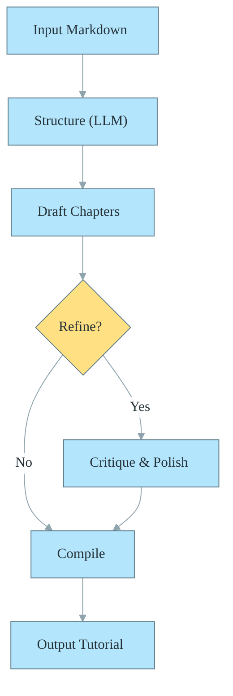
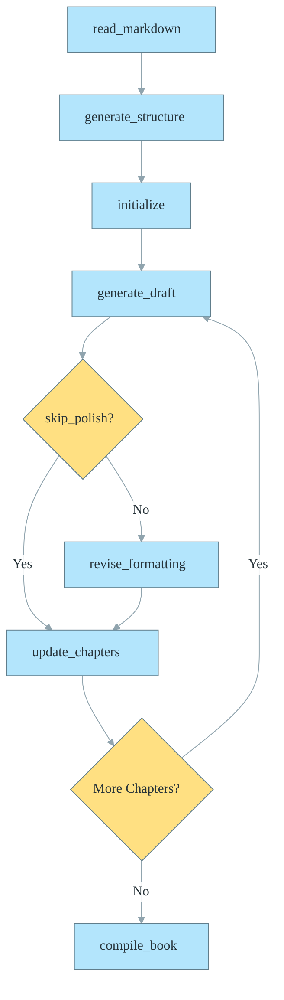
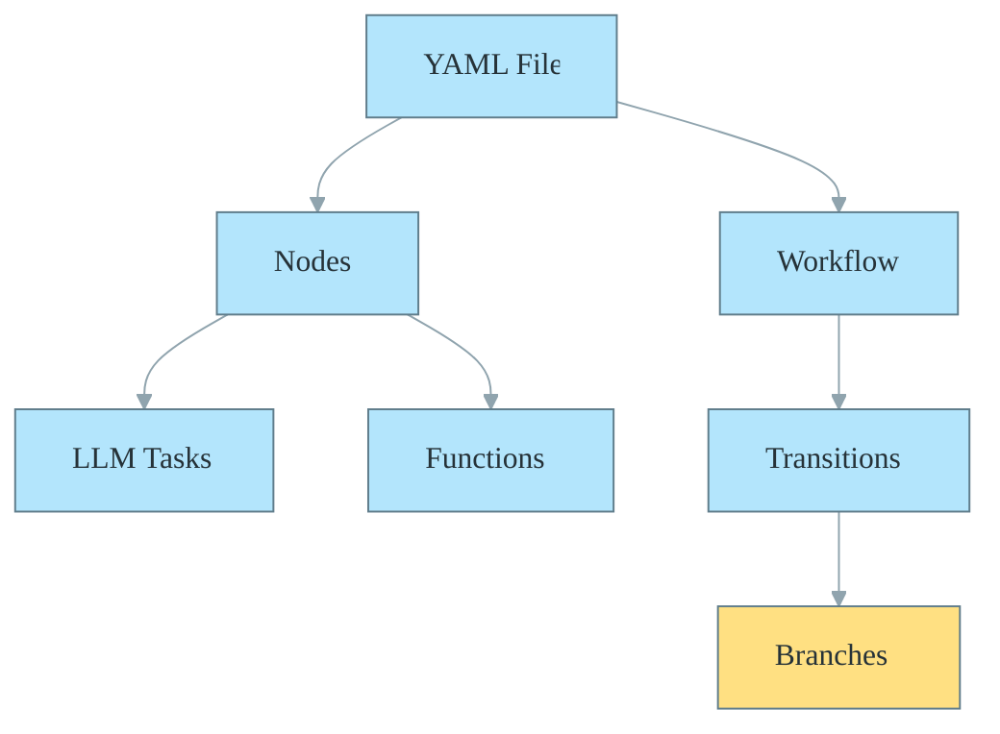

# Orchestrating Intelligence: Building GenAI-Powered Tutorial Generators with Quantalogic Flow

– Build Your Own Tutorial Generator


Ready to transform raw ideas into polished tutorials with ease? In this guide, we’ll harness **Quantalogic Flow**—a workflow wizard from `quantalogic_flow`—to craft a **tutorial generator**. 


> Using markdown input, Large Language Models (LLMs), and clever Jinja2 templates, you’ll create structured, engaging content in no time. 


We’ll dive into `quantalogic_flow/examples/create_tutorial/create_tutorial.py`, sprinkle in insights from its templates, and reference `quantalogic_flow/flow/flow_yaml.md` and `quantalogic_flow/flow/flow.py`. 

Let’s get started! 🚀

## Table of Contents
1. [Why This Matters](#1-why-this-matters)
2. [What You’ll Build](#2-what-youll-build)
3. [How to Set Up](#3-how-to-set-up)
4. [Building the Workflow in Python](#4-building-the-workflow-in-python)
5. [Switching to YAML](#5-switching-to-yaml)
6. [Running the Magic](#6-running-the-magic)
7. [Key Tricks Up Our Sleeve](#7-key-tricks-up-our-sleeve)
8. [Leveling Up](#8-leveling-up)

---

## 1. Why This Matters

Ever stared at a messy markdown file and wished it could magically become a tutorial? That’s where Quantalogic Flow shines. It’s like having a writing assistant who:

- **Saves Time** ⏱️: Automates chapter creation.
- **Boosts Clarity** ✨: Structures content logically.
- **Sparks Joy** 😊: Adds storytelling and visuals.

Think of it as your personal tutor-building toolkit—perfect for educators, developers, or anyone sharing knowledge. Inspired by `system_generate_draft.j2`, we’ll channel Feynman’s knack for explanation and Karpathy’s flair for tech storytelling.

---

## 2. What You’ll Build

Our tutorial generator takes a markdown file and churns out a multi-chapter masterpiece. Here’s the flow:

1. **Load Content**: Grab the markdown input.
2. **Outline It**: Use an LLM to plan chapters with `Why`, `What`, and `How` sections.
3. **Draft Chapters**: Generate detailed content, optionally refining it.

4. **Polish Up**: Add formatting, emojis, and diagrams.
5. **Validate Structure**: Ensure the generated structure matches the requested number of chapters (with a warning if not).
6. **Clipboard Option**: Optionally copy the final tutorial to your clipboard for quick sharing.
7. **Wrap It**: Compile and save the tutorial.


**Note:**
- The workflow uses robust logging (Loguru) for transparency and debugging.
- File operations are handled with care, but you may want to add more explicit error handling for production use.
- The CLI option for skipping refinement is called `skip_refinement` in the code (sometimes referred to as `skip_polish` in this tutorial).

Here’s a high-level view:



---

## 3. How to Set Up

Let’s gear up! Follow these steps:

### Step 1: Gather Your Tools
- **Python 3.12+**: Fresh and ready.
- **Dependencies**: Install with:
  ```bash
  uv pip install loguru litellm "pydantic>=2.0" anyio quantalogic jinja2 typer pyperclip instructor
  ```

### Step 2: Create Your Space
Set up a project folder:
```bash
mkdir tutorial-genix
cd tutorial-genix
```

### Step 3: Craft Jinja2 Templates
Templates guide our LLMs. Create a `templates` folder:
```bash
mkdir templates
```

Add these examples (from `create_tutorial/templates/`):

- **`prompt_generate_structure.j2`**:
  ```jinja2
  Markdown Content:
  {{markdown_content}}

  Generate a tutorial structure with {{num_chapters}} chapters in JSON format.
  ```
  *Purpose*: Tells the LLM to outline chapters based on input.

- **`system_generate_draft.j2`**:
  ```jinja2
  You are a skilled writer crafting educational tutorials inspired by Richard Feynman and Andrej Karpathy. Using the provided chapter structure and full markdown content, write a detailed chapter (about {{words_per_chapter}} words) with 'Why', 'What', and 'How' sections, plus examples and Mermaid diagrams. Base the content on the markdown file and the chapter structure.
  ```
  *Purpose*: Sets the tone for creative, clear chapter drafts.

- **`prompt_revise_formatting.j2`**:
  ```jinja2
  Improved Draft:
  {{improved_draft}}

  Enhance the chapter with emojis, storytelling, and formatting. Don't add any additional content, comments.
  ```
  *Purpose*: Polishes drafts with flair.

### Step 4: Prep Input
Create `input.md`:
```markdown
# Machine Learning Basics
Notes on training models, from data prep to evaluation.
```

---

## 4. Building the Workflow in Python

Let’s code this step-by-step, weaving in a story-like flow.

### Step 1: Define the Blueprint
We need a structure. Here’s our Pydantic model:
```python
from pydantic import BaseModel
from typing import List

class ChapterStructure(BaseModel):
    title: str
    summary: str
    why_ideas: List[str]
    what_ideas: List[str]
    how_ideas: List[str]
    example_ideas: List[str]
    diagram_ideas: List[str]

class TutorialStructure(BaseModel):
    title: str
    chapters: List[ChapterStructure]
```

### Step 2: Craft the Nodes
Nodes are our workflow’s heroes. Here’s a mix:

- **Read Markdown** 📜:
```python
@Nodes.define(output=None)
async def read_markdown(path: str) -> dict:
    with open(path, 'r', encoding='utf-8') as f:
        content = f.read()
    return {"markdown_content": content, "path": path}
```

- **Generate Structure** 🗂️:
```python
@Nodes.structured_llm_node(
    system_prompt_file="templates/system_generate_structure.j2",
    output="structure",
    response_model=TutorialStructure,
    prompt_file="templates/prompt_generate_structure.j2",
    temperature=0.5
)
async def generate_structure(model: str, markdown_content: str, num_chapters: int) -> TutorialStructure:
    pass
```

- **Generate Draft** ✍️:
```python
@Nodes.llm_node(
    system_prompt_file="templates/system_generate_draft.j2",
    output="draft_chapter",
    prompt_file="templates/prompt_generate_draft.j2",
    temperature=0.7
)
async def generate_draft(model: str, chapter_structure: dict, markdown_content: str, words_per_chapter: int) -> str:
    pass
```

- **Polish It** 🎨:
```python
@Nodes.llm_node(
    system_prompt_file="templates/system_revise_formatting.j2",
    output="revised_chapter",
    prompt_file="templates/prompt_revise_formatting.j2",
    temperature=0.8
)
async def revise_formatting(model: str, improved_draft: str, words_per_chapter: int) -> str:
    pass
```

- **Track Progress** 📊:
```python
@Nodes.define(output="chapter_count")
async def update_chapters(chapters: List[str], revised_chapter: str, chapter_count: int) -> int:
    chapters.append(revised_chapter)
    return chapter_count + 1
```

- **Compile the Book** 📕:
```python
@Nodes.define(output="tutorial")
async def compile_book(structure: TutorialStructure, chapters: List[str]) -> str:
    book = f"# {structure.title}\n\n"
    for i, (chapter, text) in enumerate(zip(structure.chapters, chapters), 1):
        book += f"## Chapter {i}: {chapter.title}\n\n{text}\n\n---\n\n"
    return book
```

### Step 3: Weave the Workflow
Here’s the magic, with a chapter loop:

```python
from quantalogic.flow import Workflow, Nodes
import anyio

workflow = (
    Workflow("read_markdown")
    .then("generate_structure")
    .then("initialize", inputs_mapping={"chapters": lambda ctx: [], "chapter_count": lambda ctx: 0})
    .then("generate_draft")
    .node("generate_draft", inputs_mapping={
        "chapter_structure": lambda ctx: ctx["structure"].chapters[ctx["chapter_count"]].model_dump(),
        "markdown_content": "markdown_content",
        "words_per_chapter": "words_per_chapter",
        "model": "model"
    })
    .branch([
        ("update_chapters", lambda ctx: ctx.get("skip_polish", False)),
        ("revise_formatting", lambda ctx: not ctx.get("skip_polish", False))
    ])
    .node("update_chapters", inputs_mapping={
        "chapters": "chapters",
        "revised_chapter": lambda ctx: ctx.get("revised_chapter", ctx["draft_chapter"]),
        "chapter_count": "chapter_count"
    })
    .branch([
        ("generate_draft", lambda ctx: ctx["chapter_count"] < len(ctx["structure"].chapters)),
        ("compile_book", lambda ctx: ctx["chapter_count"] >= len(ctx["structure"].chapters))
    ])
    .node("compile_book")
)
```

**Flow Diagram**:


### Step 4: Add a CLI
Make it user-friendly:
```python
import typer

app = typer.Typer()

@app.command()
def generate(path: str, model: str = "gemini/gemini-2.0-flash", chapters: int = 3, words: int = 500, skip_polish: bool = True):
    context = {
        "path": path,
        "model": model,
        "num_chapters": chapters,
        "words_per_chapter": words,
        "skip_polish": skip_polish
    }
    engine = workflow.build()
    result = anyio.run(engine.run, context)
    print(result["tutorial"])

if __name__ == "__main__":
    app()
```

---

## 5. Switching to YAML

Want a declarative twist? Convert to YAML:

```python
from quantalogic.flow.flow_extractor import extract_workflow_from_file
from quantalogic.flow.flow_manager import WorkflowManager

wf_def, _ = extract_workflow_from_file("tutorial_generator.py")
WorkflowManager(wf_def).save_to_yaml("tutorial.yaml")
```

Here’s a snippet:
```yaml
nodes:
  generate_structure:
    llm_config:
      model: "gemini/gemini-2.0-flash"
      system_prompt_file: "templates/system_generate_structure.j2"
      prompt_file: "templates/prompt_generate_structure.j2"
    inputs_mapping:
      markdown_content: "markdown_content"
      num_chapters: "num_chapters"
    output: structure
  generate_draft:
    llm_config:
      system_prompt_file: "templates/system_generate_draft.j2"
      prompt_file: "templates/prompt_generate_draft.j2"
    inputs_mapping:
      chapter_structure: "lambda ctx: ctx['structure'].chapters[ctx['chapter_count']].dict()"
    output: draft_chapter

workflow:
  start: read_markdown
  transitions:
    - from_node: generate_draft
      to_node:
        - to_node: update_chapters
          condition: "ctx.get('skip_polish', False)"
        - to_node: revise_formatting
          condition: "not ctx.get('skip_polish', False)"
```

**Structure Diagram**:


---

## 6. Running the Magic

- **Python**:
  ```bash
  python tutorial_generator.py generate input.md --chapters 3 --words 500
  ```

- **YAML**:
  ```python
  manager = WorkflowManager()
  manager.load_from_yaml("tutorial.yaml")
  engine = manager.workflow.build()
  result = anyio.run(engine.run, {"path": "input.md", "num_chapters": 3, "words_per_chapter": 500})
  print(result["tutorial"])
  ```

**Sample Output**:
```markdown
# Machine Learning Basics

## Chapter 1: Why Models Matter
Ever wondered why we train models? Here’s the scoop...

## Chapter 2: What’s Under the Hood
Let’s peek at the mechanics—data prep and all...

## Chapter 3: How to Succeed
Steps to train and evaluate like a pro...
```

---

## 7. Key Tricks Up Our Sleeve

- **Input Mapping** 🔗: Links data dynamically, e.g., `chapter_structure` from context.
- **Branching** 🌿: Skips polishing if `skip_polish` is True.
- **LLM Power** 🤖: Structured (`generate_structure`) and text (`generate_draft`) outputs.
- **Templates** 📜: Jinja2 guides LLMs with precision and style.

---

## 8. Leveling Up

Take it further:
- **Add Diagrams**: Use `diagram_ideas` from the structure for Mermaid visuals.
- **Polish More**: Drop `skip_polish` and refine with `revise_formatting.j2`.
- **Tweak Voice**: Adjust templates for humor or formality.

You’ve built a tutorial generator—now make it yours! 🌟
