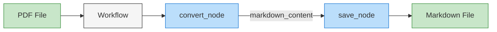
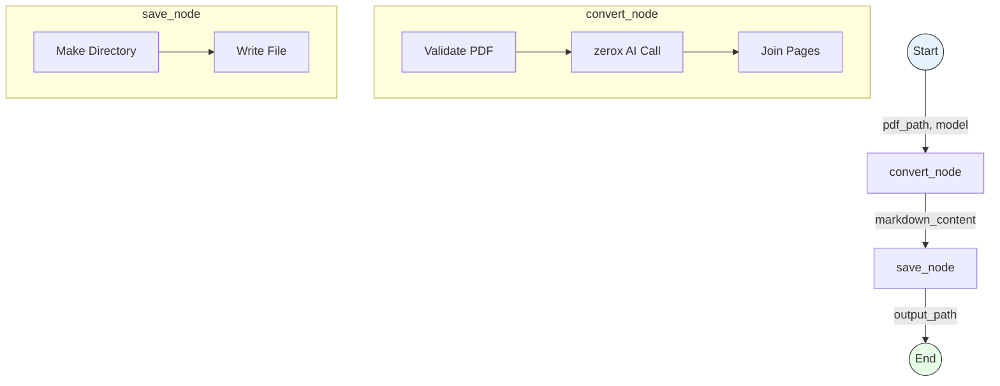

# Tutorial: Building a PDF-to-Markdown Pipeline with Quantalogic Flow

This tutorial teaches intermediate Python developers how to create a pipeline that converts PDF files into Markdown using **Quantalogic Flow**, a Python workflow framework, and `pyzerox`, an AI-driven PDF parsing library. PDFs often blend text, images, tables, and graphs—elements that basic tools like `PyPDF2` struggle to handle comprehensively. Here, you’ll use modern Python techniques to extract and interpret these components, producing structured Markdown output. With step-by-step explanations, code breakdowns, and practical examples, you’ll learn to adapt this pipeline for your own projects, from research papers to reports.

---

[Code](https://github.com/quantalogic/quantalogic/blob/main/examples/flow/pdf_to_markdown/pdf_to_markdown.py)

## Quantalogic Flow Visualization



The diagram shows the simple flow of the PDF-to-Markdown conversion process:

1. PDF file is input to the Quantalogic Workflow
2. `convert_node` transforms PDF content to Markdown using AI
3. `save_node` writes the processed content to a file
4. Markdown file is produced as output

---

## Table of Contents

1. [Why PDFs Are Tricky](#why-pdfs-are-tricky)
2. [Quantalogic Flow Basics](#quantalogic-flow-basics)
   - [What It Does](#what-it-does)
   - [How It Works: Examples](#how-it-works-examples)
   - [Why Use It](#why-use-it)
3. [UV Shebang: Simplified Execution](#uv-shebang-simplified-execution)
4. [Setup Guide](#setup-guide)
   - [Python Dependencies](#python-dependencies)
   - [System Requirements](#system-requirements)
   - [API Key Configuration](#api-key-configuration)
5. [Code Walkthrough](#code-walkthrough)
   - [`convert_node`: PDF to Markdown](#convert_node-pdf-to-markdown)
   - [`save_node`: Saving Output](#save_node-saving-output)
   - [The Workflow](#the-workflow)
6. [Running the Pipeline](#running-the-pipeline)
   - [Basic Usage](#basic-usage)
   - [Custom Options](#custom-options)
7. [Sample Output](#sample-output)
8. [Customization Ideas](#customization-ideas)
9. [Troubleshooting](#troubleshooting)
10. [Visual Workflow](#visual-workflow)
11. [Next Steps](#next-steps)

---

## Why PDFs Are Tricky

PDFs lock content into a fixed format, making extraction challenging:
- **Text**: Simple to grab with tools like `pdftotext`.
- **Images**: Stored as raster data, needing visual analysis.
- **Tables**: Structured but often garbled by basic extractors.
- **Graphs**: Complex visuals requiring context to interpret.

For instance, a scientific PDF might include a table of results or a graph of trends—critical details lost without advanced parsing. This pipeline uses AI via `pyzerox` to describe such elements in Markdown, offering a fuller solution.

---

## Quantalogic Flow Basics

### What It Does

Quantalogic Flow (from `quantalogic/flow/flow.py`) is a Python library for orchestrating tasks as workflows. It’s designed for:
- Sequential task execution.
- Parallel processing.
- Nested workflows.
- Event monitoring.

In this tutorial, it chains PDF conversion and file saving into a reusable pipeline.

### How It Works: Examples

Quantalogic Flow uses `Nodes` to define tasks and `Workflow` to arrange them. Here’s a PDF-relevant example:

#### Sequential PDF Processing
```python
from quantalogic.flow.flow import Nodes, Workflow
import asyncio

@Nodes.define(output="text")
async def extract_text(pdf_path: str) -> str:
    return "Sample PDF text"  # Placeholder for pyzerox call

@Nodes.define(output="markdown")
async def format_markdown(text: str) -> str:
    return f"# Extracted Content\n\n{text}"

workflow = Workflow("extract_text").sequence("extract_text", "format_markdown")
result = asyncio.run(workflow.build().run({"pdf_path": "sample.pdf"}))
print(result["markdown"])  # "# Extracted Content\n\nSample PDF text"
```
- **Nodes**: `extract_text` mimics PDF parsing; `format_markdown` structures output.
- **Flow**: Data passes sequentially.

#### Parallel Page Counting
```python
@Nodes.define(output="page_count")
async def count_pages(pdf_path: str) -> int:
    return 3  # Placeholder

@Nodes.define(output="image_count")
async def count_images(pdf_path: str) -> int:
    return 2  # Placeholder

workflow = Workflow("count_pages").parallel("count_pages", "count_images")
result = asyncio.run(workflow.build().run({"pdf_path": "sample.pdf"}))
print(result)  # {'pdf_path': 'sample.pdf', 'page_count': 3, 'image_count': 2}
```
- **Parallel**: Both nodes analyze the PDF concurrently.

These examples mirror the tutorial’s goals, showing Quantalogic Flow’s versatility.

### Why Use It

- **Modularity**: Tasks are reusable components.
- **Async Support**: Ideal for I/O tasks like API calls.
- **Flexibility**: Supports varied execution patterns.
- **Debugging**: Logging and observers track progress.

It’s a foundation for automating complex processes beyond PDFs.

---

## UV Shebang: Simplified Execution

The script leverages `uv`, a fast Python tool, via this header:

```python
#!/usr/bin/env -S uv run
# /// script
# requires-python = ">=3.12"
# dependencies = [
#     "loguru", "litellm", "pydantic>=2.0", "asyncio", "jinja2",
#     "py-zerox @ git+https://github.com/getomni-ai/zerox.git@abc123",  # Pinned commit
#     "pdf2image", "pillow", "typer", "pathlib", "pathspec", "quantalogic"
# ]
# ///
```

- **Shebang**: Run with `./pdf_to_md_flow.py` after `chmod +x`.
- **Metadata**: Specifies Python 3.12+ and auto-installs dependencies.
- **Install UV**: `curl -LsSf https://astral.sh/uv/install.sh | sh` (see [Astral docs](https://astral.sh/uv)).

This eliminates manual setup, enhancing portability.

---

## Setup Guide

### Python Dependencies
The `uv` metadata handles packages like:
- `py-zerox`: AI PDF parsing.
- `quantalogic`: Workflow logic.
- `pdf2image`: PDF-to-image conversion.

### System Requirements
Install `poppler` for `pdf2image`:
- **macOS**: `brew install poppler`
- **Linux**: `apt-get install poppler-utils`
- **Windows**: `choco install poppler` or manually add to PATH.

### API Key Configuration
The `--model` option (e.g., `gemini/gemini-2.0-flash`) requires API keys:
1. **Gemini**: Get a key from [Google AI Studio](https://aistudio.google.com/). Set `export GEMINI_API_KEY=your_key`.
2. **OpenAI**: From [OpenAI dashboard](https://platform.openai.com/). Set `export OPENAI_API_KEY=your_key`.
3. Verify: `echo $GEMINI_API_KEY` should show your key.

---

## Code Walkthrough

### `convert_node`: PDF to Markdown

```python
@Nodes.define(output="markdown_content")
async def convert_node(pdf_path: str, model: str, custom_system_prompt: Optional[str] = None) -> str:
    if not os.path.exists(pdf_path) or not pdf_path.endswith(".pdf"):
        raise ValueError("Invalid PDF path")
    prompt = custom_system_prompt or "Convert to clean Markdown, describing images and charts literally."
    result = await zerox(file_path=pdf_path, model=model, system_prompt=prompt)
    return "\n\n".join(page.content for page in result.pages if page.content) or ""
```
- **Role**: Uses `pyzerox` to parse PDFs with an AI model.
- **Output**: Markdown with text and visual descriptions.

### `save_node`: Saving Output

```python
@Nodes.define(output="output_path")
async def save_node(markdown_content: str, output_md: str) -> str:
    output_path = Path(output_md)
    output_path.parent.mkdir(parents=True, exist_ok=True)
    with output_path.open("w", encoding="utf-8") as f:
        f.write(markdown_content)
    return str(output_path)
```
- **Role**: Writes Markdown to a file, creating directories as needed.

### The Workflow

```python
def create_pdf_to_md_workflow():
    return Workflow("convert_node").sequence("convert_node", "save_node")
```
- **Flow**: `convert_node` → `save_node`, passing `markdown_content`.

---

## Running the Pipeline

### Basic Usage
```bash
chmod +x pdf_to_md_flow.py
./pdf_to_md_flow.py convert input.pdf
```
- Output: `input.md`.

### Custom Options
```bash
./pdf_to_md_flow.py convert input.pdf output.md --model openai/gpt-4o-mini --system-prompt "Focus on tables only"
```
- Specify model, output file, and prompt.

Set your API key first (e.g., `export OPENAI_API_KEY=your_key`).

---

## Sample Output

**Input PDF**: A page with text, a table, and a graph.  
**Output Markdown**:
```markdown
# Research Findings

The study analyzed trends over five years.

## Data Table

| Year | Value |
|------|-------|
| 2020 | 45    |
| 2021 | 50    |

## Graph Description

A line graph shows values rising from 45 in 2020 to 55 in 2024, peaking at 60 in 2023.
```

This shows how `pyzerox` interprets visuals into text.

---

## Customization Ideas

- **Model**: Try `--model gemini/gemini-2.0-flash`.
- **Prompt**: `--system-prompt "Extract code snippets only"`.
- **Pages**: Edit `convert` to add `select_pages=[1, 2]` in `initial_context`.
- **New Node**: Add a `clean_markdown` node to refine output.

---

## Troubleshooting

- **“Poppler not found”**: Install via `brew install poppler` or equivalent.
- **“API key invalid”**: Check `echo $GEMINI_API_KEY` and key source.
- **Empty Markdown**: Ensure the PDF has scannable content; test with a simple text PDF.

---

## Visual Workflow



---

## Next Steps

You’ve built a pipeline that:
- Converts PDFs to Markdown, including visuals.
- Uses Quantalogic Flow for task orchestration.
- Leverages `uv` for easy execution.

**Try Next**:
- Test a complex PDF (e.g., a financial report with tables).
- Add a node to extract keywords from the Markdown.
- Build a new pipeline, like batch-converting PDFs to HTML.

Start experimenting with your own documents now!


