# 📚✨ Educational Questionnaire Generator README

🎉 **Welcome to the Educational Questionnaire Generator!** 🎉 Imagine transforming a markdown file into a slick, interactive quiz with AI-powered precision—all in a snap! This tool takes your educational content, extracts facts, crafts questions, evaluates them, and delivers a polished questionnaire. Perfect for teachers, learners, or trivia buffs—let's make knowledge fun! 🚀

---

## 🎯 Why & What

### Why Build This? 🤔
- **Save Time**: Manual quiz-making is so last century. Let AI handle it! ⏳
- **Boost Learning**: Quizzes reinforce understanding, tailored to your content. 🧠
- **AI Magic**: Tap into cutting-edge LLMs (e.g., Gemini) for smart fact extraction and question crafting. 🤖
- **Versatile Fun**: Turn any markdown into a quiz—classrooms, blogs, or self-study, here we come! 🎲

### What Does It Do? 🌟
This Python script:
1. 📖 **Reads** your markdown file.
2. 🧩 **Extracts** detailed facts with claims and sources.
3. ❓ **Generates** multiple-choice questions (3-6 options, single or multi-answer).
4. ✅ **Evaluates** each question for quality and accuracy.
5. 🔀 **Shuffles** options for fairness.
6. 💾 **Saves** it all as a JSON file.

It's your quiz-crafting sidekick, powered by Python and AI! 🎨

---

## 🛠️ How It Works

Let's explore the workflow step-by-step with visuals and examples. Buckle up for the ride! 🚗

### Step 1: The Workflow at a Glance
Powered by `quantalogic.flow`, this script chains tasks like a relay race. Here's the flow:

```mermaid
graph TD
    A[📖 Read Markdown] --> B[🧠 Extract Facts]
    B --> C[✂️ Select Facts]
    C --> D[🔄 Loop Per Fact]
    D --> E[❓ Generate Question]
    E --> F[✅ Verify Question]
    F --> G[➕ Append Results]
    G --> H{More Facts?}
    H -->|Yes| D
    H -->|No| I[🔀 Shuffle Options]
    I --> J[💾 Save Output]
```



Each "node" passes the baton to the next—smooth and efficient! 🏃‍♂️

### Step 2: The `uv` Shebang Magic ✨
This script kicks off with a futuristic twist: a `uv`-powered shebang! Here's what it looks like:

```python
#!/usr/bin/env -S uv run
# /// script
# requires-python = ">=3.12"
# dependencies = [
#     "loguru",
#     "litellm",
#     "pydantic>=2.0",
#     "anyio",
#     "quantalogic>=0.35",
#     "jinja2",
#     "typer>=0.9.0"
# ]
# ///
```

#### What's This Do? 🧐
- **Shebang (`#!/usr/bin/env -S uv run`)**: Tells your system to run the script with `uv`, a Rust-based Python tool that's *fast* and *smart*.
- **Metadata Block**: Specifies Python 3.12+ and lists dependencies. When `uv` runs this, it:
  1. Downloads the right Python version if needed.
  2. Installs all listed packages in a temporary, isolated environment.
  3. Executes the script—no setup required! 🚀

#### Why It Rocks 🌟
- **No Manual Installs**: Forget `pip install`—`uv` handles it on the fly.
- **Conflict-Free**: Each run is sandboxed, keeping your system Python pristine.
- **Speedy**: Built in Rust, it's quicker than traditional tools like `venv`.
- **Portable**: The script carries its own requirements—share it anywhere `uv` is installed!

#### How to Use It
- Install `uv` (see below), then run `./question_and_answers.py`—it's that easy! More details in "Running It" below. 😎

### Step 3: Data Structures
The script uses Pydantic models for structured data handling. Here's what they look like:

```python
# Pydantic Models
class Fact(BaseModel):
    title: str
    claims: str
    sources: List[str]

class FactsList(BaseModel):
    facts: List[Fact]

class QuestionnaireItem(BaseModel):
    fact_title: str
    question: str
    options: List[str] = Field(..., min_items=3, max_items=6)  # 3 to 6 options
    correct_answers: List[int] = Field(..., min_items=1)       # At least one correct answer, 1-based index
    explanation: str
    is_multiple_choice_possible: bool                          # Flag indicating if multiple answers are possible

class Questionnaire(BaseModel):
    items: List[QuestionnaireItem]
```

### Step 4: Workflow Details with Example
Let's use a markdown file about **Space Exploration** to see it in action.

#### 📖 Node 1: Read Markdown
- **What**: Loads your `.md` file.
- **Code**:
```python
@Nodes.define(output="markdown_content")
async def read_markdown_file(file_path: str) -> str:
    """Read content from a markdown file."""
    with open(file_path, encoding="utf-8") as f:
        content = f.read()
    print(f"Read markdown content from {file_path}, length: {len(content)} characters")
    return content
```

- **Example**: `space.md` says:
  ```markdown
  ## The Moon Landing
  In 1969, Apollo 11 landed humans on the Moon...
  ```

#### 🧠 Node 2: Extract Facts
- **What**: AI pulls out facts with details.
- **Code**:
```python
@Nodes.structured_llm_node(
    system_prompt="You are an AI assistant tasked with extracting detailed factual information from educational markdown texts.",
    output="facts_list",
    response_model=FactsList,
    prompt_template="""
Extract key facts from the markdown text below. For each fact, include:
- A concise 'title' summarizing the fact.
- A detailed 'claims' description that provides a comprehensive summary with enough context.
- A list of 'sources' identifying the specific headings, sections, or parts of the text.

Markdown content:
{{markdown_content}}
""",
    max_tokens=4000
)
async def extract_facts(markdown_content: str) -> FactsList:
    pass
```

- **Output**:
  ```json
  {
    "facts": [
      {
        "title": "Apollo 11 Moon Landing",
        "claims": "On July 20, 1969, NASA's Apollo 11 mission landed humans on the Moon. Neil Armstrong and Buzz Aldrin walked the surface, while Michael Collins orbited. It was a historic milestone, meeting Kennedy's 1961 goal despite technical hurdles.",
        "sources": ["The Moon Landing"]
      }
    ]
  }
  ```

#### ❓ Node 3: Generate Question
- **What**: Creates a quiz item.
- **Code**:
```python
@Nodes.structured_llm_node(
    system_prompt="You are an AI assistant tasked with generating educational questionnaires from a single fact.",
    output="questionnaire_item",
    response_model=QuestionnaireItem,
    prompt_template="""
Generate a single questionnaire item from the fact below. The question must have 3-6 options, one or more correct answers.

Fact:
- Title: {{ current_fact.title }}
- Claims: {{ current_fact.claims }}
- Source: {{ current_fact.sources | join(', ') }}

Provide:
- Fact title
- Question
- Options (3-6 strings)
- Correct answers (list of integers, e.g., [1, 3])
- Is multiple choice possible (true if multiple answers, false if one)
- Explanation (why the answers are correct)
""",
    max_tokens=2000
)
async def generate_questionnaire_item(current_fact: Fact, model: str) -> QuestionnaireItem:
    pass
```

- **Output**:
  ```json
  {
    "question": "Who walked on the Moon during Apollo 11?",
    "options": ["Armstrong & Aldrin", "Collins & Glenn", "Shepard & Grissom"],
    "correct_answers": [1],
    "explanation": "Armstrong and Aldrin landed; Collins orbited."
  }
  ```

#### ✅ Node 4: Verify Question
- **What**: Evaluates the quality of each question.
- **Code**:
```python
@Nodes.structured_llm_node(
    system_prompt="You are an AI assistant evaluating the quality of a single questionnaire item against its fact.",
    output="evaluation_item",
    response_model=EvaluationItem,
    prompt_template="""
Evaluate this questionnaire item against its corresponding fact. Rate the question (1-5) on:
1. Relevance: Related to the fact?
2. Plausibility: Options realistic?
3. Correctness: Answers accurate?
4. Clarity: Question clear?
5. Explanation Quality: Explanation informative?

Provide comments specific to this item.
""",
    max_tokens=2000
)
async def verify_questionnaire_item(current_fact: Fact, questionnaire_item: QuestionnaireItem,
                                   model: str, question_number: int) -> EvaluationItem:
    pass
```

#### 🔀 Node 5: Shuffle Options
- **What**: Randomizes answer choices for fairness.
- **Code**:
```python
@Nodes.define(output="questionnaire")
async def shuffle_options(combined_questionnaire: Questionnaire) -> Questionnaire:
    """Shuffle the options for each question and update the correct answers' indices."""
    for item in combined_questionnaire.items:
        # Store the content of the correct options
        correct_contents = [item.options[i - 1] for i in item.correct_answers]
        # Shuffle the options
        random.shuffle(item.options)
        # Update the correct_answers with new indices
        item.correct_answers = [item.options.index(content) + 1 for content in correct_contents]
    return combined_questionnaire
```

### Step 5: Workflow Assembly
The script connects all nodes into a seamless workflow:

```python
def create_fact_extraction_workflow() -> Workflow:
    """Create a workflow to extract facts and generate/verify a questionnaire one fact at a time."""
    wf = Workflow("read_markdown_file")
    
    # Initial sequence: read file, extract and select facts
    wf.node("read_markdown_file").then("extract_facts")
    wf.then("select_facts")
    wf.then("initialize_question_processing")
    
    # Fact-by-fact processing loop
    wf.then("get_current_fact")
    wf.then("generate_questionnaire_item")
    wf.then("append_questionnaire_item")
    wf.then("verify_questionnaire_item")
    wf.then("append_evaluation_item")
    wf.then("increment_fact_index")
    
    # Conditional transitions to simulate loop
    wf.transitions["increment_fact_index"] = [
        ("get_current_fact", lambda ctx: ctx.get("fact_index", 0) < len(ctx.get("selected_facts").facts)),
        ("finalize_evaluation", lambda ctx: ctx.get("fact_index", 0) >= len(ctx.get("selected_facts").facts))
    ]
    
    # Post-loop: finalize evaluation and shuffle options
    wf.node("finalize_evaluation").then("shuffle_options")
    
    # Input mappings defined here...
    
    return wf
```

### Step 6: Running It
1. **Install `uv`**:
   - On macOS/Linux: `curl -LsSf https://astral.sh/uv/install.sh | sh`
   - On Windows: `powershell -c "irm https://astral.sh/uv/install.ps1 | iex"`
   - Check it: `uv --version` (e.g., `uv 0.4.0`).

2. **Make Executable** (optional, Unix-like systems):
   ```bash
   chmod +x question_and_answers.py
   ```

3. **Run with the Command Line**:
   The script provides a clean Typer CLI interface:

```python
@app.command()
def generate(
    file_path: Annotated[str, typer.Argument(help="Path to the markdown file")],
    model: Annotated[str, typer.Option(help="LLM model to use")] = "gemini/gemini-2.0-flash",
    num_questions: Annotated[int, typer.Option(help="Number of questions to generate")] = 5,
    token_limit: Annotated[int, typer.Option(help="Token limit per batch")] = 2000,
    save: Annotated[bool, typer.Option(help="Save results to JSON file")] = True
):
    """Extract facts from a markdown file and generate an educational questionnaire."""
    # Implementation details...
```

Example commands:
   - Direct: `./question_and_answers.py generate space.md --num-questions 3`
   - Or: `uv run question_and_answers.py generate space.md --model gemini/gemini-2.0-flash`

4. **Output Example**: The script generates a structured output like this:

```
Generated Educational Questionnaire:
=====================================
Fact: Apollo 11 Moon Landing
Question: Who walked on the Moon during Apollo 11?
Multiple Choice Possible: false
1. Collins & Glenn
2. Shepard & Grissom
3. Armstrong & Aldrin
Correct Answers: 3
Explanation: Neil Armstrong and Buzz Aldrin were the astronauts who walked on the lunar surface, while Michael Collins remained in orbit around the Moon.
-------------------------------------

Questionnaire Evaluation:
=========================
Question 1:
  Relevance: 5/5
  Plausibility: 5/5
  Correctness: 5/5
  Clarity: 5/5
  Explanation Quality: 4/5
  Comments: The question directly addresses key information from the fact...

Results saved to space_results.json
```

---

## 🚀 Try It Out!
Write a markdown file (e.g., `planets.md`), run the script, and watch your quiz come to life. Share it, tweak it, or challenge your friends! 🎉

## 🌟 Features
- ✅ Structured data with Pydantic
- 🤖 AI-driven fact and question generation
- 🔄 Dynamic workflow loops
- 💯 Built-in question evaluation
- 📝 Typer CLI interface
- ⚡ `uv` for effortless execution

Happy quizzing—may your knowledge blast off! 🌌✨

😊