# 📚 Educational Questionnaire Generator

An AI-powered tool that transforms markdown educational content into comprehensive questionnaires with automatic fact extraction, question generation, and quality evaluation.

## 🎯 Overview

### Purpose
This tool automates the creation of educational questionnaires from markdown content, making it ideal for:
- **Educators** creating assessments from course materials
- **Students** generating self-study quizzes
- **Content creators** producing interactive learning materials
- **Training professionals** developing knowledge assessments

### Key Features
- **Intelligent fact extraction** from markdown files using LLMs
- **Dynamic question generation** with 3-6 multiple choice options
- **Quality evaluation** with automated scoring on 5 criteria
- **Flexible answer formats** (single or multiple correct answers)
- **Option shuffling** for assessment integrity
- **Structured output** in JSON format for easy integration

### Technical Stack
- **quantalogic-flow** for workflow orchestration
- **Pydantic** for data validation and serialization
- **Typer** for CLI interface
- **uv** for dependency management and execution
- **LLM integration** (Gemini 2.0 Flash by default)

## � Workflow Architecture

The tool uses a sophisticated workflow orchestration system built with `quantalogic-flow` that processes facts individually for better quality control and resource management.

### Workflow Diagram

```mermaid
%%{init: {
  'theme': 'base',
  'themeVariables': {
    'primaryColor': '#E8F4FD',
    'primaryTextColor': '#1E40AF',
    'primaryBorderColor': '#3B82F6',
    'lineColor': '#6B7280',
    'secondaryColor': '#FEF3C7',
    'tertiaryColor': '#F0FDF4',
    'background': '#FFFFFF',
    'mainBkg': '#F8FAFC',
    'secondBkg': '#E8F4FD',
    'tertiaryBkg': '#FEF3C7',
    'primaryTextColor': '#1E293B',
    'secondaryTextColor': '#475569',
    'tertiaryTextColor': '#64748B',
    'lineColor': '#94A3B8',
    'primaryBorderColor': '#CBD5E1',
    'secondaryBorderColor': '#E2E8F0',
    'tertiaryBorderColor': '#F1F5F9',
    'clusterBkg': '#F1F5F9',
    'altBackground': '#FFFFFF',
    'nodeTextColor': '#1E293B',
    'activationBorderColor': '#3B82F6',
    'activationBkgColor': '#DBEAFE',
    'loopTextColor': '#DC2626',
    'selectionColor': '#3B82F6',
    'selectionBkg': '#EFF6FF'
  }
}}%%

graph TD
    %% Input Phase
    A[📖 Read Markdown File] --> B[🧠 Extract Facts with AI]
    B --> C[✂️ Select Facts for Processing]
    C --> D[🔄 Initialize Loop State]
    
    %% Processing Loop
    D --> E[📋 Get Current Fact]
    E --> F[❓ Generate Questionnaire Item]
    F --> G[📊 Evaluate Question Quality]
    G --> H[📝 Append to Results]
    H --> I[➕ Increment Counter]
    
    %% Loop Decision
    I --> J{More Facts?}
    J -->|Yes| E
    J -->|No| K[🔀 Shuffle Answer Options]
    
    %% Output Phase
    K --> L[� Generate Final Output]
    L --> M[�💾 Save JSON Results]
    
    %% Styling
    classDef inputPhase fill:#E8F4FD,stroke:#3B82F6,stroke-width:2px,color:#1E40AF
    classDef processingPhase fill:#FEF3C7,stroke:#F59E0B,stroke-width:2px,color:#92400E
    classDef loopPhase fill:#F0FDF4,stroke:#10B981,stroke-width:2px,color:#047857
    classDef outputPhase fill:#FCE7F3,stroke:#EC4899,stroke-width:2px,color:#BE185D
    classDef decisionPhase fill:#FEF2F2,stroke:#EF4444,stroke-width:2px,color:#DC2626
    
    class A,B,C,D inputPhase
    class E,F,G,H,I processingPhase
    class J decisionPhase
    class K,L,M outputPhase
```



### Processing Flow Details

1. **Input Phase** (Blue)
   - Reads markdown content from file
   - Extracts structured facts using LLM
   - Selects subset based on question count
   - Initializes processing state

2. **Processing Loop** (Yellow)
   - Processes one fact at a time for quality control
   - Generates tailored questions with 3-6 options
   - Evaluates each question on 5 quality criteria
   - Accumulates results incrementally

3. **Decision Point** (Red)
   - Conditional logic determines workflow continuation
   - Efficient resource management through batching

4. **Output Phase** (Pink)
   - Shuffles options to prevent answer pattern bias
   - Generates comprehensive JSON output
   - Saves results with evaluation metrics

## 🚀 Getting Started

### Prerequisites

1. **Install uv** (Python package manager):
   ```bash
   # macOS/Linux
   curl -LsSf https://astral.sh/uv/install.sh | sh
   
   # Windows
   powershell -c "irm https://astral.sh/uv/install.ps1 | iex"
   
   # Verify installation
   uv --version
   ```

2. **LLM API Access**: Configure your preferred LLM provider (default: Gemini 2.0 Flash)

### Quick Start

The script uses Python 3.12+ with automatic dependency management via `uv`:

```bash
# Make executable (Unix/Linux/macOS)
chmod +x question_and_anwsers.py

# Run with default settings
./question_and_anwsers.py generate your_file.md

# Or run directly with uv
uv run question_and_anwsers.py generate your_file.md
```

### Command Line Options

```bash
# Basic usage
./question_and_anwsers.py generate INPUT_FILE.md

# With custom options
./question_and_anwsers.py generate INPUT_FILE.md \
  --model "gemini/gemini-2.0-flash" \
  --num-questions 10 \
  --token-limit 4000 \
  --save

# Get help
./question_and_anwsers.py --help
```

### Parameters

- `INPUT_FILE.md`: Path to your markdown file
- `--model`: LLM model to use (default: "gemini/gemini-2.0-flash")
- `--num-questions`: Number of questions to generate (default: 5)
- `--token-limit`: Token limit for processing (default: 2000)
- `--save`: Save results to JSON file (default: true)

## 📊 Data Models

The application uses strongly-typed Pydantic models for data validation and serialization:

### Core Data Structures

```python
class Fact(BaseModel):
    """Represents an extracted fact from markdown content."""
    title: str                    # Concise fact title
    claims: str                   # Detailed claims (100-150+ words)
    sources: List[str]            # Source sections/headings

class QuestionnaireItem(BaseModel):
    """Represents a single question with evaluation."""
    fact_title: str
    question: str
    options: List[str] = Field(..., min_items=3, max_items=6)
    correct_answers: List[int] = Field(..., min_items=1)  # 1-based indexing
    explanation: str
    is_multiple_choice_possible: bool

class EvaluationItem(BaseModel):
    """Quality evaluation for each question."""
    question_number: int
    relevance: int = Field(..., ge=1, le=5)           # 1-5 scale
    plausibility: int = Field(..., ge=1, le=5)        # 1-5 scale
    correctness: int = Field(..., ge=1, le=5)         # 1-5 scale
    clarity: int = Field(..., ge=1, le=5)             # 1-5 scale
    explanation_quality: int = Field(..., ge=1, le=5) # 1-5 scale
    comments: str
```

### Output Structure

The final JSON output contains:
- `facts_list`: All extracted facts with metadata
- `questionnaire`: Complete questionnaire with shuffled options
- `evaluation`: Quality assessment for each question

## 🔍 Example Usage

### Sample Input: `space_exploration.md`

```markdown
# Space Exploration History

## The Moon Landing
In 1969, Apollo 11 successfully landed humans on the Moon for the first time. 
Neil Armstrong and Buzz Aldrin walked on the lunar surface while Michael Collins 
orbited above. This achievement fulfilled President Kennedy's 1961 goal of landing 
humans on the Moon before the end of the decade.

## Mars Exploration
Mars has been a target of robotic exploration since the 1960s. The first 
successful landing was Viking 1 in 1976, followed by numerous rovers including 
Sojourner, Spirit, Opportunity, and Curiosity. These missions have discovered 
evidence of past water activity on Mars.
```

### Command Execution

```bash
./question_and_anwsers.py generate space_exploration.md --num-questions 2
```

### Sample Output

```
Generated Educational Questionnaire:
=====================================
Fact: Apollo 11 Moon Landing
Question: Which astronauts walked on the Moon during the Apollo 11 mission?
Multiple Choice Possible: false
1. Neil Armstrong and Michael Collins
2. Buzz Aldrin and Michael Collins  
3. Neil Armstrong and Buzz Aldrin
4. John Glenn and Alan Shepard
Correct Answers: 3
Explanation: Neil Armstrong and Buzz Aldrin were the two astronauts who walked on the lunar surface during Apollo 11, while Michael Collins remained in orbit around the Moon.
-------------------------------------

Questionnaire Evaluation:
=========================
Question 1:
  Relevance: 5/5
  Plausibility: 5/5
  Correctness: 5/5
  Clarity: 5/5
  Explanation Quality: 4/5
  Comments: Question directly addresses key historical facts with plausible distractors.

Results saved to space_exploration_results.json
```

### JSON Output Structure

```json
{
  "facts_list": {
    "facts": [
      {
        "title": "Apollo 11 Moon Landing",
        "claims": "In 1969, Apollo 11 successfully landed humans on the Moon...",
        "sources": ["The Moon Landing"]
      }
    ]
  },
  "questionnaire": {
    "items": [
      {
        "fact_title": "Apollo 11 Moon Landing",
        "question": "Which astronauts walked on the Moon during the Apollo 11 mission?",
        "options": ["Neil Armstrong and Michael Collins", "..."],
        "correct_answers": [3],
        "explanation": "Neil Armstrong and Buzz Aldrin were the two astronauts...",
        "is_multiple_choice_possible": false
      }
    ]
  },
  "evaluation": {
    "items": [
      {
        "question_number": 1,
        "relevance": 5,
        "plausibility": 5,
        "correctness": 5,
        "clarity": 5,
        "explanation_quality": 4,
        "comments": "Question directly addresses key historical facts..."
      }
    ],
    "overall_assessment": "Evaluated 2 questions based on 2 facts. The questionnaire appears consistent and well-structured overall."
  }
}
```

## 🏗️ Architecture Details

### Workflow Implementation

The script uses quantalogic-flow's workflow orchestration system with these key components:

```python
def create_fact_extraction_workflow() -> Workflow:
    """Create a workflow to extract facts and generate/verify a questionnaire."""
    wf = Workflow("read_markdown_file")
    
    # Sequential processing chain
    wf.node("read_markdown_file").then("extract_facts")
    wf.then("select_facts")
    wf.then("initialize_question_processing")
    
    # Fact-by-fact processing loop
    wf.then("get_current_fact")
    wf.then("generate_questionnaire_item")
    wf.then("append_questionnaire_item")
    wf.then("verify_questionnaire_item")
    wf.then("append_evaluation_item")
    wf.then("increment_fact_index")
    
    # Conditional loop control
    wf.transitions["increment_fact_index"] = [
        ("get_current_fact", lambda ctx: ctx.get("fact_index", 0) < len(ctx.get("selected_facts", FactsList(facts=[])).facts)),
        ("finalize_evaluation", lambda ctx: ctx.get("fact_index", 0) >= len(ctx.get("selected_facts", FactsList(facts=[])).facts))
    ]
    
    # Finalization
    wf.node("finalize_evaluation").then("shuffle_options")
    
    return wf
```

### Key Node Functions

1. **`read_markdown_file`**: File I/O with encoding handling
2. **`extract_facts`**: LLM-powered fact extraction with structured output
3. **`select_facts`**: Fact filtering based on question count
4. **`generate_questionnaire_item`**: Individual question generation
5. **`verify_questionnaire_item`**: Quality evaluation on 5 criteria
6. **`shuffle_options`**: Answer randomization with index tracking

### uv Integration

The script uses Python's PEP 723 inline script metadata for dependency management:

```python
#!/usr/bin/env -S uv run
# /// script
# requires-python = ">=3.12"
# dependencies = [
#     "anyio",
#     "quantalogic-flow>=0.6.7",
#     "typer>=0.9.0"
# ]
# ///
```

This approach provides:
- **Zero-setup execution**: No manual dependency installation
- **Reproducible environments**: Consistent dependency versions
- **Portability**: Self-contained script with requirements
- **Performance**: Fast dependency resolution with uv

## 🔧 Advanced Configuration

### LLM Model Options

The tool supports various LLM providers through the `--model` parameter:

```bash
# OpenAI models
./question_and_anwsers.py generate input.md --model "gpt-4o"
./question_and_anwsers.py generate input.md --model "gpt-4o-mini"

# Anthropic models
./question_and_anwsers.py generate input.md --model "claude-3-5-sonnet-20241022"
./question_and_anwsers.py generate input.md --model "claude-3-5-haiku-20241022"

# Google models (default)
./question_and_anwsers.py generate input.md --model "gemini/gemini-2.0-flash"
./question_and_anwsers.py generate input.md --model "gemini/gemini-1.5-pro"
```

### Token Management

The `--token-limit` parameter controls processing batch sizes:

```bash
# For large documents
./question_and_anwsers.py generate large_doc.md --token-limit 4000

# For complex content requiring detailed analysis
./question_and_anwsers.py generate complex_doc.md --token-limit 6000
```

### Customization Options

#### Question Generation Parameters

The fact extraction process can be tuned by modifying these parameters in the code:

- **`max_tokens`**: Controls response length for fact extraction (default: 4000)
- **`min_items`/`max_items`**: Number of answer options (3-6)
- **Claims length**: Target 100-150+ words for comprehensive context

#### Quality Evaluation Criteria

Questions are evaluated on five dimensions:
1. **Relevance**: How well does the question relate to the extracted fact?
2. **Plausibility**: Are the incorrect options realistic distractors?
3. **Correctness**: Are the marked correct answers actually correct?
4. **Clarity**: Is the question clearly written and unambiguous?
5. **Explanation Quality**: Does the explanation adequately justify the answer?

### Output Customization

The JSON output can be customized by modifying the `generate` function:

```python
# Save only questionnaire without evaluation
if save:
    output_data = {
        "questionnaire": questionnaire.model_dump()
    }
    
# Custom filename pattern
output_file = f"{base_name}_{model.replace('/', '_')}_questionnaire.json"
```

## 🐛 Troubleshooting

### Common Issues

1. **File Not Found Error**
   ```bash
   Error: The file 'nonexistent.md' does not exist.
   ```
   **Solution**: Verify the file path is correct and the file exists.

2. **LLM API Errors**
   ```bash
   Error: Authentication failed for model access
   ```
   **Solution**: Ensure proper API keys are configured for your chosen LLM provider.

3. **Memory Issues with Large Files**
   ```bash
   Error: Token limit exceeded
   ```
   **Solution**: Reduce `--num-questions` or increase `--token-limit`.

4. **No Questions Generated**
   ```bash
   Error: No questionnaire generated.
   ```
   **Solution**: Check if your markdown file contains sufficient educational content.

### Debug Mode

Enable detailed logging by modifying the logger configuration:

```python
from loguru import logger
logger.add("debug.log", level="DEBUG")
```

## 📚 Best Practices

### Input Preparation

1. **Structure your markdown** with clear headings and sections
2. **Include detailed explanations** rather than just bullet points
3. **Use educational tone** appropriate for your target audience
4. **Ensure factual accuracy** in your source material

### Question Quality

1. **Review generated questions** before using in assessments
2. **Verify correct answers** against source material
3. **Check option plausibility** - avoid obviously wrong distractors
4. **Ensure explanations are comprehensive** and educational

### Performance Optimization

1. **Process in batches** for large documents
2. **Use appropriate token limits** based on content complexity
3. **Monitor API usage** and costs for your chosen LLM provider
4. **Cache results** to avoid regenerating identical questionnaires

## 🤝 Contributing

This tool is part of the quantalogic-flow ecosystem. Contributions are welcome!

### Development Setup

```bash
# Clone the repository
git clone https://github.com/your-repo/quantalogic
cd quantalogic/quantalogic_flow/examples/questions_and_answers

# Install development dependencies
uv sync --dev

# Run tests
uv run pytest
```

### Extension Ideas

- Support for different question types (true/false, fill-in-the-blank)
- Integration with learning management systems
- Batch processing for multiple files
- Custom prompt templates for different subjects
- Export formats (PDF, HTML, SCORM)

## 📄 License

This project is licensed under the MIT License - see the LICENSE file for details.

---

**Happy learning! 🎓** Transform your educational content into engaging assessments with AI-powered precision.