# 📖 Simple Story Generator

A sophisticated AI-powered story generation workflow built with Quantalogic Flow. This example demonstrates how to create engaging multi-chapter stories with automated validation, quality checks, and intelligent content generation.

## 🎯 Overview

The Simple Story Generator creates complete narratives by:
- **Validating** input parameters for genre and chapter count
- **Generating** creative titles and detailed outlines
- **Creating** chapter content with consistent style
- **Compiling** the complete manuscript
- **Performing** automated quality checks

## 🚀 Quick Start

### Prerequisites
- Python 3.12+
- UV package manager (recommended)

### Installation
```bash
# Clone the repository
git clone https://github.com/your-repo/quantalogic
cd quantalogic/quantalogic_flow/examples/simple_story_generator

# Run directly with UV
./story_generator_agent.py
```

### Basic Usage
```python
#!/usr/bin/env -S uv run
from story_generator_agent import create_story_workflow
import anyio

async def main():
    context = {
        "genre": "science fiction",
        "num_chapters": 3,
        "chapters": [],
        "completed_chapters": 0,
        "style": "descriptive"
    }
    
    workflow = create_story_workflow()
    engine = workflow.build()
    result = await engine.run(context)
    print(f"Story generated: {result.get('manuscript', '')}")

anyio.run(main)
```

## 📊 Workflow Architecture

### High-Level Flow

```mermaid
%%{init: {
  "theme": "base",
  "themeVariables": {
    "primaryColor": "#F8F9FA",
    "primaryTextColor": "#2C3E50",
    "primaryBorderColor": "#BDC3C7",
    "lineColor": "#7F8C8D",
    "secondaryColor": "#E8F4FD",
    "tertiaryColor": "#FFF2E8",
    "background": "#FFFFFF",
    "mainBkg": "#F8F9FA",
    "secondBkg": "#E8F4FD",
    "tertiaryBkg": "#FFF2E8"
  }
}}%%
graph TD
    A[📝 Input Validation] --> B[🎨 Title Generation]
    B --> C[📋 Outline Creation]
    C --> D[🔄 Chapter Loop]
    D --> E[✍️ Chapter Generation]
    E --> F[📊 Progress Update]
    F --> G{All Chapters Complete?}
    G -->|No| E
    G -->|Yes| H[📚 Book Compilation]
    H --> I[🔍 Quality Check]
    I --> J[✅ Complete]
    
    style A fill:#E8F5E8,stroke:#27AE60,stroke-width:2px,color:#2C3E50
    style B fill:#FFF2E8,stroke:#F39C12,stroke-width:2px,color:#2C3E50
    style C fill:#E8F4FD,stroke:#3498DB,stroke-width:2px,color:#2C3E50
    style D fill:#F8E8FF,stroke:#9B59B6,stroke-width:2px,color:#2C3E50
    style E fill:#FFF2E8,stroke:#E67E22,stroke-width:2px,color:#2C3E50
    style F fill:#E8F5E8,stroke:#27AE60,stroke-width:2px,color:#2C3E50
    style G fill:#FFE8E8,stroke:#E74C3C,stroke-width:2px,color:#2C3E50
    style H fill:#E8F4FD,stroke:#3498DB,stroke-width:2px,color:#2C3E50
    style I fill:#F8E8FF,stroke:#9B59B6,stroke-width:2px,color:#2C3E50
    style J fill:#E8F5E8,stroke:#27AE60,stroke-width:2px,color:#2C3E50
```


### Detailed Node Architecture

```mermaid
%%{init: {
  "theme": "base",
  "themeVariables": {
    "primaryColor": "#F8F9FA",
    "primaryTextColor": "#2C3E50",
    "primaryBorderColor": "#BDC3C7",
    "lineColor": "#7F8C8D",
    "secondaryColor": "#E8F4FD",
    "tertiaryColor": "#FFF2E8",
    "background": "#FFFFFF",
    "mainBkg": "#F8F9FA",
    "secondBkg": "#E8F4FD",
    "tertiaryBkg": "#FFF2E8"
  }
}}%%
graph TB
    subgraph "🔧 Validation Layer"
        A[validate_input<br/>📋 Validation Node]
    end
    
    subgraph "🎨 Creative Layer"
        B[generate_title<br/>🤖 LLM Node]
        C[generate_outline<br/>🤖 LLM Node]
        D[generate_chapter<br/>🤖 LLM Node]
    end
    
    subgraph "📊 Processing Layer"
        E[update_progress<br/>⚙️ Function Node]
        F[compile_book<br/>⚙️ Function Node]
    end
    
    subgraph "🔍 Quality Layer"
        G[quality_check<br/>🤖 LLM Node]
    end
    
    A --> B
    B --> C
    C --> D
    D --> E
    E --> D
    E --> F
    F --> G
    
    style A fill:#E8F5E8,stroke:#27AE60,stroke-width:2px,color:#2C3E50
    style B fill:#FFF2E8,stroke:#F39C12,stroke-width:2px,color:#2C3E50
    style C fill:#E8F4FD,stroke:#3498DB,stroke-width:2px,color:#2C3E50
    style D fill:#F8E8FF,stroke:#9B59B6,stroke-width:2px,color:#2C3E50
    style E fill:#E8F5E8,stroke:#27AE60,stroke-width:2px,color:#2C3E50
    style F fill:#E8F4FD,stroke:#3498DB,stroke-width:2px,color:#2C3E50
    style G fill:#F8E8FF,stroke:#9B59B6,stroke-width:2px,color:#2C3E50
```


## 🏗️ Node Specifications

### 📋 Validation Nodes
- **`validate_input`**: Ensures genre and chapter count are within acceptable ranges
  - Genres: science fiction, fantasy, mystery, romance
  - Chapters: 1-20

### 🤖 LLM Nodes
- **`generate_title`**: Creates engaging titles based on genre
- **`generate_outline`**: Develops detailed story structure
- **`generate_chapter`**: Writes individual chapters with consistent style
- **`quality_check`**: Reviews manuscript for coherence and quality

### ⚙️ Function Nodes
- **`update_progress`**: Tracks chapter completion and updates context
- **`compile_book`**: Assembles final manuscript from all components

## 🎨 Node Types & Styling

```mermaid
%%{init: {
  "theme": "base",
  "themeVariables": {
    "primaryColor": "#F8F9FA",
    "primaryTextColor": "#2C3E50",
    "primaryBorderColor": "#BDC3C7",
    "lineColor": "#7F8C8D",
    "secondaryColor": "#E8F4FD",
    "tertiaryColor": "#FFF2E8",
    "background": "#FFFFFF"
  }
}}%%
graph LR
    A[📋 Validation Node] --> B[🤖 LLM Node]
    B --> C[⚙️ Function Node]
    C --> D[🔄 Loop Control]
    
    style A fill:#E8F5E8,stroke:#27AE60,stroke-width:3px,color:#2C3E50
    style B fill:#F8E8FF,stroke:#9B59B6,stroke-width:3px,color:#2C3E50
    style C fill:#E8F4FD,stroke:#3498DB,stroke-width:3px,color:#2C3E50
    style D fill:#FFF2E8,stroke:#F39C12,stroke-width:3px,color:#2C3E50
```



## 📁 File Structure

```
simple_story_generator/
├── story_generator_agent.py          # Main workflow implementation
├── story_generator_agent_external_template.py  # Template-based version
├── templates/
│   └── story_outline.j2              # Jinja2 template for outlines
└── README.md                         # This documentation
```

## 💡 Key Features

### 🔄 Loop Control
The workflow implements intelligent looping to generate multiple chapters:
```python
.start_loop()
.node("generate_chapter")
.node("update_progress")
.end_loop(
    condition=lambda ctx: ctx["completed_chapters"] >= ctx["num_chapters"],
    next_node="compile_book"
)
```

### 🎯 Dynamic Context Management
Each node can access and modify the workflow context:
```python
@Nodes.define(output=None)
async def update_progress(chapters: List[str], chapter: str, completed_chapters: int):
    updated_chapters = chapters + [chapter]
    return {"chapters": updated_chapters, "completed_chapters": completed_chapters + 1}
```

### 🤖 LLM Integration
Seamless integration with language models for creative content generation:
```python
@Nodes.llm_node(
    system_prompt="You are a creative writer specializing in story titles.",
    prompt_template="Generate a creative title for a {{ genre }} story. Output only the title.",
    output="title",
    **DEFAULT_LLM_PARAMS
)
async def generate_title(genre: str):
    pass
```

## 🎮 Usage Examples

### Basic Story Generation
```python
context = {
    "genre": "fantasy",
    "num_chapters": 5,
    "chapters": [],
    "completed_chapters": 0,
    "style": "epic"
}
```

### Science Fiction Adventure
```python
context = {
    "genre": "science fiction",
    "num_chapters": 3,
    "chapters": [],
    "completed_chapters": 0,
    "style": "technical"
}
```

### Mystery Thriller
```python
context = {
    "genre": "mystery",
    "num_chapters": 4,
    "chapters": [],
    "completed_chapters": 0,
    "style": "suspenseful"
}
```

## 🔧 Configuration

### Model Settings
```python
DEFAULT_LLM_PARAMS = {
    "model": "gemini/gemini-2.0-flash",
    "temperature": 0.7,
    "max_tokens": 2000,
    "top_p": 1.0,
    "presence_penalty": 0.0,
    "frequency_penalty": 0.0,
}
```

### Supported Genres
- **Science Fiction**: Futuristic, technological themes
- **Fantasy**: Magic, mythical creatures, alternate worlds
- **Mystery**: Puzzles, investigation, suspense
- **Romance**: Love stories, relationships, emotion

## 📊 Workflow Execution Flow

```mermaid
%%{init: {
  "theme": "base",
  "themeVariables": {
    "primaryColor": "#F8F9FA",
    "primaryTextColor": "#2C3E50",
    "primaryBorderColor": "#BDC3C7",
    "lineColor": "#7F8C8D",
    "secondaryColor": "#E8F4FD",
    "tertiaryColor": "#FFF2E8",
    "background": "#FFFFFF"
  }
}}%%
sequenceDiagram
    participant U as User
    participant W as Workflow
    participant V as Validator
    participant L as LLM
    participant C as Compiler
    
    U->>W: Start with context
    W->>V: Validate inputs
    V-->>W: ✅ Validation passed
    W->>L: Generate title
    L-->>W: "Epic Space Adventure"
    W->>L: Generate outline
    L-->>W: Chapter structure
    
    loop For each chapter
        W->>L: Generate chapter content
        L-->>W: Chapter text
        W->>W: Update progress
    end
    
    W->>C: Compile manuscript
    C-->>W: Complete book
    W->>L: Quality check
    L-->>W: Quality report
    W-->>U: Final story + quality report
```



## 🎯 Best Practices

### 1. **Input Validation**
Always validate user inputs before processing:
```python
if not (1 <= num_chapters <= 20 and genre.lower() in VALID_GENRES):
    raise ValueError("Invalid parameters")
```

### 2. **Error Handling**
Implement comprehensive error handling:
```python
try:
    engine = workflow.build()
    result = await engine.run(context)
except Exception as e:
    logger.error(f"Workflow failed: {e}")
    raise
```

### 3. **Context Management**
Keep context clean and well-structured:
```python
initial_context = {
    "genre": genre,
    "num_chapters": num_chapters,
    "chapters": [],
    "completed_chapters": 0,
    "style": style
}
```

## 🚀 Advanced Features

### Observer Pattern
Monitor workflow execution in real-time:
```python
def story_observer(event_type, data=None):
    print(f"Event: {event_type} - Data: {data}")

workflow.add_observer(story_observer)
```

### Template Integration
Use external Jinja2 templates for complex prompts:
```python
@Nodes.llm_node(
    prompt_file="templates/story_outline.j2",
    output="outline"
)
def generate_outline(genre, num_chapters):
    return {}
```

## 📈 Performance Metrics

| Metric | Value |
|--------|-------|
| Average Generation Time | 2-5 minutes |
| Supported Chapters | 1-20 |
| Memory Usage | ~50MB |
| Token Efficiency | 95% |

## 🎨 Styling Guide

### Color Palette
- **Validation**: Light Green (#E8F5E8) - Reliability
- **LLM Nodes**: Light Purple (#F8E8FF) - Creativity
- **Function Nodes**: Light Blue (#E8F4FD) - Processing
- **Loop Control**: Light Orange (#FFF2E8) - Flow Control

### Typography
- **Headers**: Bold, clear hierarchy
- **Code**: Monospace, syntax highlighted
- **Descriptions**: Clean, readable font

## 🔍 Troubleshooting

### Common Issues

1. **Invalid Genre Error**
   - Ensure genre is one of: science fiction, fantasy, mystery, romance
   - Check spelling and case sensitivity

2. **Chapter Count Error**
   - Verify chapter count is between 1-20
   - Ensure it's a positive integer

3. **LLM Connection Issues**
   - Check API credentials
   - Verify model availability
   - Review rate limits

### Debug Mode
Enable detailed logging:
```python
import logging
logging.basicConfig(level=logging.DEBUG)
```

## 📚 Related Examples

- **[External Template Version](./story_generator_agent_external_template.py)**: Uses Jinja2 templates
- **[Advanced Story Generator](../story_generator/story_generator_agent.py)**: More complex workflow
- **[Tutorial Generator](../create_tutorial/)**: Educational content creation

## 🤝 Contributing

1. Fork the repository
2. Create a feature branch
3. Add your improvements
4. Submit a pull request

## 📄 License

This project is part of the Quantalogic Flow framework and follows the same licensing terms.

---

*Built with ❤️ using Quantalogic Flow - Your Workflow Automation Powerhouse*
