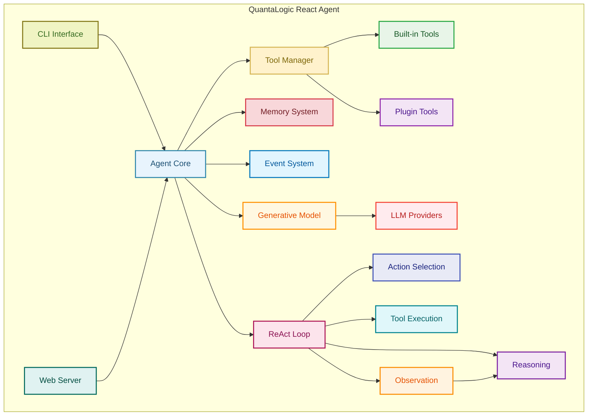
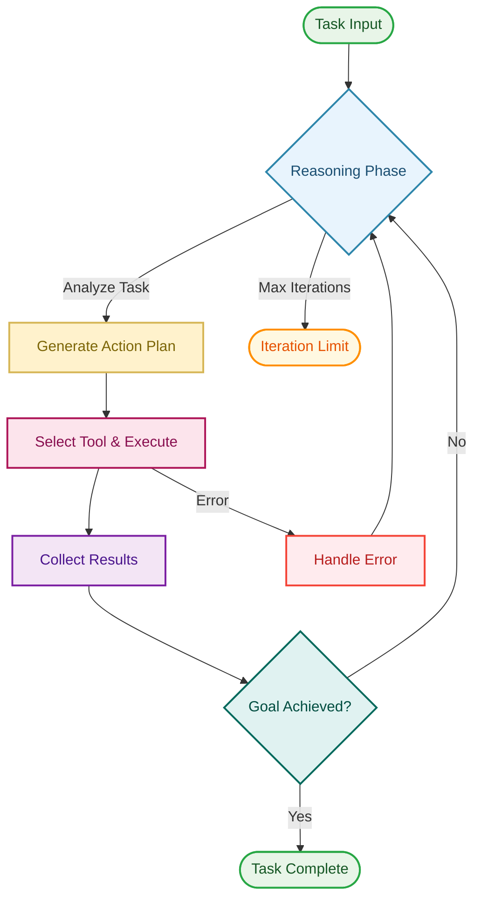
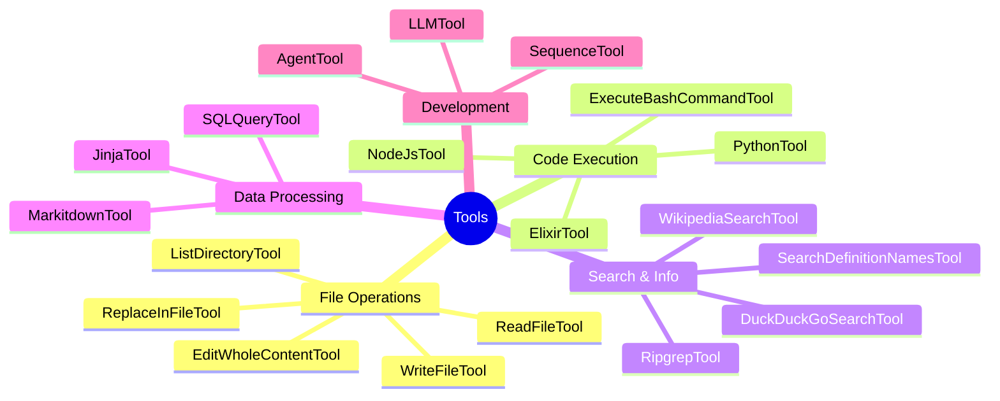

# QuantaLogic React Agent

**Component**: React Agent Implementation  
**Location**: `quantalogic_react/quantalogic/`  
**Type**: ReAct (Reasoning and Acting) AI Agent  
**Status**: Production Ready ✅

## 🎯 Overview

QuantaLogic React is the original and main implementation of the ReAct (Reasoning and Acting) paradigm for AI agents. This component provides a powerful, tool-enabled AI agent that can reason about problems and take actions to solve them.

### Key Features

- **ReAct Paradigm**: Combines reasoning and acting in a unified framework
- **Tool Ecosystem**: Extensible plugin system with 40+ built-in tools
- **Multi-Model Support**: Works with OpenAI, Anthropic, DeepSeek, and more
- **Event System**: Real-time event monitoring and custom event handlers
- **Memory Management**: Conversation history and variable storage
- **CLI Interface**: Rich command-line interface for interactive use
- **Web Server**: Optional web interface for remote access

## 📊 Architecture

### Component Overview



### Directory Structure

```
quantalogic_react/quantalogic/
├── agent.py                 # Core ReAct agent implementation
├── main.py                  # CLI entry point
├── tool_manager.py         # Tool loading and management
├── generative_model.py     # LLM integration layer
├── memory.py               # Conversation and variable memory
├── event_emitter.py        # Event system
├── tools/                  # Built-in tool collection
│   ├── tool.py            # Base tool interface
│   ├── execute_bash_command_tool.py
│   ├── python_tool.py
│   ├── read_file_tool.py
│   └── ...                # 40+ more tools
├── utils/                  # Utility functions
├── server/                 # Web server implementation
└── prompts/               # System prompts and templates
```

## 🚀 Usage

### ReAct Loop Process



### Basic Agent Usage

```python
from quantalogic import Agent

# Create a basic agent
agent = Agent(model_name="gpt-4")

# Run a task
result = agent.run("Analyze the current directory structure")
print(result)
```

### Advanced Configuration

```python
from quantalogic import Agent, console_print_events

# Create agent with custom configuration
agent = Agent(
    model_name="gpt-4",
    max_iterations=10,
    event_emitter=console_print_events
)

# Add custom tools
from quantalogic.tools import Tool

agent.add_tool(my_custom_tool)

# Run with memory persistence
result = agent.run("Complex multi-step task", persist_memory=True)
```

### CLI Usage

```bash
# Interactive mode
quantalogic

# Direct task execution
quantalogic run "Write a Python script to analyze log files"

# Coding mode with enhanced tools
quantalogic --mode coding run "Implement a REST API"

# Use specific model
quantalogic --model gpt-4 run "Analyze this codebase"
```

## 🛠 Tool Ecosystem

### Tool Categories



The React agent includes a comprehensive set of tools:

### File Operations
- `ReadFileTool`: Read file contents
- `WriteFileTool`: Write files
- `EditWholeContentTool`: Replace entire file contents
- `ReplaceInFileTool`: Replace text in files
- `ListDirectoryTool`: List directory contents

### Code Execution
- `PythonTool`: Execute Python code
- `ExecuteBashCommandTool`: Run shell commands
- `NodeJsTool`: Execute Node.js code
- `ElixirTool`: Execute Elixir code

### Search & Information
- `DuckDuckGoSearchTool`: Web search
- `WikipediaSearchTool`: Wikipedia search
- `RipgrepTool`: Fast text search in files
- `SearchDefinitionNamesTool`: Find code definitions

### Data Processing
- `SQLQueryTool`: Database queries
- `MarkitdownTool`: Convert documents to markdown
- `JinjaTool`: Template processing

### Development Tools
- `SequenceTool`: Multi-step tool execution
- `AgentTool`: Delegate to sub-agents
- `LLMTool`: Direct LLM queries

## 🔧 Configuration

### Environment Variables

```bash
# LLM API Keys
export OPENAI_API_KEY="your-openai-key"
export ANTHROPIC_API_KEY="your-anthropic-key"
export DEEPSEEK_API_KEY="your-deepseek-key"

# Optional: Tool-specific keys
export SERPAPI_API_KEY="your-serpapi-key"
export ALPHA_VANTAGE_API_KEY="your-alpha-vantage-key"
```

### Configuration File

Create `.quantalogic/config.yaml`:

```yaml
agent:
  model_name: "gpt-4"
  max_iterations: 20
  temperature: 0.1

tools:
  enabled:
    - python_tool
    - execute_bash_command_tool
    - read_file_tool
    - write_file_tool
  
server:
  host: "0.0.0.0"
  port: 8000
```

## 📚 API Reference

### Agent Class

```python
class Agent:
    def __init__(
        self,
        model_name: str,
        max_iterations: int = 20,
        system_prompt: Optional[str] = None,
        event_emitter: Optional[EventEmitter] = None,
        memory: Optional[AgentMemory] = None,
        tools: Optional[List[Tool]] = None
    )
    
    def run(self, task: str, **kwargs) -> str:
        """Execute a task using the ReAct paradigm."""
        
    def add_tool(self, tool: Tool) -> None:
        """Add a tool to the agent."""
        
    def remove_tool(self, tool_name: str) -> None:
        """Remove a tool from the agent."""
```

### Tool Interface

```python
class Tool:
    def __init__(
        self,
        name: str,
        description: str,
        arguments: List[ToolArgument]
    )
    
    def execute(self, **kwargs) -> str:
        """Execute the tool with given arguments."""
```

## 🧪 Testing

```bash
# Run basic functionality test
python -c "from quantalogic import Agent; agent = Agent('gpt-3.5-turbo'); print('✅ Agent works')"

# Test specific tools
python -c "from quantalogic.tools import PythonTool; tool = PythonTool(); print('✅ Tools work')"

# Test CLI
quantalogic --help
```

## 🔄 Integration with Other Components

### QuantaLogic Ecosystem Integration

```mermaid
graph TB
    subgraph "QuantaLogic Ecosystem"
        QR[QuantaLogic React]
        QC[QuantaLogic CodeAct]
        QF[QuantaLogic Flow]
        QT[QuantaLogic Toolbox]
        PT[Plugin Toolboxes]
    end
    
    subgraph "Integration Points"
        TI[Tool Interface]
        FI[Flow Integration]
        API[Shared APIs]
    end
    
    QR --> TI
    QC --> TI
    QT --> TI
    PT --> TI
    
    QR --> FI
    QC --> FI
    QF --> FI
    
    QR --> API
    QC --> API
    QF --> API
    
    subgraph "External Systems"
        LLM[LLM Providers]
        DB[(Databases)]
        WEB[Web APIs]
        FS[File System]
    end
    
    QR --> LLM
    QR --> DB
    QR --> WEB
    QR --> FS
    
    style QR fill:#E8F4FD,stroke:#2E86AB,stroke-width:3px,color:#1B4F72
    style QC fill:#FFF2CC,stroke:#D6B656,stroke-width:2px,color:#7D6608
    style QF fill:#E8F5E8,stroke:#28A745,stroke-width:2px,color:#155724
    style QT fill:#F8D7DA,stroke:#D73A49,stroke-width:2px,color:#721C24
    style PT fill:#F3E5F5,stroke:#8E24AA,stroke-width:2px,color:#4A148C
    style TI fill:#E0F2F1,stroke:#00695C,stroke-width:2px,color:#004D40
    style FI fill:#FCE4EC,stroke:#AD1457,stroke-width:2px,color:#880E4F
    style API fill:#E8EAF6,stroke:#3F51B5,stroke-width:2px,color:#1A237E
    style LLM fill:#FFF8E1,stroke:#FF8F00,stroke-width:2px,color:#E65100
    style DB fill:#FFEBEE,stroke:#F44336,stroke-width:2px,color:#B71C1C
    style WEB fill:#E0F7FA,stroke:#00838F,stroke-width:2px,color:#006064
    style FS fill:#F0F4C3,stroke:#827717,stroke-width:2px,color:#33691E
```



### Flow Integration
```python
from quantalogic.flow import Workflow

# Use agent in workflow
workflow = Workflow()
workflow.add_node("analysis", agent=agent)
```

### CodeAct Integration
```python
# CodeAct can use quantalogic tools
from quantalogic.tools import Tool
# CodeAct imports Tool interface from here
```

## 📈 Performance

- **Cold Start**: ~1.3s (includes model loading)
- **Import Time**: ~130ms (Agent), ~30ms (Tools)
- **Memory Usage**: ~50MB base + model overhead
- **Concurrent Users**: Supports multiple agents simultaneously

## 🐛 Troubleshooting

### Common Issues

1. **Import Errors**: Ensure all dependencies are installed
   ```bash
   pip install quantalogic
   ```

2. **API Key Issues**: Check environment variables are set
   ```bash
   echo $OPENAI_API_KEY
   ```

3. **Tool Failures**: Check tool-specific requirements
   ```bash
   quantalogic tools list
   ```

4. **Memory Issues**: Clear agent memory between runs
   ```python
   agent.memory.clear()
   ```

## 📄 License

MIT License - See LICENSE file for details.

## 🤝 Contributing

1. Fork the repository
2. Create feature branch: `git checkout -b feature/my-feature`
3. Make changes in `quantalogic_react/quantalogic/`
4. Add tests for new functionality
5. Submit pull request

## 📞 Support

- **Documentation**: [GitHub README](../README.md)
- **Issues**: [GitHub Issues](https://github.com/quantalogic/quantalogic/issues)
- **Discussions**: [GitHub Discussions](https://github.com/quantalogic/quantalogic/discussions)

---

**QuantaLogic React Agent** - Reasoning and Acting AI for Complex Tasks  
*Part of the QuantaLogic AI Agent Ecosystem*
