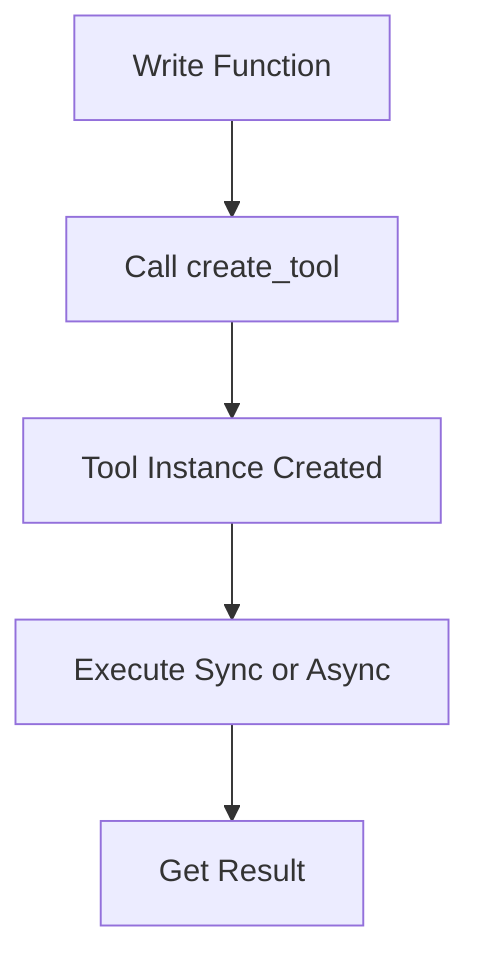

# Quantalogic Toolbox

The Quantalogic Toolbox is a Python package designed to simplify the creation of configurable tools for AI agents. Whether you're building intelligent systems or automating workflows, this toolbox provides a robust framework for defining tools with type safety, clear documentation, and flexible execution options.

## Why Use Quantalogic Toolbox?

Imagine you’re teaching an AI agent to perform tasks, like a chef learning recipes. You need tools that are easy to define, safe to use (no mixing up ingredients!), and well-documented so the agent knows exactly what to do. That’s where Quantalogic Toolbox shines:
- **Type Safety**: Prevents errors by validating argument types.
- **Clarity**: Auto-generates detailed descriptions for tools and arguments.
- **Flexibility**: Supports both synchronous and asynchronous execution.
- **Speed**: Quickly converts Python functions into agent-ready tools.

## What is It?

The toolbox revolves around a few key components in the `tool.py` module:
- **`ToolArgument`**: Defines an argument (e.g., name, type, description) with metadata like defaults and examples.
- **`ToolDefinition`**: Sets up a tool’s configuration—name, description, arguments, and return type.
- **`Tool`**: Adds execution logic to `ToolDefinition`, supporting `execute` (sync) and `async_execute` (async).
- **`create_tool`**: A magic wand that turns any Python function into a `Tool` instance, extracting metadata automatically.

Helper functions like `type_hint_to_str`, `get_type_description`, and `get_type_schema` make type handling a breeze.

## How to Use It

### Installation

```bash
pip install quantalogic-toolbox
```

### Quick Start

Turn a function into a tool in seconds:

```python
from quantalogic_toolbox import create_tool

def add_numbers(a: int, b: int) -> int:
    """Add two numbers together."""
    return a + b

tool = create_tool(add_numbers)
result = tool.execute(a=5, b=3)  # Returns 8
```

### Detailed Usage

#### Creating Tools

**Option 1: Use `create_tool`**
```python
def greet(name: str) -> str:
    """Say hello to someone."""
    return f"Hello, {name}!"

greet_tool = create_tool(greet)
print(greet_tool.execute(name="Alice"))  # Output: Hello, Alice!
```

**Option 2: Subclass `Tool`**
```python
from quantalogic_toolbox import Tool, ToolArgument

class MultiplyTool(Tool):
    name = "multiply"
    description = "Multiply two numbers."
    arguments = [
        ToolArgument(name="x", arg_type="int", description="First number", required=True),
        ToolArgument(name="y", arg_type="int", description="Second number", required=True)
    ]
    return_type = "int"

    def execute(self, x: int, y: int) -> int:
        return x * y

mult_tool = MultiplyTool()
print(mult_tool.execute(x=4, y=5))  # Output: 20
```

#### Defining Arguments

Arguments are like ingredients in a recipe—specify them clearly:

```python
arg = ToolArgument(
    name="count",
    arg_type="int",
    description="Number of items to process",
    required=True,
    example="10"
)
```

#### Executing Tools

- **Synchronous**: `result = tool.execute(arg1=value1, arg2=value2)`
- **Asynchronous**: `result = await tool.async_execute(arg1=value1, arg2=value2)`

### Visualizing the Process

Here’s how a function becomes a tool:



### Examples

**Async Example:**
```python
import asyncio

async def async_wait(name: str) -> str:
    """Wait a second, then greet."""
    await asyncio.sleep(1)
    return f"Hi, {name}!"

tool = create_tool(async_wait)
result = asyncio.run(tool.async_execute(name="Bob"))  # Output: Hi, Bob!
```

**Complex Type Example:**
```python
from typing import List

def sum_list(numbers: List[int]) -> int:
    """Sum a list of integers."""
    return sum(numbers)

tool = create_tool(sum_list)
print(tool.execute(numbers=[1, 2, 3]))  # Output: 6
```

## Insider Secrets

- **Maximize Descriptions**: Detailed argument descriptions (e.g., “a list of integers”) help AI agents use tools correctly.
- **Async Power**: Use `async_execute` for tasks that need to wait (e.g., API calls)—it’s built-in and seamless.
- **Type Details**: The `type_details` field auto-explains complex types (e.g., “a list of int”), saving you time.

## Memorization Trick

Think **“NAR”** for `ToolArgument` essentials:
- **N**ame
- **A**rg_type
- **R**equired

## Understanding Complex Concepts

Ever wonder how `create_tool` works? Picture it like a chef inspecting a recipe: it reads the function (ingredients and steps), figures out what’s needed (arguments), and writes a clear guide (tool metadata). No magic—just clever parsing of your code!

## FAQ

**Q: Can I use this with any AI framework?**  
A: Yes! It’s pure Python and framework-agnostic.

**Q: What if my tool needs user approval?**  
A: Set `need_validation=True` in `ToolDefinition`.

## Contributing

Got ideas? Open a pull request or issue on GitHub—we’d love your input!

---

This toolbox is your shortcut to building AI-ready tools fast, with less hassle and more precision. Start crafting today!