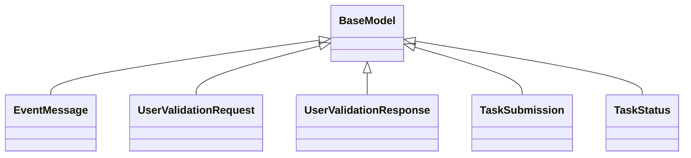

```mermaid
classDiagram
    class BaseModel
    class EventMessage
    class UserValidationRequest
    class UserValidationResponse
    class TaskSubmission
    class TaskStatus

    BaseModel <|-- EventMessage
    BaseModel <|-- UserValidationRequest
    BaseModel <|-- UserValidationResponse
    BaseModel <|-- TaskSubmission
    BaseModel <|-- TaskStatus
```