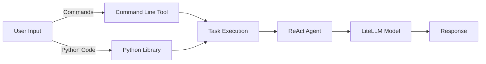
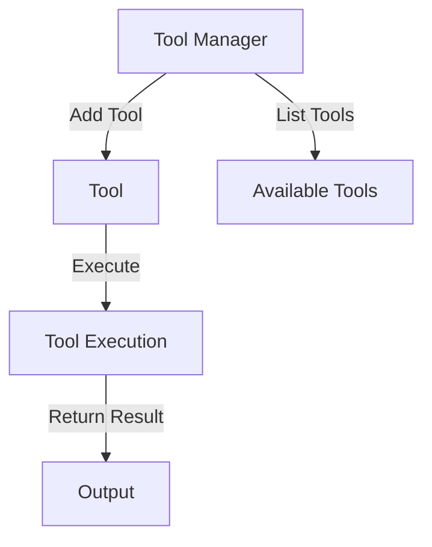
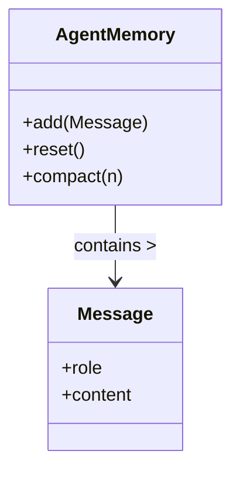

---

# QuantaLogic README.md

## Table of Contents
1. [Overview](#overview)
2. [Getting Started](#getting-started)
   - [Installation](#installation)
   - [Usage](#usage)
3. [Understanding ReAct Agents](#understanding-react-agents)
4. [QuantaLogic as a Command Line Tool](#quantalogic-as-a-command-line-tool)
   - [How to Use the Command Line Tool](#how-to-use-the-command-line-tool)
   - [Use Cases](#use-cases)
5. [Using QuantaLogic as a Python Library](#using-quantalogic-as-a-python-library)
   - [Installation Instructions](#installation-instructions)
   - [Basic Usage](#basic-usage)
   - [Creating and Configuring an Agent](#creating-and-configuring-an-agent)
   - [Solving Tasks with the Agent](#solving-tasks-with-the-agent)
6. [Integration with LiteLLM](#integration-with-litellm)
   - [Model Naming Convention](#model-naming-convention)
   - [Example Model Names](#example-model-names)
7. [Tool Management](#tool-management)
   - [Creating Custom Tools](#creating-custom-tools)
   - [Available Tools](#available-tools)
8. [Event Management](#event-management)
   - [Using the Event Emitter](#using-the-event-emitter)
   - [Logging Events](#logging-events)
9. [Memory Management](#memory-management)
   - [Understanding Agent Memory](#understanding-agent-memory)
   - [Memory Optimization](#memory-optimization)
10. [Error Handling](#error-handling)
    - [Handling Exceptions](#handling-exceptions)
    - [Retry Mechanism](#retry-mechanism)
11. [Development and Contributing](#development-and-contributing)
12. [License](#license)
13. [Contact](#contact)

---

## 1. Overview
QuantaLogic is an advanced ReAct agent library designed for building AI agents capable of executing complex tasks. It utilizes the LiteLLM framework for its generative models, allowing developers to create dynamic agents that can perform various operations, from coding assistance to automated task management. With support for both command-line and Python integration, QuantaLogic provides a flexible solution for AI-driven applications.

### Diagram: QuantaLogic Architecture


## 2. Getting Started

### Installation
To install QuantaLogic, use the following pip command:
```bash
pip install quantalogic
```

### Usage
QuantaLogic can be accessed in two main ways:
- **Command Line Interface (CLI)**: Run tasks directly through the command line.
- **Python Integration**: Import the library into your Python scripts to leverage its functionalities programmatically.

## 3. Understanding ReAct Agents
ReAct agents integrate reasoning and action, allowing them to respond adaptively to tasks. They are designed to manage both user input and background processes, making them suitable for applications such as:
- Coding assistants
- Data processing automation
- Interactive problem-solving tools

## 4. QuantaLogic as a Command Line Tool

### How to Use the Command Line Tool
To execute a task using the command line, the syntax is as follows:
```bash
quantalogic --task "Your task description here"
```
- **Options**:
  - `--verbose`: Enables detailed output.
  - `--execute-file <file_path>`: Executes tasks defined in a specified file.

### Use Cases
1. **Coding Agent**: Automatically generate code snippets based on user requirements.
2. **Data Automation**: Run predefined scripts to automate data processing tasks.
3. **Interactive Debugging**: Assist users in troubleshooting and resolving code issues.

## 5. Using QuantaLogic as a Python Library

### Installation Instructions
Ensure the library is installed as detailed in the Installation section.

### Basic Usage
Import QuantaLogic and initialize an agent:
```python
from quantalogic import Agent

agent = Agent(model_name="your_model_name")
```

### Creating and Configuring an Agent
You can create specific agents using different models and tools:
```python
from quantalogic.agent_config import create_agent

my_agent = create_agent(model_name="litellm_model_identifier")
```

### Solving Tasks with the Agent
Invoke the agent to solve a task with the following code:
```python
result = my_agent.solve_task("Write a Python function to calculate Fibonacci numbers.")
print(result)
```
- This demonstrates how to efficiently leverage the agent's capabilities for programming tasks.

## 6. Integration with LiteLLM

### Model Naming Convention
QuantaLogic agents utilize models from the LiteLLM framework. The format for specifying model names typically follows this convention:  
`<provider>/<model-name><optional-parameters>`.

### Example Model Names
- `openrouter/deepseek-chat`
- `litellm/qwen2.5-coder:14b`
- `bedrock/amazon.nova-lite-v1:0`

## 7. Tool Management

### Creating Custom Tools
To enhance agent capabilities, you can create custom tools by following the structure defined in the `Tool` class. Each tool can have specific functionalities tailored to your requirements.

### Available Tools
QuantaLogic includes a set of built-in tools, such as:
- **ReadFileTool**: Reads content from specified files.
- **WriteFileTool**: Writes output data to files.
- **ExecuteBashCommandTool**: Executes commands in a shell environment.
- **PythonTool**: Executes Python scripts within a secure environment.

### Diagram: Tool Management


## 8. Event Management

### Using the Event Emitter
QuantaLogic employs an event emitter system, allowing components to communicate through event-driven architecture. This aids in real-time updates and logging.

### Logging Events
Events can be logged to monitor the behavior of the system and debug issues effectively. Use built-in logging features to track critical operations and status changes.

## 9. Memory Management

### Understanding Agent Memory
Agents maintain a memory structure that records interactions and responses. This memory is essential for enabling context-aware conversations and task resolutions.

### Memory Optimization
To optimize memory usage, the agent can compact its memory periodically. This ensures that only essential messages are retained, improving the efficiency of the agent's processing.

### Diagram: Memory Management


## 10. Error Handling

### Handling Exceptions
QuantaLogic incorporates robust error-handling strategies to manage exceptions gracefully. Use try-except blocks around critical operations to catch and respond to any issues effectively.

### Retry Mechanism
For operations involving external calls (such as API requests), a built-in retry mechanism attempts to rerun failed operations. This ensures resilience against transient errors.

## 11. Development and Contributing
Developers are encouraged to contribute to QuantaLogic. Follow the guidelines provided in the contributing section to submit issues, enhancements, or pull requests.

## 12. License
QuantaLogic is licensed under the Apache 2.0 License. For more details, refer to the LICENSE file in this repository.

## 13. Contact
For questions, suggestions, or support, please reach out to the project maintainer or consult the project's support channels.

