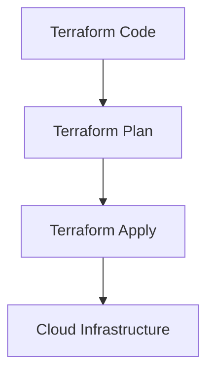

# **Chapter 1: What is Terraform? 🏗️**

Welcome to the world of Terraform! 🌍 In this chapter, we’ll explore what Terraform is, why it’s so useful, and how it works. By the end, you’ll understand why Terraform is like a magic wand 🪄 for building and managing cloud infrastructure.

---

## **1. What is Terraform? 🪄**

Imagine you’re building a sandcastle 🏰. Instead of shaping each grain of sand by hand, what if you could write a recipe 📜 that tells the sand exactly how to form itself into a castle? That’s what Terraform does for your cloud infrastructure!

Terraform is a tool that lets you write **code** to create and manage servers, databases, networks, and more in the cloud. Instead of clicking buttons in a cloud provider’s dashboard (like AWS or Azure), you describe what you want in a file, and Terraform makes it happen. It’s like having a robot 🤖 that builds your infrastructure for you!

---

## **2. Why use Terraform? 🤔**

Here’s why Terraform is awesome:

1. **Consistency 🎯**  
   With Terraform, your infrastructure is defined in code. This means you can create the same setup every time, without worrying about mistakes or forgetting steps.

2. **Collaboration 👥**  
   Since your infrastructure is code, you can share it with your team, track changes, and even use version control (like Git) to manage it. It’s like working on a group project where everyone has the same instructions.

3. **Automation 🤖**  
   Terraform lets you deploy resources with a single command. No more manual clicking or waiting! Just run `terraform apply`, and your infrastructure is ready.

---

## **3. How does Terraform work? 🔧**

Terraform works in two simple steps: **Plan** and **Apply**.

1. **Plan 📝**  
   When you run `terraform plan`, Terraform looks at your code and tells you what it’s going to do. It’s like asking, “Hey Terraform, what changes are you going to make?”  

2. **Apply 🚀**  
   Once you’re happy with the plan, you run `terraform apply`. Terraform then talks to your cloud provider (like AWS, Azure, or Google Cloud) using APIs and creates the resources you’ve described.

Here’s a simple example of Terraform code:

```hcl
provider "aws" {
  region = "us-east-1"
}

resource "aws_instance" "web" {
  ami           = "ami-0c55b159cbfafe1f0"
  instance_type = "t2.micro"
}
```

In this example:
- The `provider` block tells Terraform to use AWS in the `us-east-1` region.
- The `resource` block creates a small virtual server (a `t2.micro` instance) using a specific Amazon Machine Image (AMI).

---

## **4. Visualizing Terraform’s Workflow 🖼️**

Let’s break it down with a simple diagram:



1. You write Terraform code.
2. Terraform plans the changes.
3. Terraform applies the changes.
4. Your cloud infrastructure is created! 🎉

---

## **5. Key Takeaway 🎯**

Terraform is a tool that lets you **write code** to create and manage your cloud infrastructure. It’s consistent, collaborative, and automates the boring stuff. Think of it as your magic wand 🪄 for building anything in the cloud!

In the next chapter, we’ll write our first Terraform configuration and deploy it. Get ready to make some magic happen! ✨

---

**Next Up:** Chapter 2 - Writing Your First Terraform Configuration 📝