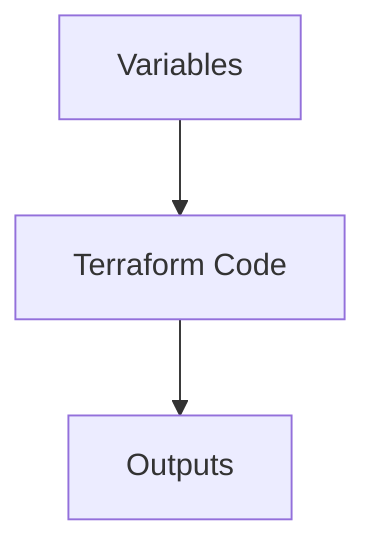

# **Chapter 3: Variables and Outputs 🎛️**

**Goal:** Learn how to use variables and outputs to make your Terraform code dynamic.

---

## **1. What are Variables? 🤔**

Imagine you’re baking cookies 🍪. Sometimes you want chocolate chips, and other times you want raisins. Variables in Terraform are like the ingredients you can swap in and out of your recipe. They let you customize your infrastructure without rewriting the whole code!

Variables make your Terraform code flexible and reusable. Instead of hardcoding values (like `instance_type = "t2.micro"`), you can use variables to change them easily.

---

## **2. Defining Variables 📝**

To define a variable, you create a `variables.tf` file. Think of this as your "ingredients list." Here’s an example:

```hcl
variable "instance_type" {
  type    = string
  default = "t2.micro"
}
```

- **`instance_type`**: This is the name of the variable. You can name it anything you like!
- **`type`**: This tells Terraform what kind of value the variable should hold. In this case, it’s a `string` (text).
- **`default`**: This is the default value if you don’t provide one. Here, it’s `"t2.micro"`.

---

## **3. Using Variables 🛠️**

Now that you’ve defined a variable, you can use it in your `main.tf` file. Instead of hardcoding the `instance_type`, you reference the variable like this:

```hcl
resource "aws_instance" "web" {
  ami           = "ami-0c55b159cbfafe1f0"
  instance_type = var.instance_type
}
```

- **`var.instance_type`**: This tells Terraform to use the value of the `instance_type` variable.

If you want to change the `instance_type`, you can do it in one place (the `variables.tf` file) instead of searching through your entire code. Easy peasy! 🎉

---

## **4. Outputs 📤**

Outputs are like the final result of your recipe. After baking your cookies, you might want to show off how many you made or what flavor they are. In Terraform, outputs let you display information after your infrastructure is created.

Here’s how you define an output:

```hcl
output "instance_id" {
  value = aws_instance.web.id
}
```

- **`instance_id`**: This is the name of the output. You can name it anything you like.
- **`value`**: This is the value you want to display. Here, it’s the ID of the AWS instance you created.

When you run `terraform apply`, Terraform will show you the `instance_id` at the end. This is super helpful if you need to share the ID with someone else or use it in another script.

---

## **5. Mermaid Diagram 🧩**

Let’s visualize how variables and outputs work together:



- **Variables** feed into your **Terraform Code**, and the code produces **Outputs**. It’s like a little factory! 🏭

---

## **6. Putting It All Together 🧑‍🍳**

Let’s see how variables and outputs work in a real example. Here’s a complete setup:

**`variables.tf`**:
```hcl
variable "instance_type" {
  type    = string
  default = "t2.micro"
}
```

**`main.tf`**:
```hcl
provider "aws" {
  region = "us-east-1"
}

resource "aws_instance" "web" {
  ami           = "ami-0c55b159cbfafe1f0"
  instance_type = var.instance_type
}
```

**`outputs.tf`**:
```hcl
output "instance_id" {
  value = aws_instance.web.id
}
```

When you run `terraform apply`, Terraform will:
1. Use the `instance_type` variable to create an AWS instance.
2. Output the `instance_id` after the instance is created.

---

## **7. Key Takeaway 🎯**

Variables and outputs make your Terraform code **flexible** and **informative**. Variables let you customize your infrastructure without rewriting your code, and outputs give you useful information after your resources are created. Together, they’re like the secret sauce 🌟 that makes your Terraform code powerful and easy to use!

---

**Next Up:** In Chapter 4, we’ll dive into **Terraform State** and learn how Terraform keeps track of your infrastructure. Stay tuned! 🚀