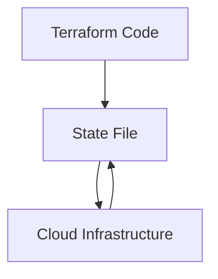

# **Chapter 4: Managing State 🗂️**

**Goal:** Understand Terraform state and how to manage it.

---

## **1. What is Terraform State? 🤔**

Imagine you’re building a LEGO castle 🏰. You have a blueprint (your Terraform code) and a pile of LEGO bricks (your cloud resources). But how do you remember which bricks you’ve already placed? That’s where **Terraform state** comes in! 🧠

Terraform state is like a **memory file** (`terraform.tfstate`) that keeps track of all the resources you’ve created. It stores details like:
- What resources exist.
- Their current configuration.
- How they’re connected.

Without state, Terraform wouldn’t know what it has already built or what needs to be updated. It’s like trying to build a LEGO castle without remembering where you left off! 🧩

---

## **2. Why is State Important? 🚨**

State is **super important** because:
1. **It tracks changes:** Terraform compares your code with the state to figure out what needs to be added, updated, or deleted.
2. **It prevents conflicts:** If two people try to change the same resource, Terraform uses the state to avoid chaos.
3. **It’s your source of truth:** The state file is the **single source of truth** for your infrastructure.

But here’s the catch: **State files are sensitive!** 🚫  
They contain secrets and sensitive data, so you need to handle them carefully. Never share your state file publicly!

---

## **3. Remote State: Sharing is Caring 🤝**

If you’re working in a team, storing the state file on your local machine won’t work. What if your teammate needs to make changes? That’s where **remote state** comes in! 🌍

Remote state means storing your `terraform.tfstate` file in a shared location, like:
- **AWS S3** (a cloud storage service).
- **Terraform Cloud** (a service by HashiCorp).
- **Azure Blob Storage** or **Google Cloud Storage**.

This way, everyone on your team can access the same state file, and Terraform can manage it safely.

---

## **4. Code Example: Storing State in AWS S3 🛠️**

Let’s store our state file in AWS S3. Here’s how:

1. **Create an S3 Bucket:**  
   First, create an S3 bucket in your AWS account to store the state file.

2. **Update Your Terraform Configuration:**  
   Add a `backend` block to your `main.tf` file:

   ```hcl
   terraform {
     backend "s3" {
       bucket = "my-terraform-state-bucket"  # Replace with your bucket name
       key    = "path/to/my/terraform.tfstate"  # Path to store the state file
       region = "us-east-1"  # AWS region
     }
   }
   ```

3. **Initialize Terraform:**  
   Run `terraform init` to configure the backend. Terraform will migrate your local state to the S3 bucket.

4. **Apply Changes:**  
   Run `terraform apply` as usual. Terraform will now use the remote state file.

---

## **5. Mermaid Diagram: How State Works 🖼️**

Here’s a simple diagram to show how Terraform state works:



- **Terraform Code:** Your instructions for building infrastructure.
- **State File:** Keeps track of what’s been built.
- **Cloud Infrastructure:** The actual resources in the cloud.

---

## **6. Key Takeaway 🎯**

Terraform state is like a **memory file** that remembers what you’ve built. It’s essential for tracking changes, preventing conflicts, and collaborating with your team. By storing your state remotely (e.g., in AWS S3), you can work together seamlessly and keep your infrastructure safe. 🛡️

---

**Next Up:** In Chapter 5, we’ll learn about **Modules and Reusability**—how to turn your Terraform code into reusable building blocks! 🧱

---

By the end of this chapter, you’ll understand why state is so important and how to manage it effectively. Ready to dive into the next chapter? Let’s go! 🚀