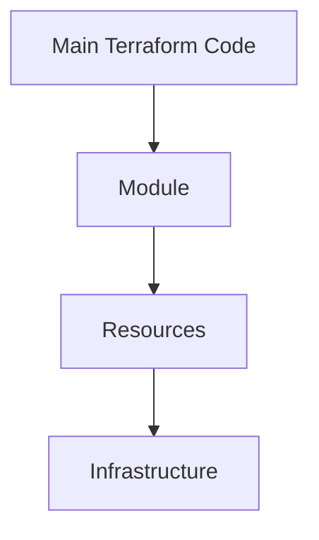

---

## **Chapter 5: Modules and Reusability 🧩**
**Goal:** Learn how to create and use Terraform modules to make your code reusable and organized.

---

### **1. What are Modules? 🧱**
Imagine you’re building a house 🏠. Instead of building every single wall, door, and window from scratch, you use pre-made pieces like Lego blocks. Terraform modules are like those Lego blocks! They let you bundle up pieces of your infrastructure code so you can reuse them again and again.

- **Why use modules?**  
  - **Reusability:** Write once, use everywhere.  
  - **Organization:** Keep your code clean and easy to understand.  
  - **Collaboration:** Share modules with your team or the world.  

---

### **2. Creating a Module 🛠️**
Let’s say you want to create a module for a web server. Here’s how you do it:

1. **Create a folder for your module:**  
   Inside your project, create a folder called `modules/web_server`. This folder will hold all the code for your module.

2. **Write the module code:**  
   Inside the `modules/web_server` folder, create a `main.tf` file. This file will define the resources for your web server.  

   ```hcl
   # modules/web_server/main.tf
   resource "aws_instance" "web" {
     ami           = "ami-0c55b159cbfafe1f0"
     instance_type = var.instance_type
   }
   ```

3. **Add variables:**  
   Modules can accept inputs (variables) to make them flexible. Create a `variables.tf` file in the same folder:  

   ```hcl
   # modules/web_server/variables.tf
   variable "instance_type" {
     type    = string
     default = "t2.micro"
   }
   ```

---

### **3. Using a Module 🚀**
Now that you’ve created a module, you can use it in your main Terraform configuration. Here’s how:

1. **Call the module:**  
   In your `main.tf` file, call the module like this:  

   ```hcl
   # main.tf
   module "web_server" {
     source = "./modules/web_server"
     instance_type = "t2.micro"
   }
   ```

   - `source`: Tells Terraform where to find the module.  
   - `instance_type`: Passes a value to the module’s variable.  

2. **Run Terraform:**  
   Just like before, run `terraform init`, `terraform plan`, and `terraform apply` to create your infrastructure.  

---

### **4. Code Example 🖥️**
Here’s what your project structure might look like:  

```
my-terraform-project/
├── main.tf
├── modules/
│   └── web_server/
│       ├── main.tf
│       └── variables.tf
└── terraform.tfstate
```

And here’s the code for each file:  

- **`main.tf`:**  
  ```hcl
  module "web_server" {
    source = "./modules/web_server"
    instance_type = "t2.micro"
  }
  ```

- **`modules/web_server/main.tf`:**  
  ```hcl
  resource "aws_instance" "web" {
    ami           = "ami-0c55b159cbfafe1f0"
    instance_type = var.instance_type
  }
  ```

- **`modules/web_server/variables.tf`:**  
  ```hcl
  variable "instance_type" {
    type    = string
    default = "t2.micro"
  }
  ```

---

### **5. Mermaid Diagram 📊**
Here’s how modules fit into the Terraform workflow:  



---

### **6. Key Takeaway 🎉**
Modules are like Lego blocks for your Terraform code. They help you:  
- **Reuse code** so you don’t have to write the same thing over and over.  
- **Organize your code** so it’s easier to understand and maintain.  
- **Collaborate** by sharing modules with your team or the community.  

Now you’re ready to build your own modules and make your Terraform code super reusable! 🧱🚀  

--- 

Next up: **Chapter 6: Working with Multiple Environments 🌍**  
We’ll learn how to manage different environments (like dev, staging, and production) using Terraform. Stay tuned! 🌟