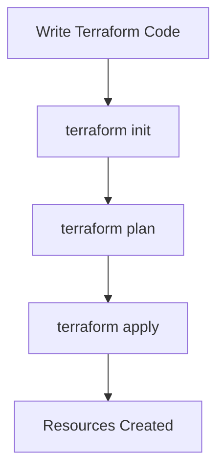

---

## **Chapter 2: Writing Your First Terraform Configuration 📝**
**Goal:** Write and deploy a simple Terraform configuration.

---

### **1. Install Terraform 🛠️**

Before we start writing Terraform code, we need to install Terraform. Think of it like downloading a new app on your phone. Here’s how:

1. Go to the [Terraform website](https://www.terraform.io/).
2. Download the version for your computer (Windows, Mac, or Linux).
3. Follow the installation instructions.

Once installed, open your terminal or command prompt and type:
```bash
terraform version
```
If you see a version number, congratulations! 🎉 Terraform is ready to use.

---

### **2. Basic Terraform File Structure 🗂️**

Terraform uses files to define your infrastructure. Think of these files as recipes 🍳 for building your cloud resources. Here’s what a simple Terraform project looks like:

- **`main.tf`**: This is the main file where you define your resources (like servers or databases).
- **`provider.tf`**: This file tells Terraform which cloud provider to use (like AWS, Azure, or Google Cloud).
- **`variables.tf`**: This file stores variables, which are like placeholders for values you can change later.

Let’s create these files step by step.

---

### **3. Code Example: Your First Terraform Configuration 🖥️**

Let’s write a simple Terraform configuration to create a virtual server (called an **EC2 instance**) on AWS.

#### Step 1: Create `provider.tf`
This file tells Terraform to use AWS as the cloud provider.
```hcl
provider "aws" {
  region = "us-east-1"  # This is where your server will be created
}
```

#### Step 2: Create `main.tf`
This file defines the server we want to create.
```hcl
resource "aws_instance" "web" {
  ami           = "ami-0c55b159cbfafe1f0"  # This is the "image" for the server
  instance_type = "t2.micro"               # This is the size of the server
}
```

#### Step 3: Create `variables.tf`
This file defines a variable for the instance type.
```hcl
variable "instance_type" {
  type    = string
  default = "t2.micro"
}
```

Now, your project folder should look like this:
```
📁 my-terraform-project
   ├── main.tf
   ├── provider.tf
   └── variables.tf
```

---

### **4. Running Terraform 🏃‍♂️**

Now that we’ve written our Terraform code, let’s run it! Terraform works in three steps:

1. **`terraform init`**: This command prepares Terraform to run. It’s like setting up your kitchen before cooking. 🍴
   ```bash
   terraform init
   ```

2. **`terraform plan`**: This command shows you what Terraform will do. It’s like checking your recipe before you start cooking. 📋
   ```bash
   terraform plan
   ```

3. **`terraform apply`**: This command creates the resources. It’s like cooking the meal! 🍲
   ```bash
   terraform apply
   ```

When you run `terraform apply`, Terraform will ask for confirmation. Type `yes` and press Enter. After a few moments, your server will be created in AWS! 🎉

---

### **5. Mermaid Diagram: Terraform Workflow 🔄**

Here’s a simple diagram to show how Terraform works:


---

### **6. Key Takeaway 🎯**

Writing Terraform code is like writing a recipe for your infrastructure. 🍳 You define what you want (like a server), and Terraform takes care of the rest. By following the steps in this chapter, you’ve created your first Terraform configuration and deployed a server in the cloud. Great job! 👏

In the next chapter, we’ll learn how to make your Terraform code even more powerful using **variables and outputs**. Stay tuned! �

--- 

**Next Chapter Preview:**  
In **Chapter 3: Variables and Outputs 🎛️**, you’ll learn how to make your Terraform code dynamic and reusable. Think of it like adding spices to your recipe to make it tastier! 🌶️