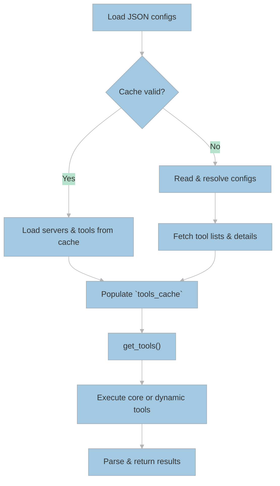

# 🛠️ QuantaLogic MCP Toolbox

> A generic adapter for interacting with one or more MCP servers via JSON-based configuration, with automatic tool discovery, caching, and session management.

---

[](https://pypi.org/project/quantalogic-toolbox-mcp)
[](LICENSE)

---

## 📋 Table of Contents

1. [Installation](#installation)
2. [Configuration](#configuration)
3. [Quickstart Example](#quickstart-example)
4. [Architecture](#architecture)
5. [API Reference](#api-reference)
6. [Contributing](#contributing)
7. [License](#license)

---

## 🚀 Installation

Install from PyPI:

```bash
pip install quantalogic-toolbox-mcp
```

Or with Poetry:

```bash
poetry add quantalogic-toolbox-mcp
```

---

## ⚙️ Configuration

By default, the toolbox reads JSON files from `./mcp_config/` or the directory set by `MCP_CONFIG_DIR`. You can also specify a single file via the `MCP_CONFIG_FILE` environment variable.

Create a config file (`mcp.json`) in `mcp_config/` with the following structure:

```json
{
  "mcpServers": {
    "sqlite": {
      "command": "docker",
      "args": [
        "run",
        "--rm",
        "-i",
        "-v",
        "mcp-test:/mcp",
        "mcp/sqlite",
        "--db-path",
        "/mcp/test.db"
      ]
    },
    "mcp_hn": {
      "command": "uvx",
      "args": ["mcp-hn"]
    },
    "fetcher": {
      "command": "npx",
      "args": ["-y", "fetcher-mcp"]
    },
    "job_search": {
      "command": "npx",
      "args": ["-y", "job-searchoor"]
    },
    "edgeone": {
      "command": "npx",
      "args": ["edgeone-pages-mcp"]
    }
  }
}
```

- **command**: Executable or Docker alias
- **args**: Argument list to launch the server

Environment variables in `env` entries can use `{{ env.VAR_NAME }}` and will be resolved at runtime.

### Remote servers over Streamable HTTP

Set `transport` to `streamable_http` and supply a URL instead of `command` and `args`:

```json
{
  "mcpServers": {
    "parallel": {
      "transport": "streamable_http",
      "url": "https://search.parallel.ai/mcp"
    }
  }
}
```

Command-based configurations still use stdio by default. Remote servers use the
same discovery, dynamic tools, response parsing and configuration cache. Optional
`headers` support `{{ env.VAR_NAME }}` values, for servers that need authentication.
The default HTTP User-Agent is `quantalogic-toolbox-mcp/0.13.0`; an explicit
`User-Agent` header overrides it. Optional positive `timeout` and
`sse_read_timeout` values are in seconds, with MCP SDK defaults of 30 and 300.
Only Streamable HTTP is supported for remote URLs.

### Try anonymous Parallel search and fetch

[Parallel Search MCP](https://docs.parallel.ai/integrations/mcp/search-mcp) provides
`web_search` and `web_fetch` without a Parallel API key at
`https://search.parallel.ai/mcp`. Anonymous access has lower rate limits and
server-managed fast-mode search settings. Model inference, if you use an agent,
is separate. The example calls the tools directly and needs no model credentials.

From `toolboxes/quantalogic-toolbox-mcp/`, install this checkout and run:

```bash
pip install -e .
MCP_CONFIG_DIR=./examples/parallel python examples/parallel/search.py
```

The separate example directory enables Parallel explicitly and leaves your
existing server configuration unchanged. It contains no authentication headers.
The example discovers the tools through `get_tools()`, prints search results with
source URLs and excerpts, then fetches the Python asyncio documentation. It uses
one conversation `session_id` for both calls. The toolbox writes its usual
`config_cache.json` inside the selected directory; delete that cache to refresh
the discovered schemas.

---

## 🏃 Quickstart Example

```python
from quantalogic_toolbox_mcp.tools import get_tools
import asyncio

async def main():
    # Discover core and dynamic tools
    tools = get_tools()

    # List configured servers
    from quantalogic_toolbox_mcp.tools import list_servers
    servers = await list_servers()
    print("Servers:", servers)

    # List tools on a server
    resources = await tools[0]('sqlite')  # mcp_list_tools
    print("Tools on sqlite:", resources)

    # Call a specific tool dynamically
    dynamic = [t for t in tools if hasattr(t, 'server_name') and t.server_name == 'sqlite'][0]
    result = await dynamic(input_file="/mcp/test.db")
    print("Result:", result)

asyncio.run(main())
```

---

## 🏛️ Architecture

```mermaid
%%{init: { 'theme': 'base', 'themeVariables': { 
    'primaryColor': '#A3C9E2', 
    'secondaryColor': '#B7E3CC', 
    'tertiaryColor': '#F9E0BB', 
    'lineColor': '#B5B5B5', 
    'fontFamily': 'Inter, Arial, sans-serif'
} }}%%
flowchart TD
    A[Load JSON configs] --> B{Cache valid?}
    B -- Yes --> C[Load servers & tools from cache]
    B -- No  --> D[Read & resolve configs]
    D --> E[Fetch tool lists & details]
    C & E --> F[Populate `tools_cache`]
    F --> G["get_tools()"]
    G --> H[Execute core or dynamic tools]
    H --> I[Parse & return results]
```

---

## 📖 API Reference

- **get_tools()** → `List[Callable]`
  - Returns core functions and dynamic tool wrappers.

- **mcp_list_resources(server_name: str)** → `List[str]`
- **mcp_list_tools(server_name: str)** → `List[str]`
- **mcp_call_tool(server_name: str, tool_name: str, arguments: dict)** → `Any`
- **list_servers()** → `List[str]`

For full signatures and details, refer to `toolboxes/quantalogic-toolbox-mcp/quantalogic_toolbox_mcp/tools.py`.

---

## 🤝 Contributing

1. Fork the repository
2. Create a feature branch
3. Add tests in `tests/`
4. Run `pytest` and `ruff .`
5. Submit a pull request against `main`

Please see `CONTRIBUTING.md` for more details.

---

## 📜 License

This project is licensed under the MIT License – see the [LICENSE](../../LICENSE) file for details.